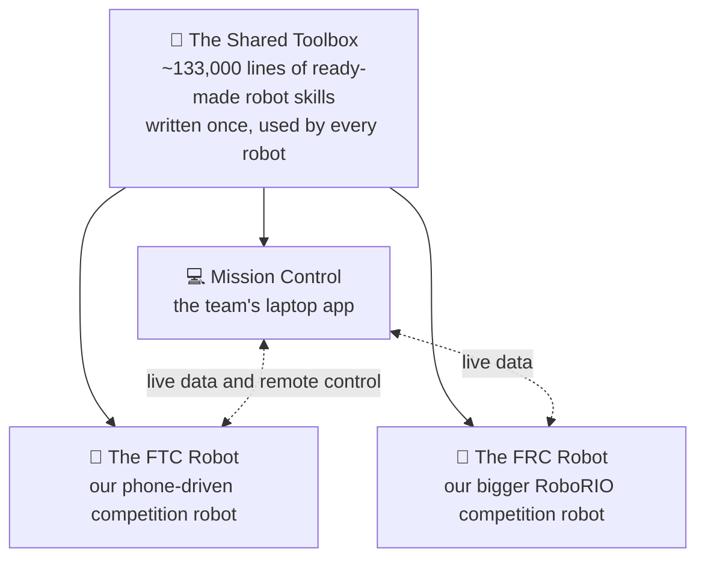
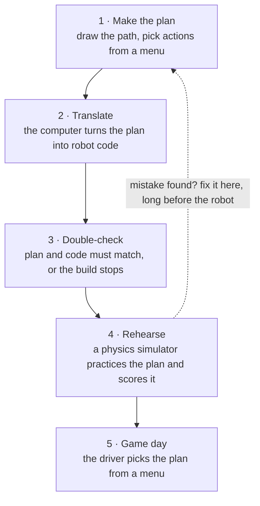
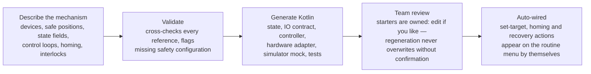
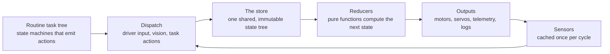
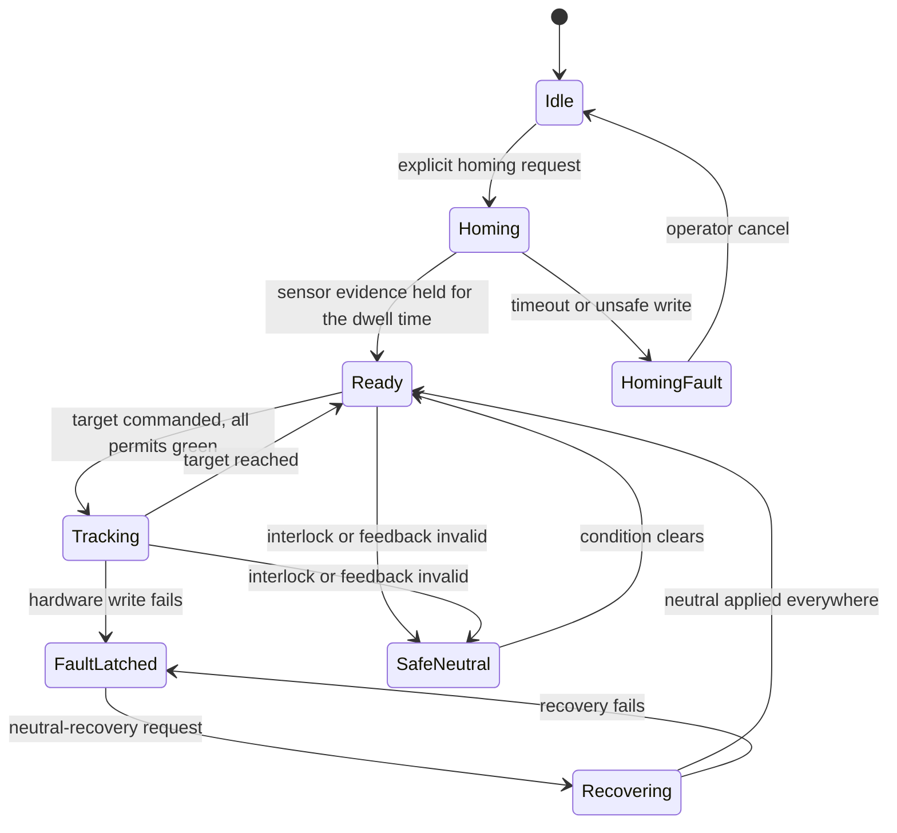
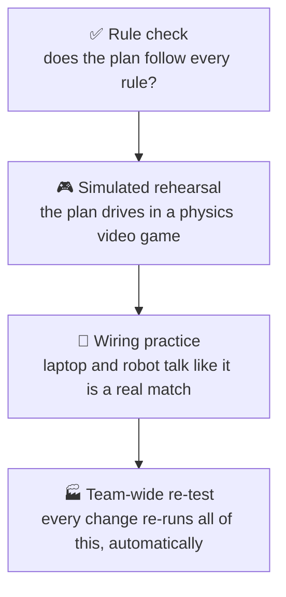
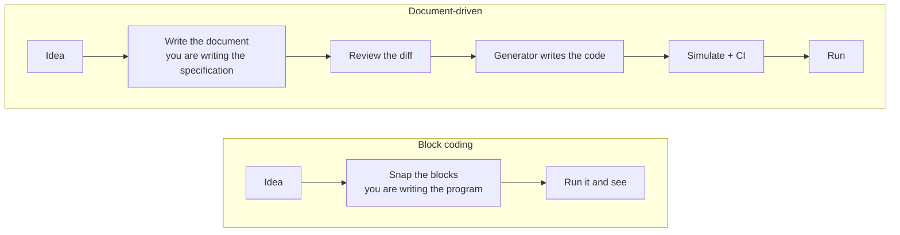

<!--
slug: the-program-is-a-document
title: The Program Is a Document: How Our Team Programs Robots (Almost) Without Code
date: 2026-08-17
author: ARES Robotics — FTC team 23247
snippet: Our team members plan autonomous routines by drawing paths and picking actions, and describe whole subsystems with forms — then generators turn those documents into reviewed, simulated, safety-checked Kotlin. A tour of the pipeline, the generated code, and the state-machine architecture underneath it.
thumbnail: assets/architecture-four-repos.svg
-->

# The Program Is a Document: How Our Team Programs Robots (Almost) Without Code

*ARES Robotics — FTC team 23247 · August 2026*

Every robotics team knows the ritual. It's the night before a competition, and someone is up late changing the autonomous program — commenting out lines, tweaking numbers, hoping. The next morning nobody is sure which version is on the robot, and when it drives the wrong way in the first match, the post-mortem is a shrug.

We built our way out of that. On our team, robot behavior starts as a **document**: a versioned, reviewable description of what the robot should do and what it's made of. Generators turn those documents into real Kotlin code, simulators prove the code before it touches hardware, and the driver picks the result from a menu on game day. We call it zero-code robot programming — with an asterisk we'll honor near the end.

## Four tools, one team

We compete in two leagues — FIRST Tech Challenge (FTC) and FIRST Robotics Competition (FRC) — with two very different robots. The workspace that keeps both running has four parts:



The **shared library** is roughly 133,000 lines of ready-made robot capability — path following, position estimation that fuses wheel odometry with camera sightings of field markers, battery and current protection, logging, a physics simulator. Both robots are thin shells over it, which is why each robot's own code is only 8–10 thousand lines. **Mission Control** is the Compose Desktop app where team members author the documents, watch live data, and tune mechanisms — talking to the robots over the local network, never through the cloud.

Two document families live at the center of all this: **routines** (what the robot should do) and **subsystems** (what the robot is). Both become Kotlin. Let's take them in order.

## Routines: the plan is a document

It's a Tuesday build night. A team member wants a new autonomous for the 30-second autonomous period. They open Mission Control, get a picture of the field, and **draw the path** — click, drag, adjust waypoints — with a live preview computed by the *same* trajectory planner the robot uses. Then they compose steps by **picking actions from a menu** (*start intake*, *stop intake*, *wait 0.25 s*); the menu only offers actions our robot actually has. Finally they add a catalog entry: name, starting pose, alliance color, and whether the routine should mirror for the opposite side of the field.

The saved file is plain JSON. This real one from our FTC repo says, in full, *"drive half a meter forward at the safe speed preset"*:

```json
{ "name": "Test Path",
  "steps": [
    { "kind": "DRIVE_TO",
      "target": { "xMeters": 0.5, "yMeters": 0, "headingRadians": 0 },
      "motionPresetKey": "safe" } ] }
```

Steps form a tree with ten kinds: `DRIVE_TO` (spline to a pose, with speed preset and event markers along the way), `ACTION`, `WAIT`/`WAIT_UNTIL`, `TOGETHER` (parallel), `FIRST_TO_FINISH` (race), `DEADLINE`, `CALL` (sub-routine), `REPEAT`, and `BRANCH`. Each action in the catalog declares which subsystem resources it locks exclusively — two steps fighting over the intake simply can't be scheduled together.

### From plan to robot



**Translate.** A code generator converts the JSON project into a deterministic Kotlin file that is *checked into the repository*, with a content hash tying it provably to the documents it came from. That means a routine shows up in code review like any code change — a reviewer reads exactly what the robot will do — and the robot never parses loose JSON at runtime. Our FRC repo states the policy outright: the RoboRIO loads no routine documents it didn't compile in with.

**Double-check.** Compilation depends on a verification task that fails the build if the generated Kotlin is stale relative to the `.ares` documents. Edit a routine, forget to regenerate — nothing ships, locally or in CI.

**Rehearse.** A dyn4j physics simulation — think video-game physics, real robot program inside — runs the actual OpModes headless and writes a run summary with hard numbers: how far the robot's true pose drifted from the target (RMSE per axis), peak motor current. Pass or fail is a measurement, not an opinion.

**Game day.** The driver picks the routine and alliance from the Driver Station's INIT screen (or Mission Control selects it over the network), and the robot publishes which generated version — by hash — it's about to run.

The robot adds its own guardrails before the wheels turn: the planned spline is swept against the field's obstacles using the robot's rotated footprint, and every action is checked against hardware discovered at startup — a routine asking for a flywheel that isn't present is *rejected*, not silently skipped. A 29.5-second internal deadline enforces a safe stop inside FTC's 30-second clock, and the end-of-auto pose is handed to teleop only after a provably successful run.

## Teleop is a document too: the controller editor

Autonomous is 30 seconds of the match; the other two minutes are driver-controlled — and that's where gamepad logic traditionally festers as code: `if (gamepad1.a && !gamepad1.b)` scattered through a teleop file, re-tuned by whoever happens to be driving that week.

Control schemes get the same treatment as routines. A `.arescontrols` document (schema v2) declares, as data:

- **Controller assignments** — logical slots (driver, operator) mapped to controller profiles and Driver Station device ports, so the generated runtime never guesses wiring.
- **Bindings** — a *source* (button, chord, axis threshold, axis value, or stick zone) plus an *event* (press, release, held, hold, repeat, value change, zone enter/active/exit) mapped to a *target*: an action from the same catalog the autonomous uses, launching a routine, or cancelling one — with an explicit invocation policy (ignore-if-running, restart, queue, run parallel, toggle-cancel).
- **Analog shaping** — deadbands, a response exponent, inversion, and per-joystick calibration that turns a worn stick's lopsided raw range into a clean output range.
- **Timing, hysteresis, and suppression** — press durations and debouncing so a flaky bumper can't machine-gun an action, and rules that mute one control while another is held, like a modifier key.

The TeleOp Controls editor in Mission Control is where team members build these: bindings are placed on a visual controller layout, validation flags conflicts before saving, and — a nice touch — you can plug a real gamepad into the laptop and watch the scheme respond to actual presses before it ever reaches a robot.

Because every binding targets a catalog action, teleop and autonomous share one vocabulary and the same safety rails: resource locking and hardware gating apply identically whether a routine step or a driver's thumb fired the action. The pipeline is identical too — documents → validation → compiled into the generated robot project as controller runtimes — with a dedicated controls test suite (digital and analog bindings, suppression, scheme validation) running in CI alongside everything else.

Honest status: as with the generated-subsystem path, this leg is built and CI-tested, but the current FTC project hasn't checked in a `.arescontrols` document — its generated runtime reports "no control scheme" and the season's teleop bindings are still programmatic Kotlin. The staircase has one more step to climb.

## Subsystems: describe the mechanism, receive the Kotlin

A subsystem is a mechanism — an intake, an elevator, a shooter — and classically it's where most hand-written robot code lives. Ours starts as a form. A `.aressubsystem` document declares:

- **Hardware**: each device by kind (motor, positional or continuous servo, digital or analog input, color sensor; CAN motor on the FRC side), its name in the hardware map, whether it's required, and its **safe neutral output** — the value it falls to when anything goes wrong.
- **State fields**: typed, bounded, unit-carrying values (target position, measured velocity…) with a role — target or measurement.
- **Control loops**: which actuator chases which field, and how — from `SERVO_POSITION` and `BANG_BANG` up to full `POSITION_PID`/`VELOCITY_PID` with feedforward terms (kS/kV/kA/kG — static friction, velocity, acceleration, gravity).
- **Safety policy**: homing method (e.g. drive slowly until motor current stalls, or velocity stalls), interlocks against other subsystems ("don't extend while the intake runs"), fault-recovery behavior, feedback timeouts.



The generator's output is a complete, working stack — not stubs. For one document it writes an immutable state class carrying every safety flag; a cached IO contract (hardware is read exactly once per cycle, getters never touch devices); an allocation-free controller implementing the declared loops with filtered derivatives, anti-windup integral clamping, and feedforward; the platform hardware adapter for FTC or FRC; optionally a deterministic simulator mock with the same failure semantics; and a generated contract-test suite covering startup, faults, recovery, and cleanup. Then the registry generator wires the subsystem into the routine system: *set target*, *request homing*, *request neutral recovery*, and *confirm calibration* appear on the action menu automatically, gated by the declared interlocks.

Two details make this trustworthy in a team setting. First, **"starter" means ownership, not maturity**: each generated file is marked as reviewable-and-customizable, and regeneration never replaces it without an explicit previewed diff and a replacement token — the machine cannot silently clobber a team member's edits. Second, the escape hatch is honest: a device that speaks its own protocol, like our goBILDA Prism RGB light strip, is declared `HAND_AUTHORED` and stays hand-written Kotlin that the tooling refuses to touch. Full disclosure: both subsystems in the FTC repo today are `HAND_AUTHORED` (the Prism deliberately, as a teaching example) — the generated path is currently proven by the generator and simulator-parity test suites rather than by a season mechanism. The boundary is real, and shrinking.

## State machines all the way down

Underneath both document families is a single architectural idea: **the whole robot is a set of state machines talking to one shared store.**

The store holds the complete robot state — drive, vision, each subsystem, the running routine — as an *immutable* data tree. Nothing ever edits it in place. Instead, anything that wants a change *dispatches an action* (a small value describing the request), and pure functions called **reducers** compute the next state from the current one. If you've heard of Redux from web development: yes, that's the pattern, running at 50 Hz on a phone and on a RoboRIO. The FRC season layer doesn't fork this machinery — its reducer calls the shared one first, then layers season-specific state on top, so improvements flow to both robots.



Where do autonomous actions come from? The routine document is compiled into a tree of **tasks**, and a task is itself a small state machine — it initializes, runs, reports completion, and each cycle returns the actions it wants dispatched. Tasks never touch hardware or state directly; they only *propose* changes through the store. The executor composes them sequentially, in parallel, in races, under deadlines, with preemption — which is exactly what the routine step kinds (`TOGETHER`, `FIRST_TO_FINISH`, `DEADLINE`…) map onto.

Generated subsystems are state machines too, in the most literal sense. Their controllers run a safety lifecycle like this (simplified):



Every transition fails safe: invalid or stale feedback, a failed configuration, an interlock trip, or a brownout scaling of zero drops the mechanism to its declared neutral output. A failed hardware write *latches* a fault — normal commands are refused until an explicit neutral-recovery request succeeds at writing neutral to every actuator. Homing requires sensor evidence held for a dwell time, with a timeout that latches and requires an operator cancel before retry. None of this is convention the subsystem author must remember; the generator emits it from the document.

Why insist on this pattern everywhere? Three payoffs we collect constantly:

- **Replay.** Because every change flows through dispatched actions and state is never mutated, a recorded action log *is* a replay of the match. Debugging "why did it turn left in Q37" means re-watching the log, not arguing from memory.
- **Determinism.** One clock, zero allocations in the hot loop, pure reducers — so the simulator reproduces robot behavior faithfully enough to gate releases on it.
- **One mental model.** A team member who learns how one subsystem works has learned how all of them work, on both robots.

## Proof before metal

Every change, in any of the four projects, climbs this ladder automatically:



The rule checks are unit and schema tests across the library; the rehearsal runs real OpModes headless against dyn4j physics and scores the run; the wiring practice drives real teleop over actual network sockets (the same safety-checked protocol Mission Control uses for remote driving) and exercises all 12 automated calibration routines; and the top rung is a single script that re-tests all four projects in dependency order on every change — library first, so consumers always test against the exact library build that just passed. The honest limit is documented too: no simulation can feel which way a motor actually spins or catch a quirky gamepad, so those get restrained-hardware bench tests with a hand on the stop button.

## Mission Control: the pit crew's laptop

The desktop app is where the documents live and breathe:

- **Plan and preview routines** on the field canvas — preview math is robot math.
- **Wire the controllers**: place bindings on a visual controller layout — chords, stick zones, trigger thresholds — and test them with a real gamepad plugged into the laptop.
- **Build subsystems** with the form-based builder, which validates references and flags missing safety configuration before saving.
- **Edit the field** — obstacles, AprilTag placements, game pieces — when rules change.
- **Tune live**: adjust gains over the network with a request-acknowledgement handshake, so a stray click can't change a motor mid-match; SysId fits (system identification — measuring a motor's real behavior) become reviewable tuning proposals.
- **Pull the robot's logs** over local Wi-Fi into a database and browse them like game film; cloud backup happens from the laptop, never from the robot.

## Isn't this just block coding?

Fair question. FTC offers a Blocks programming environment, and younger leagues grow up on Scratch-style tools — so "program without typing code" isn't new. The difference is more fundamental than the input method: **it's the difference between writing the program and writing the specification.**



In block coding, the blocks *are* the program — you're still hand-authoring the implementation, just with a visual syntax instead of text. That's genuinely good for learning programming fundamentals: sequencing, conditionals, loops. But it inherits the same ceiling text code has for beginners (you must get the implementation right) while losing the tools that make text code manageable at scale — block canvases don't diff cleanly, don't review well, and degrade into spaghetti exactly when programs get serious.

Authoring a document inverts the relationship. You state *intent* — drive here, grab that, this mechanism has these parts and these limits — and the implementation is generated, the change is reviewed, and the result is verified before anything moves:

| | Block coding | Document-driven (ours) |
|---|---|---|
| What you author | The program (visual syntax) | A specification of intent |
| Abstraction level | Same as text code, different skin | Higher — implementation is machine-written |
| Getting it right | Run it and see | Schemas, resource rules, simulation, CI — all before hardware |
| Review & history | Awkward to diff | Documents diff cleanly; generated Kotlin is reviewed in pull requests |
| Scaling | Degrades as logic grows | Composes — catalogs, sub-routines, resource locking, many authors |
| Closest adult analog | Writing a script | Requirements → design review → codegen → verification |

Here's the part we care about as a team: **the skills this stack exercises are the higher-level ones, and none of them require typing syntax.** A team member who has never written a line of Kotlin still practices, every week:

- **Specification writing.** Documents must be precise — the validator is an unforgiving reader, and a vague or contradictory document is rejected with a concrete error. Learning to write specs a machine can't misread is most of engineering communication.
- **Design review.** Behavior changes land as diffable artifacts that teammates read and approve before merging — the same pull-request culture professional software teams run on.
- **Design by contract.** Actions declare the resources they lock; subsystems declare interlocks; the runtime enforces the contracts. You learn to think in interfaces and obligations, not just steps.
- **Safety engineering.** Safe neutral outputs, fault latches, recovery procedures, fail-safe defaults — specified in the document, emitted by the generator, so safety is a design input rather than a patch.
- **A verification mindset.** Pass/fail arrives as a number (simulation RMSE, current draw), and the system documents what it *cannot* prove — so team members learn both to trust automated evidence and to respect its limits.
- **State thinking.** Homing sequences, fault recovery, resource contention — the documents force you to think in states and transitions, which is how real systems (and real bugs) behave.

The honest trade: blocks give free-form creativity; documents constrain you to a vocabulary. That rigidity is precisely what buys verification. Blocks teach you to be a programmer; this teaches you to practice engineering. Both are worth learning — they're different subjects.

And it isn't a dead end for coding. The generated Kotlin is checked in and written to be read — a team member can open it and see exactly what their document became. Reading well-made code before writing code is a staircase, not a wall. It's also the direction professional software engineering has moved for decades: compilers, then frameworks, now generation — with engineers spending more of their time specifying, reviewing, and verifying, and less of it typing every line.

## Where team members still write Kotlin

The asterisk, in full:

- **Beyond the document vocabulary.** The subsystem generator speaks standard devices and five control strategies. A vendor device with its own protocol (the Prism light strip) or a genuinely novel control law is `HAND_AUTHORED` Kotlin, untouchable by the tooling.
- **New menu actions.** Bespoke orchestration beyond what subsystems auto-publish is a hand-written task factory with editor-facing metadata; then it's on the menu for everyone.
- **New state slices.** Anything needing a brand-new reducer or state branch is library- or season-level Kotlin.

That's the list. The split is deliberate: team members without Kotlin experience contribute real, competition-safe work from day one, and the coders spend their time on capabilities instead of rewriting drive code every season.

## By the numbers

| Thing | Size, plainly |
|---|---|
| Shared library | ~133,000 lines, 921 Kotlin files, written once for both robots |
| Each robot's season code | ~8,000–10,000 lines |
| Mission Control | ~102,000 lines, 22 screens |
| Actions on the routine menu | 39 |
| Routine building blocks | 10 step kinds |
| Subsystem vocabulary | 6 device kinds, 5 control strategies, homing + interlocks + fault recovery |
| Teleop binding vocabulary | 5 source kinds · 9 event types · targets fire actions, routines, or cancels |
| Automated calibration routines | 12 |
| The example routine above | 8 lines of JSON |

## Why it matters

None of the ingredients are exotic — documents, generators, a store, a simulator, CI. The leverage is that they close into one loop: *author as data, generate deterministically, gate on verification, and let nothing unproven near a robot*. When a first-year team member can sketch a routine on a laptop, watch a simulated robot perform it the same afternoon, and select it on the field Saturday — and when describing a mechanism in a form yields safety-checked Kotlin with tests — robotics programming stops being a gatekeeper and starts being a team sport.

That's the version of robotics we wanted. So we built it — and along the way, the team isn't just building robots; the members who never touch Kotlin are still practicing the parts of engineering that matter most: stating intent precisely, reviewing each other's work, designing for failure, and demanding evidence before metal moves.

*Curious, or want to borrow the approach for your team? The documents-plus-generators pattern is the portable part — come find team 23247 in the pits.*
