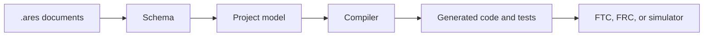
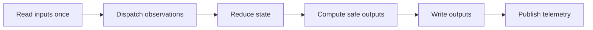

# ARESLib architecture and ownership

ARESLib is the shared robotics library inside the ARES Robotics monorepo. FTC and FRC use many of
the same ideas, but they keep separate device adapters and league lifecycles. ARES Robotics Studio
uses the same project model and telemetry rules. Robot code does not call Studio or its cloud
services while the robot is running.

## The main pipeline

## Module map

| Area | Job |
| --- | --- |
| `project-schema` | Reads and writes canonical files. Checks schema versions and stable IDs. |
| `project-model` | Builds the full, effective robot project and reports model errors. |
| `project-compiler` | Turns the project into typed instructions and a verification manifest. |
| `codegen` | Makes repeatable Kotlin, registries, manifests, and safety tests. |
| `core` | Owns Redux, math, controls, paths, sequencing, hardware contracts, and logs. |
| FTC and FRC hardware | Connect shared contracts to each league's real devices. |
| mocks and simulation | Let desktop tests and simulators use the same shared contracts. |

**Repeatable** means the same input creates the same output. Generated files belong in generated
folders. A team-owned extension must be marked clearly so regeneration does not erase it.

## One robot loop

Reducers are pure: they do not read devices, files, networks, or clocks. League-specific reducers
wrap the shared `rootReducer`; they do not replace it. Shared behavior belongs in ARESLib. A single
robot's mechanism or season plan belongs in that robot's FTC or FRC project.

## Check your understanding

1. Which module should reject a bad project document?
2. Why must generated output be repeatable?
3. Where should code for one team's special mechanism live?
