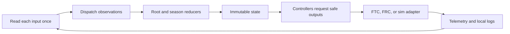

# ARESLib architecture and ownership

## Purpose and prerequisites

ARESLib is the shared robotics library in the ARES Robotics monorepo. It gives FTC, FRC, and the
simulator a common set of ideas. This reference helps you decide where a change belongs. It also
shows how a request moves through the robot loop without hidden device reads.

You should know that a robot has sensors, motors, and a repeating control loop. You do not need to
know every Gradle module. Keep the current ARES source open so you can compare this map with real
files. This page applies to ARES 11.1.0 and Studio 2.0.3.

## Vocabulary

- **Contract:** a clear rule about inputs, outputs, units, or safe behavior.
- **Adapter:** code that connects a shared contract to an FTC, FRC, or simulated device.
- **Store:** the one place that holds the current Redux state.
- **Action:** a named fact or request sent to the store.
- **Reducer:** a pure function that creates the next state from old state and an action.
- **Controller:** code that reads state and decides which safe output to request.
- **Cached input:** one sensor value read once for the current loop.
- **Generated code:** repeatable code made from a checked ARES project document.

Shared math, controls, sequencing, state, and hardware contracts belong in ARESLib. FTC and FRC
adapters belong in their platform modules. One robot's mechanism and season plan belong in that
robot project. Studio may author or inspect project files, but robot code does not call Studio or a
cloud service while it runs.

## Worked example

Imagine that a driver presses the intake button. The controller should not reach around the system
and write a motor at once. It sends an action that describes the request. The reducer makes the next
state. The intake controller reads that state and asks the motor contract for a bounded output. The
FTC or FRC adapter performs the actual write.

The sensor side follows the same ownership rule. At the start of a loop, the adapter reads each
needed input once. It stores that observation in a snapshot. An action carries the observation into
Redux. Later code uses the cached value, so two parts of one loop do not see two different readings.

This split makes a bug easier to locate. A wrong state change points toward an action or reducer. A
wrong motor command points toward a controller or its limits. A device that ignores a correct
command points toward the platform adapter, wiring, or configuration.

## Visual model

The shared `rootReducer` keeps common behavior. A season reducer may wrap it and add robot-specific
state. It must not replace the shared reducer or create another hidden store. Reducers do not read
devices, files, networks, or clocks. Those effects stay at the edges.

## Hands-on activity

Use the flow tracer below. Start with a driver request. Follow it through the store, controller, and
adapter. Then start with a sensor observation and trace it back to state and telemetry.

<robotflowtracer />

This interaction is a fixed concept model. It does not inspect your repository, run the real Redux
store, compile robot code, or command hardware. Confirm every project-specific claim in the pinned
source and in your own code.

Create a small ownership table with four columns: change, shared rule, platform adapter, and robot
project. Add these changes: a new angle unit, a REV motor reader, a 2026 intake sequence, and a
simulated encoder. Place each item in one column and explain your choice in one sentence.

## Checkpoints

Before you change ARES code, answer these questions:

1. Is this behavior shared by more than one robot or platform?
2. Does the code describe a rule, a device connection, or one robot's plan?
3. Will a reducer stay pure and repeatable after the change?
4. Does each required input have one read point per loop?
5. Can a test replace the real adapter with a mock or simulator adapter?
6. Will the same checked project input create the same generated output?

A good answer names one owner and one boundary. “It could go anywhere” means the design needs more
work before coding starts.

## Troubleshooting

| Symptom | First boundary to inspect | Useful evidence |
| --- | --- | --- |
| State changes twice | action dispatch and reducer wiring | ordered action log |
| Two values disagree in one loop | cached input ownership | timestamps and loop number |
| FTC works but simulation differs | adapter parity | same request and input snapshot |
| Generated files change each run | compiler or generator inputs | clean diff from two runs |
| A season change breaks shared code | module ownership | import path and dependency direction |
| Motor stays active after a fault | controller limit and adapter neutral | fault action and output log |

Do not hide a failed input by inventing a value. Keep the failure visible and move to the stated safe
output. Simulation can prove software flow for the model it runs. It cannot prove wiring, device
identity, calibration, or physical safety.

## Evidence artifact

Make a one-page ownership map for one real subsystem. Include the project document, generated or
hand-written subsystem code, actions, reducer state, controller, hardware contract, platform
adapter, simulator adapter, and tests. Draw arrows only where the code has a real dependency.

Below the map, write three evidence statements:

- one fact confirmed by source code;
- one behavior confirmed by a test or simulation; and
- one physical fact that still needs a student-led robot check under the team's safety procedure.

Do not include student names, account IDs, secrets, or private telemetry in the artifact.

## Short assessment

1. Why should a reducer avoid reading a motor or clock?
2. Where should a shared pose type live?
3. Where should an FTC-only device adapter live?
4. Why does one input read per loop help debugging?
5. What is the difference between a controller and an adapter?
6. What can simulation show, and what can it not show?

Check your answers against the architecture source. Revise any answer that names a folder but does
not explain the ownership rule.

## Extension challenge

Choose one small change from your current robot work. Predict every module it should touch before
you open the editor. Then inspect the real diff. If the diff crosses an unexpected boundary, decide
whether the prediction was incomplete or the implementation leaks ownership.

For a deeper challenge, write one test that runs a controller with a mock adapter. Use a fixed input
snapshot and check the requested output. The test should not need a robot, network, or clock.

## Related and next

- Continue with [Telemetry, control state, and offline logs](/docs/telemetry-and-control) to learn
  how the loop records useful evidence.
- Use [Drivebase, swerve, and kinematics contracts](/docs/swerve-and-kinematics) when a project owns
  a drivebase description.
- Use [Autonomous paths, localization, and vision](/docs/autonomous-and-vision) when routines and
  delayed measurements enter the state flow.
