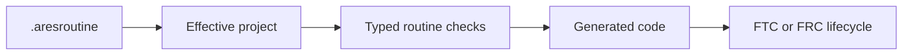
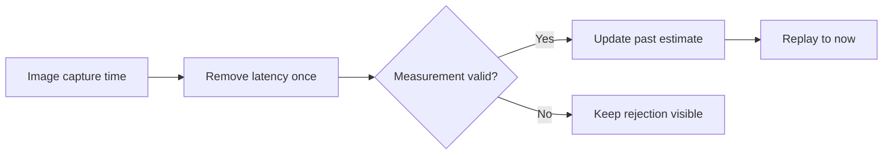

# Autonomous paths, localization, and vision

Autonomous code needs one trusted path from the team's plan to the robot runtime. It also needs a
clear way to handle late or uncertain camera measurements.

## From routine to runtime

The compiler resolves stable names for subsystems, abilities, resources, and tasks. Every used name
must be declared. A lifecycle adapter must not contain a hidden second routine parser.

External path files may supply reviewed path points. They are inputs to the canonical routine, not
a second source of robot meaning.

## Coordinate rules

- Path X and Y use field-relative meters.
- Tangent and robot heading use radians.
- Positive turns go counter-clockwise.
- Alliance mirroring happens once at the stated runtime boundary.
- The screen's field-to-pixel change is only for drawing.

Before a path runs, reject empty paths, values that are not finite, unsafe field intersections,
broken endpoints, and conflicting limits. Stop the drivetrain if loading or execution fails.

## Use vision at the right time

The timestamp must describe when the camera captured the image, not when code received it. Reject
unknown tags, high ambiguity, impossible uncertainty, points outside history, and very large jumps.
Do not replace the estimate with simulator truth or force it to snap just to improve the display.

Simulation checks this data flow. It cannot prove camera position, focus, exposure, wiring,
calibration, or field setup.

## Check your understanding

1. Why should alliance mirroring happen only once?
2. Why does capture time matter?
3. What should the system show when a camera measurement is rejected?
