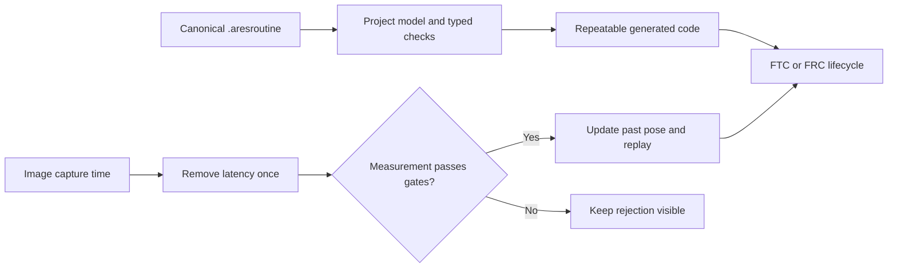

# Autonomous paths, localization, and vision

## Purpose and prerequisites

Autonomous code needs one trusted path from a team plan to the robot runtime. Localization needs one
clear coordinate system. Vision needs honest handling of delay and uncertainty. This reference joins
those three ideas without treating a clean simulation as proof of a physical robot.

Read [ARESLib architecture and ownership](/docs/areslib-fundamentals) first. It helps to know that a
pose has X, Y, and heading. Keep the current routines, localization, and coordinate sources open.
This page applies to ARES 13.0.0 and Studio 3.1.0.

## Vocabulary

- **Routine:** a checked `.aresroutine` plan made from known actions.
- **Action catalog:** the allowed action types and fields a routine may use.
- **Field frame:** the agreed field axes, units, origin, and turn direction.
- **Localization:** an estimate of the robot pose from motion and sensors.
- **Capture time:** the time when a camera image was taken.
- **Latency:** the delay between capture and use of a measurement.
- **Uncertainty:** a numeric description of how unsure a measurement is.
- **Rejection gate:** a check that keeps unsafe or unusable evidence out of the estimator.

ARES path X and Y values use field-relative meters. Headings use radians. Positive turns go
counter-clockwise. Alliance mirroring happens once at the stated runtime boundary. A screen may
convert field values to pixels for drawing, but pixels never become the robot's control frame.

## Worked example

Suppose a routine says, “follow path A, then run the intake ability.” The routine refers to stable
names. The project model resolves those names. The compiler checks that the path, subsystem,
ability, resource, and task exist. Generation creates repeatable Kotlin and a manifest. The FTC or
FRC lifecycle starts the generated routine. A lifecycle adapter must not hide a second parser with
different meaning.

Now suppose a camera result arrives 120 milliseconds after capture. The estimator has already moved
forward. Code should not pretend the result describes the present. It uses the capture timestamp,
checks the measurement, updates the matching point in pose history, and replays later motion to now.
Latency is removed once, not in both the camera adapter and estimator.

The measurement stays rejected when its tag is unknown, ambiguity is too high, or uncertainty is
not valid. It also fails when capture time falls outside history or the pose jump breaks a reviewed
gate. Rejection is evidence. The UI and logs should show the failed stage instead of snapping to a
nicer-looking pose.

## Visual model

External path files can provide reviewed points. They are inputs to the canonical routine, not a
second source of robot meaning. Empty paths, values that are not finite, broken endpoints, unsafe
intersections, and conflicting limits should stop loading or execution.

## Hands-on activity

First, use the path lab to compare waypoint spacing and turn shape.

<autonomouspathlab />

This interaction draws a teaching path. It does not read a team routine, check field obstacles,
compile generated code, or prove that a robot can follow the path.

Next, use the uncertainty lab. Change one measurement condition at a time. Record the first gate
that rejects the sample and the evidence needed to resolve it.

<visionuncertaintylab />

This interaction does not load a camera image, field layout, pose history, or estimator. It cannot
calibrate a camera or validate a physical robot. Use real telemetry and pinned source for project
decisions.

## Checkpoints

Before running an autonomous routine, check that:

1. every stable name resolves in the effective project;
2. path units, axes, origin, and turn signs match the ARES field frame;
3. alliance mirroring occurs once;
4. endpoints and limits pass the stated checks;
5. any required localization input is current and valid;
6. camera capture time has one clear source;
7. uncertainty and rejection reasons remain visible; and
8. a load or execution failure moves the drivetrain to safe neutral.

Simulation is a useful software evidence level. It does not prove camera placement, focus, exposure,
wiring, calibration, field setup, traction, or physical clearance.

## Troubleshooting

| Symptom | First boundary to inspect | Useful evidence |
| --- | --- | --- |
| Path is mirrored twice | alliance transform ownership | points before and after the runtime boundary |
| Robot turns the wrong direction | frame sign or heading units | radians and positive-turn trace |
| Routine action is missing | project model or action catalog | compiler error with stable name |
| Vision pose jumps forward | capture time or latency | capture, receive, and use timestamps |
| Good samples are rejected | uncertainty or gate limits | all gate inputs and first failure |
| Bad samples are accepted | adapter normalization | raw result and normalized measurement |
| Simulation passes, robot misses | physical evidence gap | calibration, traction, and localization logs |

Change one boundary at a time. Keep the original run and compare the same evidence after the change.
Do not replace an estimate with simulator truth to make a graph look correct.

## Evidence artifact

Create an autonomous evidence packet for one routine. Include its stable identity, action list, path
source, coordinate frame, generated manifest, start conditions, stop conditions, and safe neutral.
Add one annotated telemetry view with units and timestamps.

For one vision sample, record capture time, receive time, tag identity, ambiguity, uncertainty, pose,
gate result, and rejection reason. Separate observed values from your explanation. Leave out student
names, account IDs, precise private locations, and other personal data.

## Short assessment

1. Why must alliance mirroring happen only once?
2. What is the difference between capture time and receive time?
3. Why does a delayed pose update start in estimator history?
4. What should happen when a routine name cannot be resolved?
5. Name two reasons to reject a vision measurement.
6. Which physical facts cannot be proved by this page's interactions?

Check each answer against the pinned sources. Revise answers that describe only what the screen looks
like instead of the data contract.

## Extension challenge

Trace one current routine from its `.aresroutine` document to generated Kotlin and the platform
lifecycle. List every stable name and the check that resolves it. Then find where a failed routine
moves the drive request to neutral.

For another challenge, take one saved vision result and draw a time line from image capture to the
present pose. Mark exactly where latency is removed and where the past estimate is replayed. If the
real code differs, record the source line and ask whether the contract or implementation should
change.

## Related and next

Use [Task Sequences, Resources, and Cleanup](/docs/sequencing-and-resources) to review group finish
rules, actuator resource conflicts, bounded waits, and interrupted cleanup before a routine runs.

- Review [ARESLib architecture and ownership](/docs/areslib-fundamentals) when a routine crosses
  project, compiler, runtime, or adapter boundaries.
- Review [Drivebase, swerve, and kinematics contracts](/docs/swerve-and-kinematics) for the robot
  frame and drivebase geometry used by localization.
- Continue with [Telemetry, control state, and offline logs](/docs/telemetry-and-control) to preserve
  timestamps, rejected evidence, and run comparisons.
