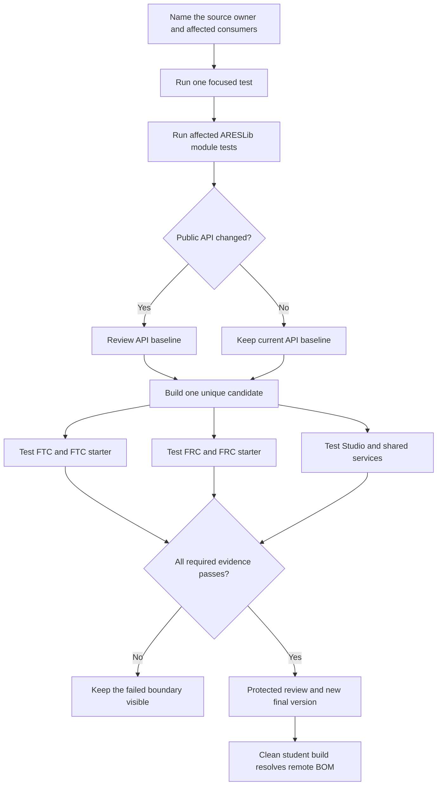

# Develop, test, and validate ARESLib changes

## Purpose and prerequisites

An ARESLib change can pass one small test and still break an FTC robot, an FRC robot, Studio, or a
starter project. This reference shows how to match evidence to the boundary that changed. It also
explains why one version name must always point to one exact set of library files.

This page applies to ARES 15.0.3 and Studio 5.0.5. Read
[ARESLib Architecture and Ownership](/docs/areslib-fundamentals) first. Use
[Test Robot Logic Across Mocks and Simulation](/academy/programming-tests-parity?path=programming-with-ares)
when you need to compare behavior at two runtime boundaries.

Most students consume a released ARESLib version. They do not need an ARESLib checkout or the
release credentials. The candidate and publishing steps below are for trusted library maintainers.
They are not instructions to publish from a student computer.

## Vocabulary

- **Focused test:** the smallest test that checks the code being changed.
- **Module test:** tests for one Gradle module, such as core or an FTC adapter.
- **Consumer:** a product that compiles and runs with ARESLib.
- **Public API baseline:** a checked list of types and functions that other code may use.
- **Candidate:** a temporary library build with a unique prerelease version.
- **Validation repository:** an isolated local Maven repository that holds candidate files.
- **Coordinate:** the group, artifact, and version that identify one library file set.
- **BOM:** a Bill of Materials that keeps related ARES modules on one version.
- **Composite substitution:** a developer option that replaces a released dependency with sibling
  source code.
- **Immutable:** unable to change after a version is released.

## Choose the owner before the test

Start by naming the source owner. A documentation change needs link and policy checks. An FTC
season change needs FTC tests and simulator checks. A shared ARESLib change needs library tests and
consumer checks. A public API change also needs a reviewed API baseline.

Do not run the largest command first and call that a plan. A useful plan starts with the smallest
test that can explain a mistake. It then expands to every boundary that could be affected.

| Changed boundary | First useful evidence | Required wider evidence |
| --- | --- | --- |
| Documentation only | link and policy checks | review the rendered document |
| One FTC season project | focused season test | FTC unit, simulator, and APK checks |
| Shared ARESLib behavior | focused and module tests | unique candidate through every affected consumer |
| Public ARESLib API | focused tests and API review | unique candidate through every affected consumer |
| Final released dependency | clean remote resolve | representative student build without sibling source |

## Worked example

Imagine a maintainer changes a shared pose helper. FTC, FRC, and Studio all use it. The focused pose
test passes. That proves the helper passed selected cases inside its module. It does not prove that
all three consumers received the same candidate or still agree on units.

The maintainer runs the affected ARESLib module tests. If the public API changed on purpose, the
maintainer updates and reviews the API baseline. Next, the build creates a candidate such as
`12.1.0-rc.abc123`. The exact candidate is written to an isolated validation repository.

FTC, FRC, Studio, and both starter sources then resolve that exact version from that exact
repository. Composite source substitution stays off. A green matrix supports a narrow claim:

> These consumer builds passed against candidate `12.1.0-rc.abc123` from this validation repository.

It does not prove that a physical robot is safe. It also does not make the candidate a final
release. Final publishing uses a separate protected workflow after review.

## Visual model

The candidate has its own identity. A final version also has its own identity. Neither identity may
be reused for different bytes later.

## Hands-on activity

Use the lab below to match a change to the smallest complete validation plan.

<releasevalidationlab />

The lab follows the pinned ARES 15.0.3 development and publishing documents. It does not inspect a
branch, run a build, publish files, or approve a release.

Then create a change card for one real proposed change. Do not edit or publish anything yet.

1. Name the owning folder and exact file.
2. List every product that imports the changed contract.
3. Write one focused test command or test name.
4. Name the affected module tests.
5. Decide whether the public API baseline should change.
6. Write a unique candidate pattern using `<next-version>-rc.<commit>`.
7. List the FTC, FRC, Studio, and starter checks that apply.
8. State how composite source substitution will stay off during candidate checks.
9. Add one clean remote consumer check for a final release.
10. Mark every check as planned, passed, failed, or not run.

Never place repository credentials, signing keys, tokens, or private build logs in this card.

## Why version identity matters

The release manifest owns the final ARESLib and Studio versions. Normal season projects resolve the
ARES BOM and modules from the ARES GitHub Maven repository. Maven Central may be a second channel.
Both channels must return the same files for the same coordinate.

Suppose two different JAR files are both given the fictional coordinate `core:9.9.9`. One developer may receive the cached
first file. Another may receive the second file because repository order changed. Both builds print
the same version, so the mismatch is hard to see. This is a version identity collision.

The repair is not to clear every cache forever. The repair is to give changed files a new semantic
version. Candidate files use a unique prerelease coordinate. Final files use a new final coordinate.
The release repository is append-only, so published bytes are not replaced.

## Student consumption

A normal student project imports the ARES BOM once. Individual ARES modules then omit their own
version, so Gradle keeps them together. Checked FTC and FRC build logic also selects the matching
desktop simulation runtime.

A student build should not need `-ParesUseSiblingLib=true`. That flag is an explicit library
developer escape hatch. It can hide a missing remote artifact because the build uses sibling source
instead. A release check therefore uses a clean consumer with substitution off.

## Checkpoints

- Did you name the source owner before choosing commands?
- Does the focused test check the changed rule rather than a nearby feature?
- Did you list every consumer that receives the changed library?
- Is an intentional public API change visible in the API baseline?
- Is the candidate version unique to one source revision?
- Do all consumers use the exact candidate and validation repository?
- Is composite source substitution disabled for candidate and remote checks?
- Does one coordinate point to one immutable file set?
- Is a failed or skipped consumer still visible?
- Is physical robot evidence kept separate from library build evidence?

## Troubleshooting

| Symptom | First check |
| --- | --- |
| Consumer cannot find the candidate | Match the exact candidate version and validation repository URI. |
| Local build passes but clean build fails | Check for accidental sibling source substitution or a cached local repository. |
| API check fails | Review whether the public change is intentional; do not erase the baseline failure blindly. |
| FTC passes but FRC fails | Keep the FRC result visible and inspect the shared contract, units, and adapter boundary. |
| Simulator starts with no OpMode | Check the season runtime classpath and the fully qualified OpMode selection. |
| Desktop tests cannot load FRC native code | Check the matching WPILib JDK and desktop native dependencies. |
| Network test says a port is busy | Stop the earlier test process cleanly before rerunning the port-owning suite. |
| Two machines receive different files for one version | Treat it as a version collision and assign changed bytes a new version. |
| Student build needs an ARESLib checkout | Check the remote repository, BOM version, and published module set. |

Do not weaken a consumer check just because another product passed. A red boundary tells you where
the current evidence stops.

## Evidence artifact

Create one validation packet. Include the source commit, changed paths, owner, affected consumers,
public API decision, focused tests, module tests, candidate version, repository location, and full
consumer matrix. Record the command, result, and time for each check.

For a final release, add the protected review, new final coordinate, and clean remote consumer
result. Record which checks were not run. Do not claim that build evidence proves wiring,
calibration, robot motion, or field safety.

## Short assessment

1. Why is one focused test useful but incomplete for a shared library change?
2. When must the public API baseline be reviewed?
3. Why does a candidate need a unique prerelease version?
4. Why should consumer validation disable sibling source substitution?
5. What makes a version identity collision difficult to diagnose?
6. Why must a released coordinate never point to new bytes?
7. What does the BOM do for a student project?
8. What evidence is still missing after every build passes?

## Extension challenge

Trace one current ARES module from `release/ares-versions.properties` to the BOM, a season project,
and a simulator runtime. Draw the repositories and substitutions that Gradle could inspect. Mark
the normal remote path and the explicit sibling-development path.

Next, design a failure drill. Pick one consumer that rejects a candidate. Write the smallest test
that could explain the failure. Keep the candidate identity and the failed matrix row unchanged
while you investigate.

## Related and next

- Return to [Find Your Way Around the ARES Workspace](/academy/ares-workspace-map?path=robotics-foundations)
  to review source ownership and release folders.
- Use [Test Robot Logic Across Mocks and Simulation](/academy/programming-tests-parity?path=programming-with-ares)
  to separate compile, lifecycle, behavior, and physical evidence.
- Use [Subsystem Ownership, I/O, and Safety](/docs/subsystems-ownership-and-safety) before a shared
  mechanism contract crosses FTC, FRC, and simulator adapters.
- Use [Typed Tuning Profiles and Safe Experiments](/docs/typed-tuning-and-safe-experiments) when a
  tested change is a bounded value rather than a new library release.
