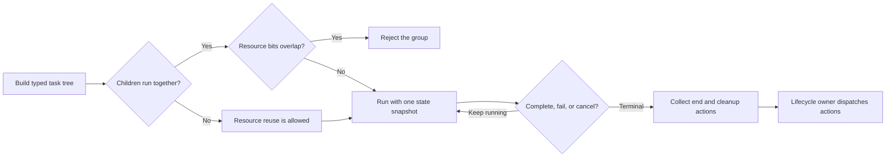

# Task sequences, resources, and cleanup

## Purpose and prerequisites

ARESLib uses **tasks** when robot work must happen in a clear order. A task can wait, send an
action, follow a path, or wrap other tasks. This reference explains how task groups finish, how
resource bits prevent unsafe overlap, and how cleanup actions return to Redux.

Read [ARESLib Architecture and Ownership](/docs/areslib-fundamentals) first. You should know what
an action, reducer, controller, and immutable state are. This page is pinned to ARES 13.0.1. It can
support source review and software tests, but it cannot prove that a physical mechanism is safe.

## Vocabulary

- **Task:** one job with start, update, finish, and cleanup steps.
- **Sequence:** tasks that run one after another.
- **Parallel group:** tasks that start together and finish when every child finishes.
- **Race group:** tasks that start together and finish when the first child finishes.
- **Deadline group:** tasks that start together, but one named child decides when the group ends.
- **Resource:** one bit that names robot work such as drive, intake, arm, or lighting.
- **Timeout:** a limit that changes an unfinished task into a failed task.
- **Cancellation:** a stop that runs interrupted cleanup instead of success cleanup.
- **Preemption:** higher-priority work pauses the active task and runs first.

## Worked example

Imagine an autonomous routine that drives toward a game piece while running an intake. Both jobs
may run together because one claims `DRIVE` and the other claims `INTAKE`. A sensor wait can race
the intake so the group ends when the piece arrives. The wait needs a timeout so a broken sensor
cannot leave the routine waiting forever.

When the wait wins, the unfinished intake task is interrupted. Its `end` function must return a
safe stop action. The task does not dispatch that action itself. `TaskExecutor` returns the action
to the robot lifecycle owner, and that owner sends it through the Redux store.

If two direct children in a concurrent group both claim `DRIVE`, ARES rejects the group while the
tree is built. A sequence may reuse `DRIVE` because only one child runs at a time. A task that uses
hardware must not claim `NONE` just to bypass the check.

## Visual model



This diagram shows ownership, not timing. It does not run the Kotlin executor, model a motor, or
check whether cleanup reached a physical device.

## Group rules

| Group | What starts? | What ends the group? | What happens to unfinished children? |
| --- | --- | --- | --- |
| Sequence | One child at a time | The final child finishes | Later children do not start after failure or cancellation |
| Parallel | Every child | Every child finishes | A failure or cancellation interrupts the group |
| Race | Every child | The first child finishes | Remaining children are interrupted |
| Deadline | Deadline and companions | The deadline finishes | Unfinished companions are interrupted |

Resource checking happens when a concurrent group is built. It is not extra work inside the fast
robot loop. ARES reserves named bits for common work and separate ranges for generated subsystems
and season code.

## Task tree explorer

Use the explorer to compare group finish rules and resource conflicts. Give both children the same
resource, then switch between sequence, parallel, race, and deadline. Test normal completion,
failure, and cancellation.

<tasksequencelab />

The explorer is a fixed two-child teaching model. It does not import an ARES task tree, run
`TaskExecutor`, dispatch Redux actions, command hardware, or prove cleanup on a robot.

## Hands-on activity

1. Open the pinned `RobotSequence.kt` source.
2. Find the builders for sequence, parallel, race, and deadline groups.
3. Write the finish rule beside each builder.
4. Open `TaskResources.kt` and list the named resource bits used by your project.
5. Find the generated-subsystem and season-code bit ranges.
6. Open `TaskGroupDispatcher.kt` and find the direct-child conflict check.
7. Find where race and deadline groups interrupt unfinished children.
8. Open `Task.kt` and trace `initialize`, `execute`, `isCompleted`, and `end`.
9. Open `TaskExecutor.kt` and find where returned actions remain caller-owned.
10. Trace one failure and one cancellation through interrupted cleanup.
11. Draw a task tree for one real routine and label every actuator resource.
12. Add a finite timeout to every sensor wait.

Run the focused ARESLib tests from the reviewed monorepo revision:

```powershell
cd ARESLib-Kotlin
.\gradlew.bat :core:test --tests "com.areslib.sequencer.RobotSequenceDslTest" --tests "com.areslib.sequencer.TaskLifecycleRegressionTest"
```

Record the source revision, command, result, and one physical fact the tests cannot prove.

## Checkpoints

- Does each task name one clear job?
- Do direct children that run together claim different resource bits?
- Does every hardware task claim its real resource instead of `NONE`?
- Does every sensor wait have a finite timeout?
- Does interrupted cleanup return a safe output action?
- Does the lifecycle owner dispatch every returned action?
- Does a failure stop queued and preempted work?
- Is software evidence kept separate from physical evidence?

## Troubleshooting

| Symptom | First check |
| --- | --- |
| Concurrent group will not build | Look for two direct children that claim the same resource bit. |
| Sequence never advances | Check the active child's completion rule and timeout. |
| Race ends but a mechanism stays active | Inspect the losing child's interrupted `end` actions and caller dispatch. |
| Timeout starts later work | Trace the failed status and executor cancellation path. |
| Cleanup action is missing | Use `cancelAll(state)` and dispatch the returned actions. |
| Paused time counts against a task | Use executor suspension and its shared `RobotClock` time domain. |
| Preempted work is not neutral | Review the exact active task and its `pause` action; do not assume a nested child handled it. |
| Test changes between runs | Use fixed state snapshots and the ARES clock instead of wall-clock calls. |

Keep the first failure visible. Do not remove a resource claim, timeout, or cleanup test merely to
make a task tree run.

## Evidence artifact

Create a one-page task review with:

- the routine goal;
- the full task tree;
- every group finish rule;
- one resource label for each hardware task;
- every wait condition and timeout;
- success, failure, cancellation, and cleanup paths;
- the lifecycle owner that dispatches returned actions; and
- the focused test command and result.

Robot verification is student-led under the team's normal safety procedure. Record the robot,
software revision, stop method, observation, and remaining limits. Website posts use the separate
Lead Coach editorial workflow before publication.

## Short assessment

1. Why may a sequence reuse one resource when a parallel group may not?
2. How is a race different from a deadline group?
3. Why does `NONE` not make a hardware task safe?
4. What should happen when a sensor wait times out?
5. Who dispatches actions returned by the executor?
6. What does a passing task test still not prove about a physical robot?

## Extension challenge

Design a **collect, confirm, then stow** task tree. Add a bounded sensor wait, resource labels, and a
safe interrupted cleanup action. Predict the actions returned for success, timeout, and
cancellation. Then write focused tests for all three paths.

For a harder review, add one higher-priority preempting task. State which output must be neutral
while the first task is paused, how time resumes, and which source or test proves each claim.

## Related and next

- Use [Build Safe Task Sequences in ARESLib](/academy/programming-safe-task-sequences?path=programming-with-ares)
  for the longer guided lab and code exercise.
- Continue with [Autonomous Paths, Localization, and Vision](/docs/autonomous-and-vision) to connect
  generated routines with path and measurement contracts.
- Use [Telemetry, Control State, and Offline Logs](/docs/telemetry-and-control) to record task status
  without turning the dashboard into a second control loop.
