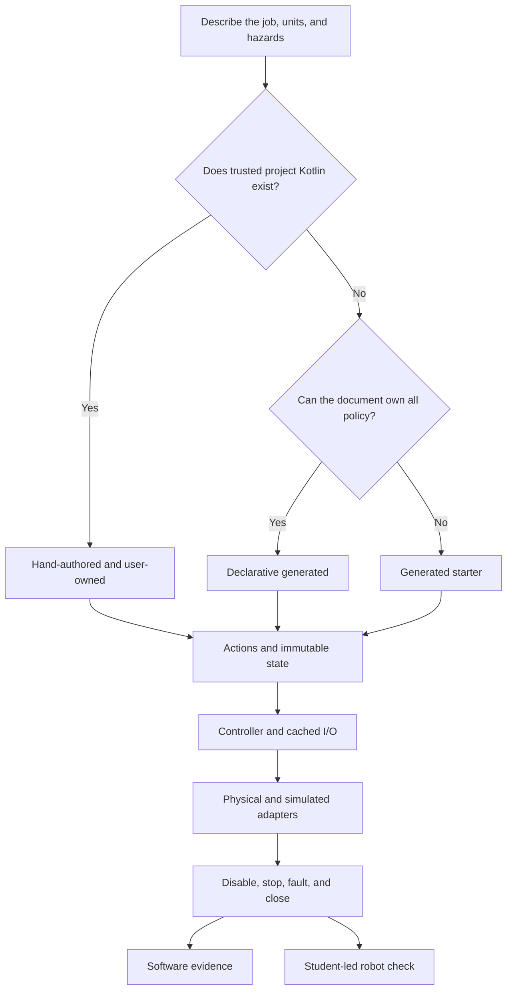

# Subsystem ownership, I/O, and safety

## Purpose and prerequisites

An ARES subsystem owns one robot job. It might move an arm, spin an intake, or read a sensor. This
page helps you choose who owns its source. It also helps you trace its parts and check its safe
behavior. It applies to ARES 16.0.1, ARES FTC 16.0.1, and Studio 6.0.1.

Read [ARESLib Architecture and Ownership](/docs/areslib-fundamentals) first. Learn what an action,
reducer, controller, and adapter do. Use the longer
[Choose and Author an ARES Subsystem](/academy/programming-code-subsystem?path=programming-with-ares)
lesson when you are ready to review a real mechanism step by step.

## Vocabulary

- **Subsystem document:** the canonical `.aressubsystem` file under `.ares/subsystems/`.
- **Declarative generated:** ARES builds the runtime from the checked document.
- **Generated starter:** ARES creates editable Kotlin once and then protects it.
- **Hand-authored:** the project owns existing Kotlin and declares its integration facts.
- **User-owned:** source that ARES must never replace.
- **Generated plumbing:** repeatable build output that belongs under `build/generated`.
- **I/O contract:** the units, cached inputs, outputs, neutral state, and cleanup rules.
- **Fresh input:** a cached reading that is valid and recent enough for control.
- **Parity:** the physical and simulated adapters follow the same observable rules.
- **Capability action:** a named command exposed to controls or autonomous routines.

## Worked example

Suppose a team needs an elevator. Begin with ownership, not file count. Current subsystem schema 11
offers three paths:

| Starting point | Implementation kind | Source ownership | What ARES may do |
| --- | --- | --- | --- |
| The document can describe the whole job | `DECLARATIVE_GENERATED` | `GENERATED_DO_NOT_EDIT` | Rebuild runtime plumbing, mock support, and baseline checks from the document. |
| Students need new editable Kotlin | `GENERATED_STARTER` | `GENERATED_STARTER` | Create missing starter files; replace a changed starter only through reviewed replacement. |
| Proven or custom Kotlin already exists | `HAND_AUTHORED` | `USER_OWNED` | Validate declared source and integration facts, but never generate or replace that source. |

For a generated starter, students first state the elevator's units and positive direction. They
also state its limits, homing rule, feedback age, neutral output, and fault recovery. Preview shows
each planned file. The normal create task cannot replace an edited starter. A separate replace task
needs the exact token for the reviewed diff. If either file changes, that token no longer fits.

For hand-authored code, the document names the Gradle module and source files. It also names the
subsystem class, I/O contract, device adapter, sim support, teaching notes, and action keys. ARES
does not scan Kotlin and guess these facts. Keeping tested project code may be safer than rewriting
it to match a template.

All paths must keep a request apart from what sensors saw. A target height is a request. The height,
valid flag, and sample time are facts from a sensor. The controller may ask for motion only when
setup, homing, calibration, and feedback checks are healthy.

## Visual model



Generated code can reduce repeated plumbing. It cannot prove device identity, wiring, motor
direction, sensor scale, mechanism clearance, or safe physical motion.

## Hands-on activity

Choose one real subsystem in a checked-in project. Do not invent hardware or test results.

1. Find its `.aressubsystem` document, or record that it is missing.
2. State the job, physical units, positive direction, and safe neutral.
3. List its Kotlin, action keys, tuning values, adapters, simulator support, and tests.
4. Mark each file as user-owned, generated starter, or generated do-not-edit.
5. Trace one request from an action to immutable state, controller, and output call.
6. Trace one sensor read into a cached value, validity flag, state update, and telemetry.
7. Check disable, stop, failed write, successful neutral recovery, and close behavior.
8. Compare the physical and simulated adapters against the same limits and fault rules.
9. Use the ownership lab to reveal any missing contract item.

<subsystemownershiplab />

The lab is a fixed plan model. It does not read a project or check a descriptor. It does not compile
Kotlin, run a sim, or command hardware. A filled lab is not proof that work was approved.

For an FTC project, preview before writing:

```powershell
.\gradlew.bat :TeamCode:previewSubsystemChanges
.\gradlew.bat :TeamCode:generateSubsystemStarters
.\gradlew.bat :TeamCode:generateAresProject
.\gradlew.bat :TeamCode:verifyAresProject
```

Record the source revision, command, result, and any check you did not run. The `clean` task may
delete generated folders. The source documents can build them again. Do not copy generated parts
into normal source folders.

## Checkpoints

- Does the implementation kind match who really owns the source?
- Can a reviewer tell which files students may edit?
- Does every input have a unit, validity rule, age limit, and one refresh owner?
- Does every actuator have finite command bounds and a safe neutral?
- Does nonzero output require healthy configuration and required homing or calibration?
- Do failed writes latch safely and require an explicit successful neutral to recover?
- Do disable, stop, fault, and close reach neutral without depending on a fresh motion command?
- Do the physical and simulated adapters enforce the same contract?
- Does each capability action exist in the project action catalog?
- Are source, test, simulation, build, and physical evidence labeled separately?

## Troubleshooting

| Symptom | First check |
| --- | --- |
| A preview wants to replace user-owned Kotlin | Stop and inspect the ownership metadata; user-owned source is never replaceable. |
| A starter changes but the token fails | Re-run preview and review the new diff; tokens are tied to exact file hashes. |
| Studio cannot show existing code | Add accurate hand-authored metadata instead of scanning or guessing classes. |
| A motor moves with stale feedback | Check the cached sample age, validity, and output permit. |
| A fault clears on the next move request | Require a separate successful neutral before re-arming. |
| Simulation passes but the robot moves backward | Treat direction as an unverified physical fact and use a bounded student-led check. |
| A clean build removes source | Confirm that only generated plumbing was under `build/generated`. |
| Controls cannot call the subsystem | Check that the declared capability key exists in the action catalog. |

Keep failures visible. Do not remove a validity check, safe output, ownership header, or test just to
make generation or simulation pass.

## Evidence artifact

Create a one-page subsystem contract map. Include the source document and each Kotlin file. Name
its owner, module, path, and job. Add arrows for state, control, cached I/O, device and sim adapters,
lifecycle setup, and tests.

Below the map, record:

- one ownership fact confirmed by pinned source;
- one behavior confirmed by a test or simulator run;
- one build command and result;
- one physical fact that remains unknown; and
- the exact safe stop method for a future robot check.

Robot verification is student-led under the team's normal safety procedure. Record the robot,
software revision, bounded test, observation, and evidence limits. Website posts use the separate
Lead Coach editorial workflow before publication.

## Short assessment

1. When should a project keep a subsystem hand-authored?
2. Why is generated plumbing different from an editable generated starter?
3. Why does starter replacement need a hash-bound review token?
4. Which observations must be cached and checked before motion?
5. What should happen after a nonzero output write fails?
6. What can a simulator prove, and what still needs a robot check?

## Extension challenge

Review one real subsystem without changing it. Compare its document with its source and tests.
Pick one result: keep it, improve its facts, use a generated starter, or plan a hand-written change.
Support the choice with pinned source and test proof. Do not rewrite working code just to cut the
file count.

## Related and next

- Use [Choose and Author an ARES Subsystem](/academy/programming-code-subsystem?path=programming-with-ares)
  for the full guided review and evidence ladder.
- Continue with [Task Sequences, Resources, and Cleanup](/docs/sequencing-and-resources) when several
  subsystem jobs must share resources and clean up safely.
- Use [Telemetry, Control State, and Offline Logs](/docs/telemetry-and-control) to record useful
  evidence without making the dashboard a second controller.
- Use [Typed Tuning Profiles and Safe Experiments](/docs/typed-tuning-and-safe-experiments) when a
  subsystem declares bounded values or supports a guarded live experiment.
- Use [Test Robot Logic Across Mocks and Simulation](/academy/programming-tests-parity?path=programming-with-ares)
  to compare adapters against the same behavior table.
