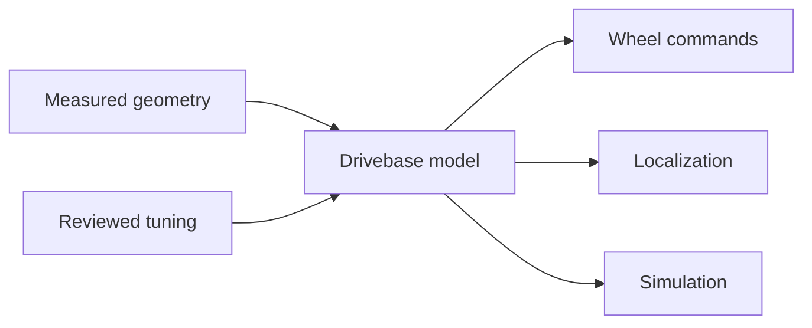

# Drivebase, swerve, and kinematics contracts

A drivebase describes how a robot moves. It includes the physical wheel layout, measured geometry,
sensor locations, control rules, safety limits, and simulation model. **Kinematics** is the math that
connects robot motion to wheel motion.

## Keep facts and tuning apart

Physical facts include wheel locations, module order, gear ratios, wheel size, and encoder units.
Tuning includes gains and motion limits. A tuning change must not quietly change physical topology.

## Swerve module rules

A swerve module can turn and drive. The module order and each module's X and Y position must stay the
same across generation, control, odometry, telemetry, and simulation. A swapped module can make the
math look correct while the robot moves the wrong way.

The control path should:

1. receive a robot motion request;
2. turn it into one speed and angle for each module;
3. keep values inside reviewed limits;
4. choose a safe wheel-angle representation; and
5. write through the platform adapter.

Localization uses measured wheel and heading changes to estimate pose. It must use the same units,
signs, and module positions as control.

## Fail closed

Reject missing geometry, non-finite values, duplicate module names, invalid ratios, and limits that
cannot be applied safely. On a failed write or stale required input, move to the stated safe output.
Do not invent a device or silently switch to a different drivebase.

## Student evidence activity

Draw the robot as a rectangle. Mark X forward and Y left. Add each wheel at its measured position
and label the canonical module name. Compare the drawing with generated configuration and the
simulator. For a physical robot, follow the team's safety procedure and test one restrained command
at a time.

## Check your understanding

1. Which drivebase values are measured facts?
2. Why must module order match across every layer?
3. What should happen when required geometry is missing?
