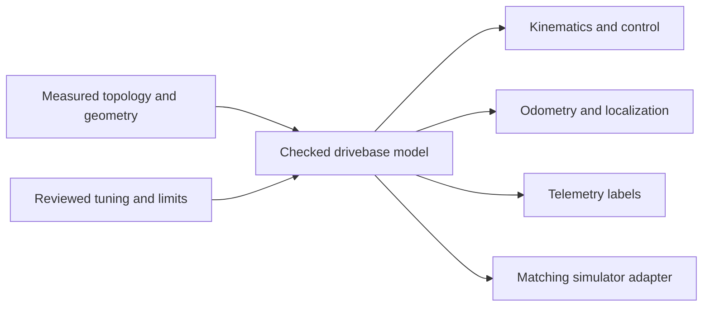

# Drivebase, swerve, and kinematics contracts

## Purpose and prerequisites

A drivebase description connects the robot's real shape to control, localization, telemetry, and
simulation. This reference explains which values are measured facts and which values are tuning.
It also shows why stable module identity matters.

Read [ARESLib architecture and ownership](/docs/areslib-fundamentals) first. You should know that X
points forward, Y points left, and positive turns go counter-clockwise in the ARES robot frame. Keep
the current drivebase authoring source open while you work.

## Vocabulary

- **Topology:** the kind, count, and arrangement of drive devices.
- **Geometry:** measured positions and sizes, such as wheel radius and module location.
- **Stable UID:** an identity that stays the same across files, generation, and runtime.
- **Kinematics:** math that changes robot motion into wheel or module motion.
- **Odometry:** a pose estimate built from measured robot motion.
- **Tuning:** gains, limits, and other reviewed values used by control code.
- **Adapter:** the FTC, FRC, or simulator code that reads and writes a device.
- **Safe neutral:** the stated output used when a required input or write fails.

ARES stores canonical drivebase documents under `.ares/drivetrains`. Supported families include FTC
mecanum, FRC CTRE swerve, differential drive, and an advanced custom path. The document is the source
of topology. A tuning overlay may adjust allowed tuning fields, but it must not quietly move a wheel
or replace the drive type.

## Worked example

Picture a four-module swerve robot. Each module needs a stable name and UID. Each also needs an X and
Y location measured from the chosen robot origin. The front-left module might be at positive X and
positive Y. Its exact numbers come from the real design, not this lesson.

Generation carries that identity into configuration and code. Kinematics uses the same positions to
find module speed and angle. Odometry uses them again to estimate motion. Telemetry and simulation
must use the same order. If one layer swaps front-left and rear-left, the values can still look like
valid numbers while the robot behaves incorrectly.

Now separate facts from tuning. Module location, wheel size, gear ratio, and sensor units describe
the built robot. Steering gain, speed limit, and acceleration limit describe reviewed control
choices. Changing a gain should not change the robot drawing. Changing wheel radius should trigger
a new measurement record and checks across control and localization.

## Visual model

Every output path should fail closed. Missing geometry, duplicate IDs, values that are not finite,
invalid ratios, and unusable limits are errors. The system must not invent a module or silently pick
a different drivebase.

## Hands-on activity

Use the comparison lab to explore how robot goals differ across common drivebase families.

<drivetrainchoicelab />

This interaction compares concepts. It does not select hardware, read a `.aresdrivetrain` file,
calculate your robot's real limits, or validate a physical drivebase.

Next, draw a rectangle for a real or planned robot. Mark the origin, X forward, and Y left. Add every
wheel or module. Copy each stable identity from the current project file. Put the measured X and Y
values beside it. Make a second list for gains and motion limits. Do not mix the two lists.

For a physical robot, follow the team's safety procedure. Keep the robot restrained for the first
bounded checks. Students can verify one module identity and one low command at a time, then record
what the robot actually did.

## Checkpoints

Use these checks before generation or testing:

1. Each module or wheel has one unique, stable identity.
2. The document uses the stated robot frame and units.
3. Module order matches generation, control, odometry, telemetry, and simulation.
4. Measured facts have a source, date, and method.
5. Tuning changes cannot rewrite topology.
6. Required values are finite and inside valid ranges.
7. A stale input or failed write has a clear safe-neutral response.
8. The simulator uses the same contract without claiming physical proof.

## Troubleshooting

| Symptom | Likely boundary | First check |
| --- | --- | --- |
| Robot rotates during a forward request | module identity or geometry | compare module order and X/Y signs |
| Pose drifts at a steady rate | units, ratio, or wheel size | compare measured distance with reported distance |
| One module turns the wrong way | adapter sign or device mapping | run one bounded module check |
| Simulation and robot disagree | contract or adapter parity | compare the same input snapshot and request |
| A tuning edit changes the layout | schema or overlay boundary | inspect the generated diff |
| Output continues after stale input | controller or adapter safety | inspect fault state and neutral write |

Do not fix an identity problem by changing several signs until motion looks right. Record the first
failed boundary, correct one fact, and repeat the same bounded check.

## Evidence artifact

Create a drivebase contract sheet. Include a labeled top view, origin, axes, stable IDs, measured
positions, units, wheel size, ratios, sensor sources, and safe neutral. Add a separate tuning table
with each gain or limit and its test evidence.

Attach three short notes: what source code confirms, what simulation confirms, and what still needs a
physical check. A screenshot is useful only when it shows the label, value, units, and context. Do
not include private account data or unapproved team media.

## Short assessment

1. What is the difference between topology and tuning?
2. Why must module identity stay stable across every layer?
3. Which direction is positive Y in the ARES robot frame?
4. What should happen when a required position is missing?
5. Why can a simulator pass while a physical module still fails?
6. Which evidence would show that wheel radius is wrong?

Use the pinned source to check each answer. A complete answer names both the rule and the evidence
that would test it.

## Extension challenge

Choose one drive request, such as forward motion with no turn. Predict the desired state for each
wheel or module. Then trace the request through the real project model, generated configuration,
kinematics, and adapter. Record where identity and units are checked.

For another challenge, compare the simulator adapter with the physical platform adapter. List the
contract methods they share. Explain which differences are required by the platform and which would
break parity.

## Related and next

- Review [ARESLib architecture and ownership](/docs/areslib-fundamentals) when a drive change crosses
  a module boundary.
- Continue with [Telemetry, control state, and offline logs](/docs/telemetry-and-control) to record
  drive requests, measurements, and faults.
- Continue with [Autonomous paths, localization, and vision](/docs/autonomous-and-vision) to connect
  the drivebase frame to paths and delayed pose measurements.
