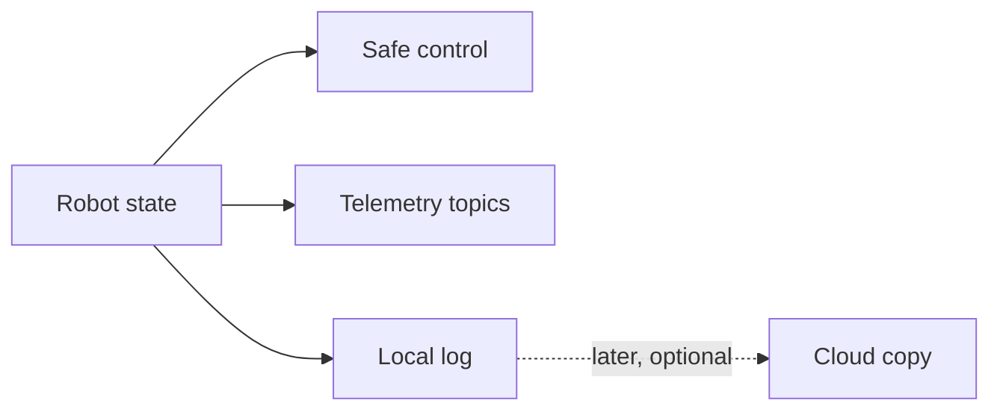

# Telemetry, control state, and offline logs

**Telemetry** is data the robot sends so people can understand what it is doing. Logs save that
story for later. Neither one should secretly control the robot.

## Keep three jobs separate

Control reads current state and decides an output. Telemetry publishes selected facts. Logging saves
a time-ordered record. Losing a dashboard or internet connection must not stop the robot loop.

## Topic rules

Use canonical NT4 topic names and units. A topic should keep the same meaning across the robot,
simulator, and dashboard. Store units in the contract instead of expecting readers to guess. Do not
reuse one topic for different kinds of values.

Useful telemetry includes:

- requested and measured motion;
- estimated pose and its time;
- battery or power limits;
- routine state and failure reason; and
- whether a sensor observation was accepted or rejected.

Publish at a bounded rate. High-rate values can fill memory, slow a network, or hide useful signals.

## Offline-first logs

The robot writes logs locally first. A local log should stay useful when the internet is missing.
Cloud upload is a later, optional step. Keep its failure visible, but do not tie it to safe control.

Use a stable session ID and ordered timestamps. Record units and source names. Avoid student names,
emails, or other personal data in diagnostics.

## Quick review

For one drive command, list:

1. the state used by control;
2. the topic a dashboard may read;
3. the facts a local log should keep; and
4. what still works when the network is unplugged.

## Check your understanding

1. Why should telemetry never be the only source of control state?
2. What makes a topic name useful?
3. Why are robot logs local first?
