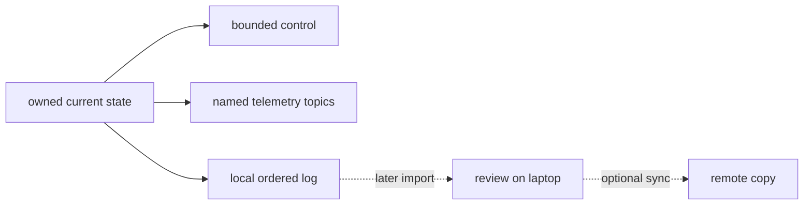

# Telemetry, control state, and offline logs

## Purpose and prerequisites

**Telemetry** is data a robot or simulator sends so people can understand what it is doing. A log
saves that story for later. Neither one should secretly control the robot.

In this lesson, you will read invented telemetry, separate an observation from an explanation, and
design a small evidence record. Read [ARESLib Architecture and
Ownership](/docs/areslib-fundamentals?path=areslib-engineering-reference) first. The Academy lesson
[Simulation Is Not Hardware
Validation](/academy/simulation-is-not-hardware-validation?path=testing-debugging-commissioning)
is useful practice before you treat simulator evidence as robot evidence. No physical robot is
needed.

The topic and logging examples are pinned to the current ARES 16.0.1 contract. A real review must
still confirm the source identity and version stored with that run. Never copy a topic meaning from
one robot or simulator into another record without checking its contract.

## Vocabulary

- **State:** the current facts that robot control owns.
- **Control:** logic that reads state and chooses a bounded output.
- **Telemetry:** selected state copied to named topics for observation.
- **Topic:** a stable name and type for one telemetry signal.
- **Unit:** the scale attached to a value, such as volts, meters, or seconds.
- **Sample:** one value recorded at one time.
- **Timestamp:** the time attached to an event or sample.
- **Log:** an ordered local record saved for later review.
- **Observation:** a statement directly supported by visible data.
- **Explanation:** a possible reason that needs more evidence.
- **Dropped frame:** an accepted sample the logger could not preserve.
- **Offline-first:** useful operation that does not depend on internet access.

## Worked example

An invented graph shows battery voltage at six one-second times. The lowest visible value is `11.8
V` at `3 s`. That sentence is an observation because the axes, unit, time, and value support it.

“A motor caused the dip” is an explanation. It may be reasonable, but the voltage graph alone does
not show motor commands, current, mechanism state, or another event at the same time. A useful next
step is to compare a second source-aligned signal rather than repeat the explanation as fact.

ARES keeps control, telemetry, and logs separate. Control reads current owned state. Telemetry copies
selected facts. The local logger stores bounded records. A dashboard or internet failure must not
become a robot-control failure.

For pose, `ARES/EstimatedPose` is one atomic `[x, y, heading]` array. The scalar
`ARES/EstimatedPose/0..2` values and `Drive/Pose_X`, `Drive/Pose_Y`, and `Drive/Pose_Heading` must
describe the same field frame and counter-clockwise-positive heading. A display must not choose one
source only because it arrived last and hide a disagreement.

## Visual model

The graph and flow show evidence routes. They do not model ARES timing, network load, a controller,
or one real robot session.

## Hands-on activity

1. Open the Telemetry Graph Lab below.
2. Select the voltage-dip data set.
3. Read the horizontal and vertical axes, including units.
4. Copy every time and value into an evidence table.
5. Choose the statement that is an observation.
6. Write one possible explanation in a separate column.
7. Name one extra signal or event that could test that explanation.
8. Repeat the steps for steady distance.
9. Select the missing-sample data set.
10. Leave the missing value blank; do not draw or calculate a replacement.
11. Write how a dropped frame, stopped sensor, or display issue would remain separate hypotheses.
12. Add topic name, type, unit, source identity, and time basis to each record.
13. Reset the lab and ask another student to repeat your classification.

<telemetrygraphlab />

The three data sets are fixed lesson examples. They are not team logs and cannot prove why any real
signal changed.

## Checkpoints

- Does every signal have one stable name, type, and unit?
- Is the time basis clear?
- Are missing samples visible instead of filled silently?
- Does each observation name a visible value, trend, peak, or gap?
- Are explanations labeled as hypotheses?
- Does the next step request a useful second signal or bounded test?
- Is control independent from dashboard, cloud, and internet availability?
- Do topic names omit a transport-only leading slash?
- Does a pose comparison keep the atomic and scalar sources in the same frame and units?
- Do logger checks include dropped frames, queue depth, and a cleanly closed file?
- Does the record avoid student names, emails, and other personal data?

## Troubleshooting

| Symptom | Check |
| --- | --- |
| Two topics look like the same signal | Compare canonical name, type, unit, source, frame, and sign before joining them. |
| A plot has no unit | Return to the source contract. Do not guess the scale. |
| A line crosses a missing sample | Break the line and preserve the gap. |
| The graph proves a cause | Rewrite the claim as an observation, then request another signal or test. |
| Robot and simulator disagree | Check whether both use the same topic meaning, units, sign, geometry, and source revision. |
| A completed log is not listed | Confirm the writer closed cleanly. Active `.csv.gz.active` files stay hidden until a successful close. |
| A log is missing data | Check `Diagnostics/Logging/DroppedFrames`, `QueueDepth`, source freshness, and session completion. |
| Pose appears twice or flickers | Compare the atomic and scalar pose sources. Do not hide a frame or sign mismatch with last-arrival wins. |
| A topic works only with a leading slash | Fix the publisher or subscriber; ARES normalizes topic names without the slash. |
| A dashboard disconnect stops control | Treat that as a design defect; control must not depend on the display path. |

## Evidence artifact

Submit a telemetry review page for all three invented data sets. Include topic request, type, unit,
time basis, visible observations, missing samples, two possible explanations, and the next useful
signal or test. Add the fixed lesson-data label and the source version.

Create a second table with control, telemetry, local log, laptop import, and optional remote copy.
For each row, state what it owns, what may fail, and what must keep working offline. Do not include
personal data, credentials, raw private identifiers, or claims copied from a different robot.

Add the local-log handoff. Stop the run cleanly, inspect logger health, and list completed logs on
port `5002`. Pull the named file to the laptop and verify the copy before considering deletion.

## Short assessment

1. How is control different from telemetry?
2. Why does a topic need a stable name, type, and unit?
3. What is the difference between an observation and an explanation?
4. Why should a missing sample stay visible?
5. Why are ARES logs local first?
6. Why should atomic and scalar pose topics use the same frame and heading sign?

Good answers keep current control state, displayed copies, stored evidence, and optional network
services as separate boundaries.

## Extension challenge

Design a four-signal packet for a made-up mechanism. Include requested output, measured position,
sensor freshness, and one stop or fault state. Give each a name, type, unit, expected rate, and
reason. Then describe one graph pattern that would be visible without claiming a cause.

Write a disconnected-network test plan for the same packet. State what control, telemetry, logging,
later import, and optional synchronization should do. Keep it software-only; do not move hardware.

## Related and next

Continue with [Compare Logs and Replay a Failure](/academy/testing-logs-replay?path=testing-debugging-commissioning)
to align complete records by source identity and shared events. Use [Read a Telemetry Graph Like a
Scientist](/academy/read-a-telemetry-graph?path=math-for-robotics) for more graph-reading practice.
Use [Build a Fault Tree and Isolate a Cause](/academy/testing-fault-tree?path=testing-debugging-commissioning)
before turning one pattern into a diagnostic test. Use [Build Bounded FTC Driver Station
Telemetry](/academy/ftc-driver-station-telemetry?path=testing-debugging-commissioning) to trace the
current season helper, shared snapshot cadence, and non-blocking display boundary.
