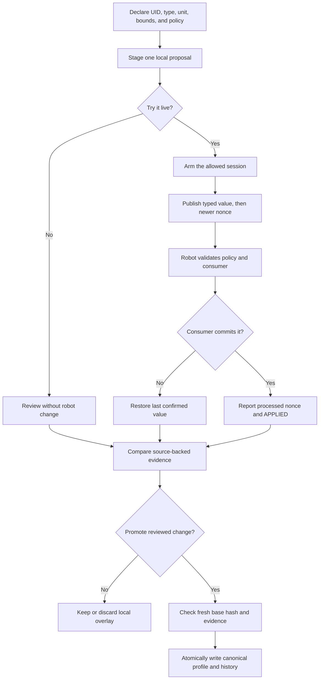

# Typed tuning profiles and safe experiments

## Purpose and prerequisites

ARES typed tuning gives each adjustable value a name, type, unit, range, default, and apply rule.
It lets a team test a small change without turning every robot constant into a live control. This
reference explains what may change, when it may change, and how an accepted experiment becomes a
checked-in profile. It applies to ARES 17.0.1, ARES FTC 17.0.1, and Studio 7.0.2.

Read [ARESLib Architecture and Ownership](/docs/areslib-fundamentals) first. Use
[Run SysId and a Bounded Tuning Experiment](/academy/testing-sysid-tuning?path=testing-debugging-commissioning)
for the longer guided lab. This page does not connect to a robot or approve physical motion.

## Vocabulary

- **Declaration:** the type, unit, bounds, default, owner, and apply rule for one value.
- **Stable UID:** an identity that stays with a value even if its display name changes.
- **Canonical profile:** a reviewed `.arestuning` file under `.ares/tuning/`.
- **Local overlay:** a temporary experiment under `.ares/local/tuning/`.
- **Proposal:** a typed value staged for review; staging alone changes nothing on the robot.
- **Nonce:** a whole number that increases for each live request.
- **Consumer:** compiled robot code that knows how to use one declared value.
- **Promotion:** an explicit, atomic update from reviewed evidence to a canonical profile.
- **Provenance:** where evidence came from and which exact files or runs support it.

Hardware identity is not tuning. Motor names, CAN IDs, inversion, gearing topology, and wiring belong
in the drivebase or subsystem description. Tuning is for bounded values such as a gain, limit, or
threshold whose meaning is already declared.

## Worked example

In this invented example, a drivetrain declares a translation gain. Its stable UID is
`drive.translation.kp`. It is a finite decimal with no hidden unit, a lower bound of 0, an upper
bound of 50, and the `LIVE_SAFE` apply rule. A practice profile stores 2.0.

A student stages 2.4 in Studio. That proposal does not change a file or send a robot command. To try
it live, the tuning session must be armed. Studio publishes the typed value, then publishes a newer
request nonce. The robot checks the UID, type, bounds, and apply rule. It also checks that compiled
consumer code supports the UID. The consumer must return success after placing the value in its
runtime storage.

The robot then reports the processed nonce and result. If the consumer rejects the value or its
callback fails, ARES restores the last confirmed value. A timeout means the result is unknown; it
does not mean the value was accepted. Even an `APPLIED` result changes only the experiment. It does
not edit the canonical profile.

After the team compares a baseline and candidate run, a student can build a promotion review. The
review shows the exact before and after values, evidence, profile hash, reviewer field, and summary.
Promotion fails if the reviewed base hash is stale. A successful promotion writes the canonical
profile atomically and keeps history. It does not push a value to the robot.

### Apply rules

| Apply rule | What ARES requires |
| --- | --- |
| `LIVE_SAFE` | An armed tuning session and a supported compiled consumer. |
| `DISABLED_ONLY` | An armed session plus a disabled robot, or outputs that are neutral and inhibited. |
| `RESTART_REQUIRED` | Save and restart instead of applying live. |
| `REBUILD_REQUIRED` | Change the checked project and rebuild. |
| `CALIBRATION_ONLY` | An armed calibration session that names this exact UID. |
| `READ_ONLY_VENDOR` | Inspect the value, but do not change it through tuning. |

The name `LIVE_SAFE` is narrow. It means the declared value may use the guarded live transaction.
It does not say that any motion, mechanism, or test area is physically safe.

## Visual model

The request and promotion paths are separate on purpose. A robot connection never copies a live
value into the checked project by itself.

## Hands-on activity

Open the tuning lab below and use **Part 2: compare one tuning change**. Keep the baseline fixed.
Choose one proposed value, state the direction you expect the metric to move, and choose the useful
percentage before you reveal the candidate result.

<sysidtuninglab />

The lab uses invented, fixed data. It does not read your project, connect to Studio, send a nonce,
apply a value, write a profile, or prove robot safety. Use it to practice the decision process.

Then inspect one real checked-in profile. For each assignment, find its declaration and record:

1. stable UID and owning component;
2. type, unit, bounds, and default;
3. apply rule and why that rule fits;
4. canonical or local authority;
5. evidence needed before promotion; and
6. one physical fact the profile cannot prove.

Do not copy private paths, student identity, credentials, or unrelated telemetry into the record.

## Checkpoints

- Is the value declared by a real component rather than added as an unowned key?
- Does the proposal match the exact type and stay inside finite bounds?
- Is hardware identity kept outside live tuning?
- Does the apply rule match the session state?
- Did Studio publish the typed value before a newer nonce?
- Did the robot report the same nonce as processed?
- Does compiled consumer code support and accept the stable UID?
- Is a timeout recorded as unknown instead of success?
- Does the experiment leave the canonical profile unchanged?
- Does promotion use a fresh base hash, evidence, reviewer field, and useful summary?

## Troubleshooting

| Symptom | First check |
| --- | --- |
| Unknown parameter | Match the stable UID to the current declaration set. |
| Invalid value | Check the exact type, finite number rule, enum choices, and bounds. |
| Session not armed | Stop and use the correct tuning or calibration session. |
| Robot must be disabled | Disable it or prove outputs are neutral and inhibited; do not bypass the rule. |
| Restart or rebuild required | Follow the declared policy instead of forcing a live push. |
| Consumer unsupported | Add and test the compiled consumer mapping before another request. |
| Consumer rejected or callback failed | Keep the prior confirmed value and inspect controller evidence. |
| Three-second acknowledgement timeout | Mark the result unknown and check transport and robot logs. |
| Promotion says the base is stale | Reload the current profile, review the new diff, and repeat the decision. |
| A local value appears in canonical source | Stop and inspect the promotion path; runtime must not write canonical files. |

Keep failed and rejected attempts visible. They can show a wrong assumption, missing consumer, or
unsafe policy before the same mistake reaches a robot.

## Evidence artifact

Create a one-page tuning change record. Include the project and profile UID, source revision,
parameter UID, owner, type, unit, bounds, and apply rule. Add the baseline value, proposed value,
prediction, threshold, held constants, baseline and candidate evidence, result, rollback, and
decision.

If a live request was used, record the request nonce, processed nonce, result, and whether the
consumer was supported. If promotion was used, record the reviewed base hash, evidence hashes,
reviewer field, summary, resulting profile hash, and history path. State clearly which checks were
not run.

Robot verification is student-led under the team's normal safety procedure. A typed policy does not
replace a reachable stop, clear test area, correct limits, or a student watching the full test.
Website posts use the separate Lead Coach editorial workflow before publication.

## Short assessment

1. Why is a stable UID safer than using a display name as a transport key?
2. What is the difference between a declaration and a profile assignment?
3. Why does Studio publish a value before a newer nonce?
4. What must happen before a live value remains active?
5. Why is a timeout not proof of failure or success?
6. Why does an `APPLIED` experiment not edit the canonical profile?
7. When should a value require restart, rebuild, or calibration instead of live apply?
8. What does a fresh base hash protect during promotion?

## Extension challenge

Review one real parameter without changing it. Trace its declaration, profile assignment, runtime
lookup, transport topics, consumer callback, test, and evidence path. Draw the line between facts
proved by source, behavior proved by a test or simulation, and physical facts still unknown.

For a second challenge, design a one-change Local Sim experiment. State the metric, percentage
threshold, held constants, eligible evidence, rollback, and a second metric that could reveal a
regression. Do not treat the plan as approval for physical motion.

## Related and next

- Use [Run SysId and a Bounded Tuning Experiment](/academy/testing-sysid-tuning?path=testing-debugging-commissioning)
  for the guided comparison workflow.
- Use [Choose and Author an ARES Subsystem](/academy/programming-code-subsystem?path=programming-with-ares)
  to see how a subsystem owns tuning declarations.
- Use [Subsystem Ownership, I/O, and Safety](/docs/subsystems-ownership-and-safety) when a value
  crosses controller, physical adapter, and simulator boundaries.
- Use [Telemetry, Control State, and Offline Logs](/docs/telemetry-and-control) to keep experiment
  evidence separate from control authority.
