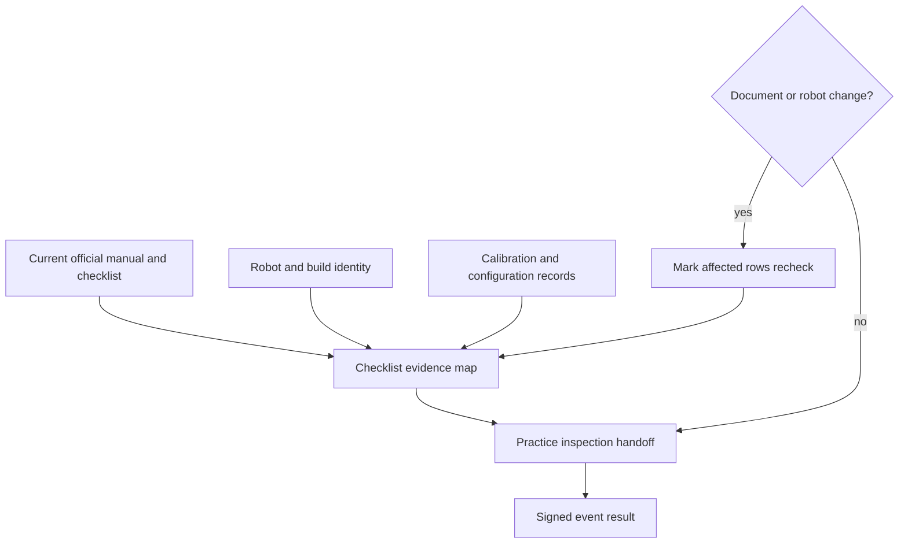

# Prepare an FRC robot for inspection and the pit

## Purpose and prerequisites

FRC inspection checks a robot against the current season manual and official inspection checklist.
It is also a conversation: the team should be able to find evidence, explain a configuration, and
record an open item without guessing. This lesson builds that process before the season documents
are complete.

Complete [Know What a Simulator Can Prove](/academy/simulation-is-not-hardware-validation?path=testing-debugging-commissioning)
first. Use the official [FRC game and season page](https://www.firstinspires.org/programs/frc/game-and-season)
to find current materials. Confirm the year, title, revision, and access date. A past-season manual
or inspection list may help you practice the workflow, but it cannot supply current limits.

As of this lesson's source review, the 2027 challenge and inspection materials were not yet the
current published authority. For that reason, this lesson gives no robot dimension, weight,
electrical, bumper, software, or construction value. Students can lead the team's evidence and
functional verification. The official checklist and event inspector determine the inspection
result.

## Vocabulary

- **Inspection checklist:** the official list used to record robot inspection results.
- **Manual:** the current season rules and event requirements published by FIRST.
- **Revision:** a dated change to an official document.
- **Evidence owner:** the student responsible for locating and recording one bounded fact.
- **Configuration identity:** the hardware, software, and settings expected on this robot build.
- **Calibration:** a measured setting tied to a known robot state.
- **Reinspection:** another inspection after a change or when the event process calls for one.
- **Fail-safe:** behavior that moves the robot toward a safer output when a fault occurs.

## Worked example

An FRC group prepares a packet before kickoff. The first page says **2027 authority pending**. It
links to the official season page and records the last access date. The team does not copy limits
from the 2026 checklist.

Students still prepare a robot identity page. It lists the expected build, deployed configuration,
calibration files, hardware map, tested stop states, and who owns each evidence area. The team also
records which checks can happen while disabled and which need a separate controlled test.

The current ARES FRC operations guide adds useful team checks. Verify the selected autonomous entry
and generated action catalog. Inspect the deployed swerve-offset file, confirm expected hardware
topology, and enable mechanisms one at a time. These are operational readiness checks. They do not
claim that an official FRC inspection row passed.

If a swerve offset changes after a known calibration, the team records the old and new file identity,
reviews all four values, rebuilds, and retests steering orientation. The inspection packet marks any
related official rows for review after the current checklist is available.

## Visual model

The three inputs answer different questions. Official documents define what is checked. Robot
identity shows which build is present. Team records show the evidence used for that build.

## Hands-on activity

Build a local inspection-readiness packet without student names or contact details. Start with an
authority table:

| Record | Bounded entry |
| --- | --- |
| Official season page | FIRST game and season URL |
| Manual title and revision | Pending until current material exists |
| Inspection checklist title and revision | Pending until current material exists |
| Retrieval date | Date each file was checked |

Create a robot identity card. Include repository release or commit, generated project status,
deployed configuration identity, hardware-map identity, calibration-file identity, and last known
safe-state test. Use **unknown** when evidence is missing.

Create a blank evidence map for future official rows. Add columns for checklist item, official page,
student owner, disabled observation, controlled test if needed, result, and recheck trigger. Do not
invent the official item text.

Rehearse three change cards. Card one says that FIRST posted a newer manual revision. Card two says
a hardware device changed. Card three says a calibration file changed. For each card, name the
records and checks that become stale. Keep unaffected evidence instead of restarting blindly.

Use the practice lab below to audit the FRC packet. Check only facts that are written in it.

<inspectionpacketlab />

The lab does not load the current manual, read calibration files, or inspect a robot. Its complete
state means the six packet facts are present. It does not mean the robot passed inspection.

Finally, write a one-sentence pit handoff: current build identity, current document revision, open
items, and the next bounded action. A partner repeats the handoff in their own words.

## Checkpoints

The season and document revision must be visible on the packet. A downloaded filename alone does
not prove it is current. The official page should still point to the same or newer file.

Every robot identity value needs a source. “Latest code” is not an identity. A release, commit,
generated verification result, or file hash is bounded and repeatable.

Separate physical observations from desktop evidence. A passing build or simulation cannot prove
wiring, device identity, steering direction, calibration, or mechanism stops. A physical check also
cannot prove that the source tree built cleanly.

Students should record the result and uncertainty. When a check reaches the team's safety boundary,
pause and switch to the approved process for that type of physical work.

## Troubleshooting

If an old checklist keeps appearing in search results, enter through the official season page and
compare dates. Label the old copy with its season before keeping it for practice.

If a configuration cannot be identified, do not call it current. Record the unknown field, preserve
the robot state, and choose the smallest check that can establish identity.

If a calibration value changes without a known procedure, quarantine the new file. Do not hide the
difference with a second correction elsewhere. Return to the known calibration process and preserve
both records.

If too many items remain open, group them by evidence owner and stop condition. Do not let several
people change the same system at once. One change and one verification path make the result easier
to trust.

## Evidence artifact

Submit the authority table, robot identity card, blank or current evidence map, three change-card
answers, and pit handoff. Mark the packet **practice** while the current official documents are
pending.

After official materials exist, attach their titles and revisions before using the map. After a real
inspection, preserve the signed checklist with the robot build identity. If the robot changes, keep
the signed record as history and mark affected rows for the event's reinspection process.

## Short assessment

1. What makes a manual or checklist the current authority?
2. Why does the packet need a robot build identity?
3. Name two checks that desktop simulation cannot prove.
4. What should happen after a calibration-file change?
5. Why should unaffected evidence be preserved?
6. What information belongs in a short pit handoff?

A strong answer connects each claim to its official source, robot identity, and bounded evidence.
It leaves an unknown visible instead of replacing it with confidence.

## Extension challenge

Create a dependency map with four nodes: official document, robot hardware, robot software, and
calibration. Add one invented change to each node. Draw arrows to the evidence that becomes stale.
Explain why a source-only change and a physical-only change need different retests.

Then design a compact reinspection log with change time, change type, affected rows, evidence owner,
result, and next action. Test it during a disabled paper rehearsal. Do not represent the rehearsal as
a signed event result.

## Related and next

Continue with [Run a Drive-Team Match Cycle](/academy/competition-drive-team?path=competition-operations).
Use [Review, Repair, and Record after a Match](/academy/competition-post-match?path=competition-operations)
after any match change that may affect inspection evidence. Before every event, return to the
official FRC season page and confirm that the packet names the newest manual and checklist revision.
