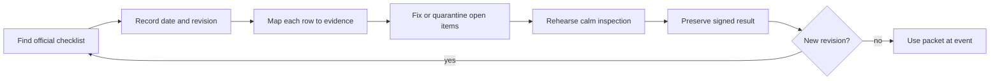

# Prepare an FTC robot for inspection and the pit

## Purpose and prerequisites

Robot inspection is a comparison between the robot and the current official checklist. It is not a
memory test, and it is not proof that the robot will work in a match. This lesson helps you build an
inspection packet and rehearse a calm pit process before the season checklist is available.

Complete [Know What a Simulator Can Prove](/academy/simulation-is-not-hardware-validation?path=testing-debugging-commissioning)
first. Open the official [FTC game and season materials](https://ftc-resources.firstinspires.org/ftc/game)
and [FTC event resources](https://ftc-resources.firstinspires.org/ftc/archive/2027/event) when you do
this activity. Use the newest dated files from FIRST. A saved copy from an older season is evidence
of history, not a current rule.

As of this lesson's source review, the 2026–2027 inspection checklist was still listed as coming
soon. This lesson therefore does not state a size, weight, part, software, or electrical limit.
Students can run and record every verification step allowed by the team's safety process. The
official checklist and event inspector decide whether the robot passes inspection.

## Vocabulary

- **Inspection packet:** the current checklist, supporting records, and team notes used at inspection.
- **Authority:** the official source that controls a rule or checklist item.
- **Revision:** a dated version of a document.
- **Evidence:** a fact that can be observed, measured, or traced to a source.
- **Pit:** the team's event work area.
- **Preflight:** a short set of checks before the robot leaves the pit.
- **Quarantine:** a label that keeps a questionable part or file out of use.
- **Stop condition:** a fact that ends a check until the team uses a safer process.

## Worked example

A student opens the official FTC event page. The page still says that the inspection checklist is
coming soon. The student does not copy values from last season. Instead, the team makes a packet
cover page with four fields: season, document title, revision date, and download date. The checklist
rows remain blank until the official file appears.

The group can still prepare useful evidence. One student makes a labeled robot map. Another records
the current control-system and hardware configuration. A third lists each planned preflight check
and its owner. The team places a red **not current** label on an older checklist so nobody mistakes
it for the season authority.

The robot also has ARES evidence. Before enabling, compare the expected hardware topology with
connected devices. Check finite battery voltage, confirm stop states, and verify local log access.
Those checks support robot readiness. They do not replace any FTC checklist row.

## Visual model

The loop matters because FIRST may publish a newer file. A packet is current only when its recorded
revision still matches the official page.

## Hands-on activity

Create a paper or local digital packet. Do not enter student names, phone numbers, or private notes.
Start with an authority record:

| Field | What to record |
| --- | --- |
| Program and season | FTC and the current season name |
| Official page | The FIRST event-resource link |
| Checklist title | Leave pending until the file exists |
| Revision or update date | Copy from the official file |
| Retrieved on | Your access date |

Next, make an evidence map with one row for each official checklist item when the checklist arrives.
Use columns for the item, source page, student owner, evidence method, result, and follow-up. Never
turn a guess into a pass. Use **not checked**, **pass**, **needs work**, or **not applicable with
source note**.

While the current checklist is pending, rehearse the packet process with three neutral cards:
**official source found**, **evidence recorded**, and **open item isolated**. A partner introduces a
change such as “a newer revision appeared” or “the robot configuration changed.” State which packet
rows must be checked again.

Add a separate ARES preflight page. Include expected hardware topology, finite battery reading,
tested stop states, sensor freshness, and local log access. Label this page **team readiness, not FTC
inspection authority**.

## Checkpoints

The official URL must belong to FIRST. A screenshot without its source page and date is not enough.
The packet must show which revision it uses. An older checklist may be kept for comparison only when
it is clearly labeled as old.

Every checklist row needs a result and evidence. “Looks good” is too broad. A measurement needs the
tool, unit, value, and checklist source. A configuration check needs the expected identity and the
observed identity.

The ARES preflight page must remain separate. A healthy log, finite sensor value, or passing desktop
test cannot approve an FTC rule item. Students should pause when a check would cross the team's
safety boundary or when the official wording is unclear.

## Troubleshooting

If two official files seem different, compare their revision dates and links. Keep both until the
newest authority is clear. Record the question instead of combining their values.

If the checklist is not published, do not fill the gap with a blog, forum post, or last season's
numbers. Prepare the evidence-map structure and return to the official page later.

If a robot change happens after rehearsal, mark the affected rows **recheck**. Do not erase the old
result. The change record explains why new evidence is needed.

If the pit becomes rushed, use one packet owner and short handoffs. Move repairs and deep diagnosis
away from the inspection table. Keep questionable parts or settings quarantined until their status
is known.

## Evidence artifact

Submit an inspection-readiness packet with the authority record, blank or current checklist map,
ARES preflight page, revision-change rehearsal, and open-question list. Include no private student
information.

Mark the packet **practice** until the current official checklist is attached. After a real
inspection, preserve the signed result and the checklist revision together. That record shows what
was checked at that event; it does not automatically apply after the robot changes.

## Short assessment

1. Why is an old checklist not a current rule source?
2. What four facts identify an official document revision?
3. Why is an ARES preflight page separate from the FTC inspection checklist?
4. What should you write when a result is unknown?
5. What happens to the packet when the robot or official checklist changes?
6. Who can record the team's robot verification evidence?

A strong answer names the official authority, preserves uncertainty, and gives students clear
ownership of the evidence process.

## Extension challenge

Design a one-page change-impact form. Include the changed part or setting, time, affected checklist
rows, prior evidence, new check, result, and student owner. Test it with one invented hardware
change and one new-document-revision scenario.

Then compare the form with the team's match preflight. Circle fields that can be reused and mark
fields that serve different purposes. Inspection asks whether the robot matches official rules.
Preflight asks whether the known robot state is ready for the next team action.

## Related and next

Continue with [Run a Drive-Team Match Cycle](/academy/competition-drive-team?path=competition-operations).
Before an event, return to the official FTC pages and replace the pending checklist entry with the
newest dated file. Use [Review, Repair, and Record after a Match](/academy/competition-post-match?path=competition-operations)
when a later robot change may affect inspection evidence.
