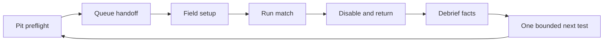

# Run a drive-team match cycle

A match cycle starts before the robot leaves the pit and ends after the team saves evidence. Clear
roles and short checklists help the team notice changes. The goal is not to rush. The goal is to
bring a known robot state to the field and return with useful facts.

## Purpose and prerequisites

Complete [Know What a Simulator Can
Prove](/academy/simulation-is-not-hardware-validation?path=testing-debugging-commissioning) first.
You should know how to match a claim to a test boundary.

This draft teaches a general FTC and FRC operations pattern from current ARES source documents. It
does not replace the current event rules, inspection list, queuing directions, or the team's final
role assignment. Those items need review before this lesson is published for an event.

## Vocabulary

- **Match cycle:** the steps before, during, and after one match.
- **Pit:** the team's work area at an event.
- **Queue:** the event area where teams line up before a match.
- **Preflight:** short checks completed before leaving the pit.
- **Role:** one person's named responsibility during the cycle.
- **Handoff:** a clear transfer of information or control.
- **Safe state:** the required robot condition before handling or repair.
- **Debrief:** a short review of facts after the match.

## Worked example

The team has fifteen minutes before queueing. A student checks the selected autonomous routine and
records its name. Another student checks battery status and visible hardware. The drive team confirms
the expected starting position and one stop signal.

At the field, one person gives the final setup call. Other students report only facts that change
the plan. After the match, the operator disables the robot and the team returns to the pit.

The debrief records that the intake stopped during the second cycle. The team does not write “bad
motor” because that cause was not tested. It records the time, visible result, driver command, and
next bounded check.

## Visual model

Each arrow is a handoff. The person receiving the handoff repeats the key state so both people know
what changed.

## Hands-on activity

Use a paper robot or a disabled practice setup. Assign these temporary roles: drive lead, operator,
pit check lead, and evidence recorder. One person may hold two roles in a small group.

Create a five-item preflight list from verified project facts. Include the chosen routine, expected
safe state, battery check, one visible hardware check, and the planned starting condition. Do not
copy event-specific values from memory.

Run a timed practice cycle without powering the robot. The pit lead gives the queue handoff. The
drive lead repeats the routine and safe state. Pretend the match ends with one visible symptom. The
recorder writes only observations.

Use the evidence activity below to choose the next test level for the symptom. Keep the test small.

<evidencelevelscenarios />

Repeat the cycle with one changed fact, such as a different routine or a sensor marked unavailable.
The second handoff must state that change aloud and in the record.

## Checkpoints

Every checklist item needs an owner and a result. “Check robot” is too broad. “Confirm selected
routine name” and “record finite battery voltage” are bounded checks.

The queue handoff should name the robot state, routine, and any known limit. The field handoff should
not introduce an untested change. If a required fact is unknown, stop and ask for the event process.

During the debrief, separate observation from cause. A mechanism that did not move is an observation.
A failed motor controller is one possible cause that still needs evidence.

## Troubleshooting

If several people give commands, assign one final call for each phase. Other team members should
report facts to that role instead of starting competing actions.

If the checklist grows too long, move deep diagnosis out of preflight. Preflight confirms a known
state. Diagnosis belongs in a bounded pit test after the robot is safe.

If the group cannot repeat what changed, repair the handoff. Use one sentence with the old state,
new state, and reason. Keep the written record visible.

## Evidence artifact

Submit a one-page match-cycle packet. Include the role table, five-item preflight list, queue
handoff, field setup statement, mock match observation, and next-test choice.

Add a debrief table with time, command, observed result, supported claim, and next question. Mark
all practice results as mock or rehearsal evidence. Do not present them as a real event record.

List the event documents that still need review. Include the current game manual, inspection list,
schedule or queue process, and final team role assignment.

## Short assessment

1. When does a match cycle begin and end?
2. What three facts belong in a queue handoff?
3. Why should a debrief record an observation before a cause?
4. What should happen when a required fact is unknown?
5. Why must rehearsal data be labeled as rehearsal data?

A strong answer shows how each role shares one robot state. It does not invent a rule or hide an
unexpected result.

## Extension challenge

Create a second match cycle for a robot with one unavailable sensor. Decide which routine or feature
must remain disabled. Write the handoff and the test needed before that feature can return.

Compare FTC and FRC event operations only after reading the current official documents. Make a table
of facts that match, facts that differ, and items that need team review.

## Related and next

Continue with scouting, evidence-based strategy, and post-match fault isolation. Use the FTC or FRC
inspection lesson only after the current official rules are attached to its source request. Practice
the complete cycle again before each event process changes.
