# Collect useful scouting evidence

## Purpose and prerequisites

Scouting is a planned way to record what a robot or match did. Useful scouting starts with a clear
question. It keeps an observation separate from a possible explanation.

In this lesson, you will improve an invented scouting record. You will not collect student names,
contact details, private notes, or judgments about people. Complete [Run a Drive-Team Match Cycle](/academy/competition-drive-team?path=competition-operations)
and [Read a Telemetry Graph Like a Scientist](/academy/read-a-telemetry-graph?path=math-for-robotics)
first.

This draft teaches an evidence process, not the team's final scouting form. The current team process
and approved non-private examples still need review.

## Vocabulary

- **Scouting:** planned collection of robot or match observations for a team question.
- **Observation:** a fact seen or measured in the named source.
- **Inference:** a possible meaning or cause suggested by observations.
- **Context:** the match phase, task, conditions, and other facts needed to read a record.
- **Sample:** one observed match, run, action, or measurement.
- **Sample size:** the number of observations that support a summary.
- **Missing data:** a field that was not observed or could not be read.
- **Conflict:** two records that disagree about the same event.
- **Provenance:** information that identifies where evidence came from.
- **Personal data:** information that identifies or contacts a person.

## Worked example

An invented record says, “Team 99999 has a bad intake.” That sentence has several problems. “Bad”
is a judgment. The source, match, task, and sample count are missing. A cause was not tested.

A stronger record says:

> In invented Match Q4, the robot attempted the floor pickup three times during the driver period.
> Two attempts moved the object inside the frame. One attempt was blocked from view. Cause unknown.

This version names a source and context. It reports counts and keeps the hidden attempt missing. It
still does not prove how the intake will act in the next match.

ARES Guided Run Review uses a similar evidence boundary. It shows source, freshness, confidence,
timestamps, units, and missing signals before conclusions. It labels correlation as weaker than
cause. A scouting sheet should be just as honest even when a student records facts by hand.

## Visual model

```mermaid
%% aria: A team question leads to a defined observation, then source and context, bounded samples, missing-data marks, and a privacy review. The result supports a team question but does not become a certain prediction or judgment about people.
flowchart LR
  Q["team question"] --> D["define an observable fact"]
  D --> S["record source and context"]
  S --> C["count bounded samples"]
  C --> M["keep missing and conflict visible"]
  M --> P["remove personal data"]
  P --> R["review evidence and limits"]
```

The source matters. A live value, completed log, video, and human observation have different limits.
ARES treats live telemetry and an imported run as different evidence. A completed log keeps a
source name, decoder, record counts, warnings, and digest. A human sheet needs its own clear source
identity and should never pretend to contain data that was not observed.

## Hands-on activity

1. Write one made-up robot question, such as “How often did the floor pickup finish?”
2. Define one fact that a student could see or count.
3. Create three invented match rows. Do not use real teams or people.
4. Give each row a match label, phase, attempt count, completed count, and note.
5. Mark one attempt hidden or unknown instead of entering zero.
6. Add a separate inference column. Leave it blank unless the record supports a bounded idea.
7. Record the sample size for any summary.
8. Write one sentence that says what the sample cannot predict.
9. Remove names, contact details, and private notes.
10. Use the quality lab from top to bottom.
11. Stop at the first missing check and revise the invented record.
12. Ask another student to locate the evidence for each checked box.

<scoutingqualitylab />

Do not check a box because the statement sounds true. Check it only when the paper record shows the
needed evidence.

## Checkpoints

- Does every field answer the team question?
- Is each observation something a student could see, count, or locate in a source?
- Are explanations stored separately from observations?
- Does every row include enough match or practice context?
- Does a summary show its sample size?
- Are hidden, missing, and conflicting values visible?
- Does the sheet avoid names, contact details, and comments about a person's ability or behavior?
- Does the record state what it cannot predict?

## Troubleshooting

| Symptom | Check |
| --- | --- |
| Two scouts report different counts | Keep both records, compare the event definition and source, and mark the conflict. |
| A hidden event is entered as zero | Use missing or not visible; zero means the event was observed and counted. |
| A note says a mechanism is broken | Rewrite the visible behavior, then list the cause as an open question. |
| A percentage has no sample size | Add the number of observed opportunities and matches. |
| One match becomes a season claim | Narrow the summary to the observed sample and list the prediction limit. |
| The sheet includes student names | Remove them. Robot, team, match, and role labels are enough for this task. |
| Imported data has no source identity | Return to the import report or mark provenance incomplete. |

## Evidence artifact

Submit the invented team question, field definitions, three match rows, quality-lab record, and a
short summary. Include the source type, context, sample count, missing-data mark, conflict rule,
privacy check, observation, inference, and prediction limit.

Label every row **invented lesson data**. Do not present it as team scouting. An approved team form
and non-private examples remain an open request. Real records must follow the team's current process
and website privacy rules.

## Short assessment

1. How is an observation different from an inference?
2. Why is missing data different from zero?
3. What does sample size tell a reader?
4. Name four facts that establish provenance for a scouting record.
5. What personal information should this activity avoid?

Good answers identify source, time or match, context, and collection method. They also preserve
uncertainty and avoid claims about people.

## Extension challenge

Create two field definitions for “successful cycle.” Ask another student to score the same invented
three-event description with both definitions. Compare the results. Then rewrite the definition so
two students are more likely to record the same fact.

Next, design one agreement check for a real future rehearsal. Keep the exercise anonymous and use
only robot actions. Do not collect names or performance judgments.

## Related and next

Use [Compare Logs and Replay a Failure](/academy/testing-logs-replay?path=testing-debugging-commissioning)
when a completed run can support a robot observation. Return to [Run a Drive-Team Match Cycle](/academy/competition-drive-team?path=competition-operations)
to add a short, private-data-free evidence handoff after the debrief. Continue later with strategy
only after the team reviews its process and limits.
