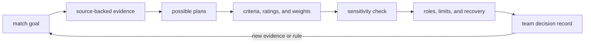

# Turn evidence into match strategy

## Purpose and prerequisites

A strategy is a shared plan for reaching a match goal. A useful strategy connects evidence,
priorities, roles, limits, and recovery choices. It does not come from one exciting number.

In this lesson, you will compare two invented plans with a visible decision matrix. Complete
[Collect Useful Scouting Evidence](/academy/competition-scouting?path=competition-operations) first.
You will not use current game rules, real teams, or a real match plan.

This draft teaches a general evidence process. The team's current strategy process still needs
review before the lesson can represent team practice.

## Vocabulary

- **Strategy:** a plan that connects a goal, evidence, actions, roles, and limits.
- **Tactic:** one action used inside a strategy.
- **Criterion:** a named feature used to compare options.
- **Weight:** the visible importance given to a criterion in a model.
- **Rating:** a bounded lesson value assigned to one option for one criterion.
- **Tradeoff:** gaining one useful feature while giving up or risking another.
- **Recovery margin:** room to respond when a task fails or takes longer than expected.
- **Assumption:** a statement accepted for a model but not yet proven.
- **Sensitivity check:** changing one input to see whether the result changes.
- **Decision record:** the options, evidence, assumptions, choice, limits, and review trigger.

## Worked example

An invented practice has two plans. Plan A repeats a well-observed task and leaves time for recovery.
Plan B attempts a larger contribution but has only one practice sample.

Students rate evidence strength, expected task contribution, and recovery margin from zero to three.
They also give each criterion a visible weight. A weighted score is calculated like this:

```text
score = evidence weight × evidence rating
      + contribution weight × contribution rating
      + recovery weight × recovery rating
```

Suppose the evidence, contribution, and recovery weights are `3`, `2`, and `2`. Plan A has ratings
of `3`, `2`, and `3`. Its score is `19`. Plan B has ratings of `1`, `3`, and `1`. Its score is `11`.

That result does not prove Plan A will score more. It shows how the entered ratings and weights fit
together. If contribution gets more weight, the result may change. The team must review the sources,
uncertainty, alliance needs, current rules, and failure cases outside this model.

## Visual model



ARES Guided Run Review keeps an observed difference separate from correlation and cause. It also
keeps missing signals visible. Those boundaries matter in strategy. A slower run does not prove a
robot will be slow in a different match. A quiet alert list does not prove a robot is ready.

The current ARES Match Strategy screen is explicitly a developer preview with sample values. It is
not session-backed analysis and must not be used for decisions. This lesson uses invented values for
the same reason: students can learn the reasoning structure without mistaking a demo for evidence.

## Hands-on activity

1. Invent a match goal with no current game names or real team data.
2. Write two possible plans, A and B.
3. Give each plan one task, one role handoff, one limit, and one recovery action.
4. Attach an invented scouting summary to each plan.
5. Rate evidence strength from zero to three. Explain each rating in one sentence.
6. Rate expected task contribution from zero to three.
7. Rate recovery margin from zero to three.
8. Choose visible weights for the three criteria.
9. Enter the values in the lab and record the result.
10. Change only one weight. Record whether the lead changes.
11. Change one rating to represent missing evidence. Record the result again.
12. Write a decision note that names the model limits and the trigger for fresh review.

<strategytradeofflab />

The score is arithmetic over student-entered values. It is not a prediction. A plan with a higher
lesson score can still be the wrong choice when its sources, assumptions, rules, or partners differ.

## Checkpoints

- Does every plan answer the same match goal?
- Does each rating point to a stated observation or assumption?
- Are the weights visible to everyone reviewing the result?
- Are missing data and conflicts kept visible?
- Does each plan include a recovery action and stop condition?
- Are alliance and opponent facts treated respectfully and without personal data?
- Does the decision record state what would trigger a new review?
- Are current event rules kept outside the lesson model until reviewed?

## Troubleshooting

| Symptom | Check |
| --- | --- |
| One plan wins because every rating is “high” | Require one evidence sentence for each rating and mark unknown values honestly. |
| A score is called a prediction | Rename it a lesson comparison score and state what the matrix omits. |
| The lead changes with one small weight change | Record that sensitivity. The decision depends strongly on that priority. |
| Missing evidence is entered as zero | Mark it missing in the record; zero is a chosen rating, not a missing-data symbol. |
| A plan has no recovery action | Add a bounded fallback and name the role that calls it. |
| The notes judge another team | Replace personal judgments with robot observations and source limits. |
| A sample screen is treated as live analysis | Stop and verify source, freshness, workspace, and session identity. |

## Evidence artifact

Submit the invented goal, Plan A and Plan B sheets, evidence notes, first matrix, sensitivity check,
and decision record. Include all ratings, weights, score math, missing facts, recovery actions, model
limits, and review trigger.

Label the artifact **invented strategy exercise**. Do not present it as a current match plan. The
team process review remains open, and current league rules must be read before any event plan.

## Short assessment

1. How is a strategy different from a tactic?
2. Why must a rating have an evidence note?
3. What does a sensitivity check reveal?
4. Why is a weighted score not a match prediction?
5. Name four facts this lesson matrix leaves out.

Good answers mention sources, assumptions, uncertainty, roles, recovery, current rules, partners,
opponents, timing, and changing robot health.

## Extension challenge

Add a third invented plan without changing the criteria. Decide whether the same weights still fit
the goal. Then remove one source from the plan that leads. Lower or mark the related rating and
explain why a missing source changes confidence before it changes arithmetic.

Use the strategy lab inside the scouting lesson to show the full handoff from an observation to a
bounded discussion. Keep every dataset invented and every limit visible.

## Related and next

Return to [Collect Useful Scouting Evidence](/academy/competition-scouting?path=competition-operations)
when a rating lacks a source or sample limit. Use [Compare Logs and Replay a Failure](/academy/testing-logs-replay?path=testing-debugging-commissioning)
when a completed run can test a robot claim. Continue later with post-match triage after the team
reviews its current handoff and repair process.
