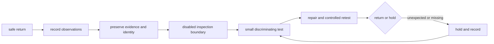

# Review, repair, and record after a match

## Purpose and prerequisites

Post-match triage is the handoff from a finished match to a safe, evidence-based next action. It
starts by placing the robot in its required safe state. It does not start by changing parts.

In this lesson, you will build an invented post-match packet. Complete [Run a Drive-Team Match
Cycle](/academy/competition-drive-team?path=competition-operations) and [Build a Fault Tree and
Isolate a Cause](/academy/testing-fault-tree?path=testing-debugging-commissioning) first. You will
not handle, power, inspect, repair, or test a real robot.

This draft teaches a general handoff. The team's current post-match checklist and event process
remain open for review.

## Vocabulary

- **Triage:** ordering observations and next actions by safety, evidence, and urgency.
- **Safe state:** the required robot condition before handling, inspection, or repair.
- **Symptom:** a behavior that was observed.
- **Possible cause:** an explanation that still needs evidence.
- **Evidence preservation:** keeping original logs, notes, and configuration identity unchanged.
- **Inspection boundary:** the allowed checks before a different procedure or tool is required.
- **Owner:** the role responsible for one named action.
- **Stop condition:** a fact that ends the action immediately.
- **Hold:** a status that blocks return until named evidence exists.
- **Return decision:** the recorded status and evidence required before the robot enters another cycle.

## Worked example

An invented robot returns after its arm stopped once. The first record is not “replace arm motor.”
The team records that the robot is disabled and outputs are neutral. It preserves the completed log,
selected project identity, and notes from the match.

The observation says:

> During the second driver-period arm request, the target changed but recorded position did not.
> The driver released the control. No cause is confirmed.

That statement keeps a possible software, sensor, power, wiring, or mechanism cause open. The next
paper step names the allowed disabled inspection boundary. The smallest later test should separate
possible causes and include a stop condition.

ARES Diagnostic Coach follows the same evidence rule. Its notice says telemetry findings are
screening observations, not root-cause diagnoses or proof that a robot is safe. Missing signals stay
listed. Possible causes and verification steps remain separate from the observation.

## Visual model

A quick turnaround does not weaken the evidence boundary. If the team cannot prove the robot matches
the expected project, inventory, safe state, and test setup, the status remains hold.

## Hands-on activity

1. Invent one match symptom with a time or phase label.
2. Write the safe-state record that comes before diagnosis.
3. Separate the visible symptom from three possible causes.
4. List the original evidence to preserve: log, notes, project revision, and inventory identity.
5. Write an allowed disabled visual inspection boundary.
6. Write what needs a different current team procedure.
7. Give each paper next action one role owner and a stop condition.
8. Choose the smallest test that could separate two possible causes.
9. Write expected and unexpected results before the test.
10. Create return, repair, and hold status definitions.
11. Use the lab from top to bottom.
12. Stop at the first missing record and revise the packet.
13. Ask another student to find every checked fact in the packet.

<postmatchtriagelab />

The completed checklist means the invented handoff is ready for process review. It does not mean a
robot is safe, repaired, tested, legal, or ready for another match.

## Checkpoints

- Does the packet begin with a safe-state record?
- Is the symptom a fact instead of a guessed cause?
- Are original logs and notes preserved?
- Is the project and inventory identity recorded?
- Does each inspection step stay inside its allowed boundary?
- Does every action have one owner and one stop condition?
- Does the next test separate possible causes while changing one thing?
- Is return, repair, or hold visible to the next role?
- Are student names, contact details, credentials, and private paths absent?

## Troubleshooting

| Symptom | Check |
| --- | --- |
| Repair begins before evidence capture | Stop and preserve the original record, source, and configuration identity. |
| The note says only “robot broken” | Add the time, request, observed behavior, and unknown facts. |
| Several parts change at once | Return to one discriminating test and preserve the baseline. |
| A missing signal looks normal | Mark it missing and add a collection step. |
| A role says “someone checks it” | Assign one named role, not a student's private identity. |
| A passing mock closes a wiring branch | Keep physical inspection and bounded hardware evidence open. |
| The next queue call arrives before review | Keep the status on hold until the required evidence exists. |

## Evidence artifact

Submit the invented safe-state record, symptom, preserved-source list, project and inventory identity,
inspection boundary, fault branches, owner table, stop conditions, smallest test, and status record.

Label every result **invented post-match exercise**. Do not present it as a real repair or event
record. The authentic team checklist remains an open request and cannot be replaced by this lesson.

## Short assessment

1. Why must safe state come before diagnosis?
2. Why should a possible cause stay separate from a symptom?
3. What original evidence should be preserved?
4. What makes a next test discriminating?
5. What facts belong in a return or hold decision?

Good answers keep observation, source identity, inspection, repair, retest, and return authority as
separate steps.

## Extension challenge

Create two versions of the packet. In the second version, make the position signal missing. Show
which conclusions must disappear and which collection step becomes the next safe action.

Then use the fault-tree lesson's triage lab before building branches. Explain why an organized
handoff still cannot confirm a root cause.

## Related and next

Use [Compare Logs and Replay a Failure](/academy/testing-logs-replay?path=testing-debugging-commissioning)
to preserve and align completed evidence. Use [Build a Fault Tree and Isolate a Cause](/academy/testing-fault-tree?path=testing-debugging-commissioning)
to separate possible causes. Return to [Run a Drive-Team Match Cycle](/academy/competition-drive-team?path=competition-operations)
only after the current team process supports the next status.
