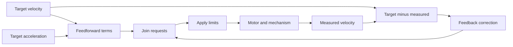

# Predict motion with feedforward

## Purpose and prerequisites

A motor needs an output before it can move. Feedforward predicts a starting output from the motion
we want. Feedback watches the measured result and corrects error. The two tools work together, but
they do different jobs.

Complete [Robot Coordinates Without Guesswork](/academy/robot-coordinate-contracts?path=controls-localization-autonomous)
and [Read a Telemetry Graph Like a Scientist](/academy/read-a-telemetry-graph?path=math-for-robotics)
first. You should be able to label units, read a graph, and change one test value at a time.

This lesson has two web activities. The first is an invented control model. The second traces one
feedforward-only step from ARES 17.0.1. Studio examples match Studio 7.0.2. The source links are
pinned to the exact monorepo commit used for this lesson. Neither activity runs a motor or approves
a robot setting.

## Vocabulary

- **Target:** the motion the controller wants.
- **Measured value:** motion reported by a model or sensor.
- **Error:** target minus measured value.
- **Feedforward:** a prediction based on requested motion.
- **Feedback:** a correction based on measured error.
- **Static term (`kS`):** a term that changes sign with requested motion.
- **Velocity term (`kV`):** a coefficient multiplied by target velocity.
- **Acceleration term (`kA`):** a coefficient multiplied by target acceleration.
- **Loop time (`dt`):** time between two controller steps.
- **Saturation:** clamping a request to an allowed range.
- **Source contract:** the units and behavior that code and its documents promise.

## The common feedforward idea

A simple motor model often uses three terms.

```text
feedforward = kS × sign(velocity) + kV × velocity + kA × acceleration
```

`kS` helps with the change from stopped to moving. `kV` grows with speed. `kA` grows when speed
changes quickly. A model may use different units or add gravity. Always read that model's source
contract before using the equation.

Feedforward does not need to wait for an error. Feedback does. If a measured velocity is `0.7 m/s`
and the target is `1.0 m/s`, the error is:

```text
error = target - measured
error = 1.0 m/s - 0.7 m/s
error = 0.3 m/s
```

A proportional feedback term could use that error. Feedforward instead starts from the target
motion. It predicts what output may be useful before the sensor result arrives.

## Visual model



The top path predicts. The lower path corrects. Limits belong after the requests are combined. A
real control loop may also use current limits, voltage rules, slew limits, and fault handling.

## Activity 1: separate prediction from correction

Open the conceptual response lab. Every plant value and gain in this first activity is invented.

<controlresponselab />

1. Keep the defaults. Record final velocity, final error, and peak velocity.
2. Open the numeric table. Check that the graph and table tell the same story.
3. Set feedforward output to zero. Keep all feedback gains unchanged.
4. Reset. Set proportional gain to zero while keeping feedforward at its default.
5. Compare the two trials. State which path was missing in each one.
6. Change feedforward in steps of `0.2`. Keep all other values fixed.
7. Choose one feedforward value. Change only proportional gain and compare peak with final error.

Do not call one setting “best” without naming a goal and a limit. A setting that lowers final error
may increase the peak.

## Bridge to the current ARES FTC source

The checked-in Team 23247 competition profile contains these values:

| Profile field | Checked-in value |
| --- | ---: |
| `kS` | 0.05 |
| `kV` | 0.638 |
| `kA` | 0.02 |

These are authentic source values, not invented lesson values. The profile calls itself a reviewed
baseline. That statement does not prove how the values were measured, that they fit another robot,
or that a web calculation is safe to send to hardware.

The current source also has an unresolved unit question. `SimpleFeedforwardCoeffs` and the `.ares`
drivebase declaration describe voltage units. `MecanumDriveFeedforward` calls `kS` a normalized
offset. Its code adds the three terms as a request, multiplies the combined request by `12 ÷ battery
volts`, and clamps the final duty request from `-1` through `1`.

Those statements do not define one clear voltage contract. Until the ARES source is aligned, this
lesson calls the runtime results **request units**, not volts. Do not use the web tracer to convert
the profile values into physical voltage.

The current FTC controller also uses positive `kV` to set the modeled maximum wheel speed:

```text
modeled maximum = 1 ÷ kV
modeled maximum = 1 ÷ 0.638
modeled maximum = 1.567398... m/s
```

The checked-in drivebase geometry stores the same value. This is the current Team 23247 software
cap, not a measured promise for every wheel, battery, floor, or robot.

## Worked example

For one steady forward target, use `1.0 m/s` now and `1.0 m/s` on the prior step. With a `0.02 s`
loop, target acceleration is zero.

```text
acceleration = (1.0 - 1.0) ÷ 0.02 = 0.0 m/s²
static term = 0.05 × sign(1.0) = 0.05 request units
velocity term = 0.638 × 1.0 = 0.638 request units
acceleration term = 0.02 × 0.0 = 0.0 request units
raw request = 0.05 + 0.638 + 0.0 = 0.688 request units
```

At a `12 V` battery input, the source factor is `12 ÷ 12`, or `1.0`. The final duty request is
`0.688`. At a `9 V` input, the factor is about `1.333`, so the result is about `0.917`. This is the
current source arithmetic. It is not a measured motor response.

A one-step change from `0` to `1.0 m/s` gives `50 m/s²` in a `0.02 s` loop. The acceleration term is
then `1.0`. The raw request becomes `1.688`, so the final duty request clamps to `1.0`. This sharp
step is useful for reading code. It is not a safe robot command.

## Hands-on activity

Use the code-derived tracer below. It covers the feedforward-only path for one wheel. It does not
include PID feedback or slew limiting.

<feedforwardtermlab />

1. Choose **Reset trace**. Confirm the three terms add to `0.688`.
2. Choose **Lower voltage**. Explain why the source factor and final request change.
3. Choose **Start step**. Find the acceleration term and the clamped result.
4. Choose **Invalid battery**. Confirm that the code-derived path leaves output at zero.
5. Choose **Stopped**. Confirm every term becomes zero.
6. Enter `-1` for both speed fields. Explain why the static and velocity terms change sign.
7. Change only `kA`. Compare steady forward with the start step.
8. Reset the tracer before creating your evidence table.

For this checked-in profile, the runtime clamps target wheel speed to about `-1.567` through
`1.567 m/s`. It also returns zero when the battery input is invalid. The browser coefficient
controls use smaller learning bounds than the full source declarations. When you change positive
`kV`, the tracer also updates the cap with `1 ÷ kV`, matching the controller rule.

## Walk the source and run the focused test

From the ARES monorepo root, find the coefficient types, runtime math, and team profile.

```powershell
rg -n "SimpleFeedforwardCoeffs|kS|kV|kA" `
  ARESLib-Kotlin/core/src/main/kotlin/com/areslib/control/tuning/FeedforwardCoeffs.kt

rg -n "applyFeedforward|voltageCompensationFactor|finiteClampedPower" `
  ARESLib-Kotlin/ftc-hardware/src/main/kotlin/com/areslib/ftc/drivetrain/MecanumDriveFeedforward.kt

rg -n "driveFeedforward.kV|maxWheelSpeedMetersPerSecond" `
  ARESLib-Kotlin/ftc-hardware/src/main/kotlin/com/areslib/ftc/drivetrain/MecanumKinematicsController.kt

rg -n "ftc.drive.feedforward" `
  ARES-FTC/.ares/tuning/team23247.ftc.season2026.gobilda.profile.competition.arestuning `
  ARES-FTC/.ares/drivetrains/gobilda-mecanum.aresdrivetrain
```

Run the current FTC hardware contract test from `ARESLib-Kotlin`.

```powershell
Set-Location ARESLib-Kotlin
.\gradlew.bat :ftc-hardware:test `
  --tests "com.areslib.ftc.MecanumHardwareIOTest"
```

Record the commit, command, test class, and pass or fail result. The test covers current software
behavior, including output clamping, voltage compensation, and fail-closed cases. It does not prove
that a physical drivetrain matches the model.

## Checkpoints

- Can you explain prediction without using the word error?
- Can you explain feedback using a measured value?
- Did you keep velocity, acceleration, loop time, and request units separate?
- Can you find each feedforward term in the runtime source?
- Can you show how the checked-in `kV` value sets the current speed cap?
- Did you label the team profile values as checked-in source data?
- Did you keep the unresolved unit contract visible?
- Can you name runtime paths missing from the tracer?

## Troubleshooting

| Symptom | Check |
| --- | --- |
| Acceleration is much larger than expected | Check the loop time and the change from the prior target. |
| The start-step output stops at `1.0` | The source clamps the final duty request. |
| Stopped still has a static term | The source returns zero when target speed is near zero. |
| Reverse motion has a positive static term | Check the sign of target velocity. |
| A larger target changes to about `1.567 m/s` | The current Team 23247 profile sets the runtime cap with `1 ÷ kV`. |
| Invalid battery leaves every result at zero | The source fails closed when battery input is not finite or is at most `0.1 V`. |
| A result is labeled volts | Use request units until the source contract is aligned. |
| A profile value is called safe for another robot | Stop. The checked-in value is not general hardware approval. |
| A browser result is treated as motor evidence | Separate source math, simulation, and physical measurement. |

## Evidence artifact

Create one comparison table with at least seven trials. Include the activity, changed value, target,
target used after the speed cap, prior target, loop time, and battery input. Also include each
feedforward term, raw request, request before the final clamp, final request, final modeled velocity
when available, and model type.

Label Activity 1 rows **invented conceptual model**. Label Activity 2 rows **pinned source arithmetic**.
Add the source commit and focused test result to the Activity 2 rows.

Write four short claims:

1. what feedforward changed in the conceptual response;
2. what feedback changed;
3. what the source tracer proves; and
4. what a restrained physical test would still need to measure.

## Short assessment

1. What does feedforward predict?
2. What measured value does feedback need in this lesson?
3. Why does the acceleration term depend on loop time?
4. What is the steady-forward raw request with the checked-in profile values?
5. Why does the start-step example clamp?
6. How does the checked-in `kV` value set the current modeled speed cap?
7. Why does this lesson call the runtime terms request units?
8. Does the checked-in team profile approve the same values for another robot?
9. Name three runtime paths missing from the source tracer.

The numeric steady-forward answer is `0.688` request units. Good explanations keep source
arithmetic, declared units, measured motion, and physical approval separate.

## Extension challenge

Build a five-row trace that starts stopped, accelerates forward, holds speed, slows, and reverses.
Predict each term before using the tracer. Mark every row that clamps.

Then design a later physical test. Name the sensor, units, output limit, stop conditions, and saved
evidence. Students may verify robot function through the team's normal safety process. Website posts
use the separate Lead Coach review flow.

## Related and next

Continue to [Tune Feedback with Evidence](/academy/controls-pid?path=controls-localization-autonomous).
That lesson keeps this prediction path and focuses on measured error. Return to
[System Identification and Feedforward Evidence](/academy/testing-hardware-system-identification?path=testing-debugging-commissioning)
before collecting physical coefficient evidence.
