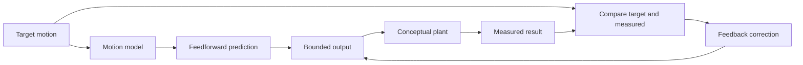

# Predict motion with feedforward

A motor needs output before it can move. Feedforward predicts a useful starting output from the
motion we want. Feedback then compares the result with the target and corrects the remaining error.
The two ideas work together, but they do different jobs.

## Purpose and prerequisites

This lesson teaches you to separate a prediction from an error correction. First complete [Robot
Coordinates Without Guesswork](/academy/robot-coordinate-contracts?path=controls-localization-autonomous)
and [Read a Telemetry Graph Like a Scientist](/academy/read-a-telemetry-graph?path=math-for-robotics).
You should be able to label a graph and describe an observation without guessing its cause.

You will use a small browser model. Every value in the model is invented for learning. The model is
not a motor test, an ARES tuning profile, or proof that a robot is safe to run.

## Vocabulary

- **Target:** the motion the controller wants.
- **Measured value:** the motion reported by a model or sensor.
- **Error:** target minus measured value.
- **Feedforward:** a predicted output based on the requested motion.
- **Feedback:** a correction based on measured error.
- **Proportional gain:** a number that makes correction grow with the error.
- **Derivative gain:** a number that reacts to how quickly the error changes.
- **Plant:** the system being controlled, such as a motor and mechanism.
- **Model:** a simpler description used to predict part of a plant's behavior.
- **Saturation:** a limit that stops the requested output from growing forever.

## Worked example

Imagine that a made-up motor needs about `1.0` output to hold a target velocity of `1.0`. A
feedforward value of `1.0` supplies that prediction. If the measured velocity is only `0.7`, the
error is:

```text
error = target - measured
error = 1.0 - 0.7
error = 0.3
```

With a proportional gain of `0.8`, the feedback correction is `0.8 x 0.3`, or `0.24`. The total
request is the feedforward value plus that correction.

```text
output = feedforward + proportional correction
output = 1.0 + 0.24
output = 1.24
```

Feedforward did not wait for an error. It predicted the base output. Feedback used the measured
error to repair what the prediction missed. A real controller may use more terms and stricter
limits. Do not copy these invented values into robot code.

## Visual model



The model path looks ahead. The feedback path looks at the error. The output limit is part of the
control contract. It does not prove that a real mechanism can safely accept that output.

## Hands-on activity

Open the response lab. Keep the default values and record the final velocity, final error, and peak
velocity. Open the numeric table so your evidence is available as text, not only as a line.

<controlresponselab />

Set the feedforward output to zero. Keep the other two settings unchanged. Describe how the final
error changes. Then reset the lab and set proportional gain to zero. Compare the two trials.

Next, change only feedforward in steps of `0.2`. Stop after five trials. Record each setting and the
three result numbers. Do not change two settings in the same trial. A one-change test makes the
result easier to explain.

Finally, choose one feedforward setting and vary proportional gain. Watch the peak and final error.
Use the graph and table to report what happened. Do not call one setting “best” without naming a
goal and a limit.

## Checkpoints

After every trial, state which value you changed. Check that the other settings stayed fixed. If
they did not, reset and repeat the trial.

Use the word **prediction** when describing feedforward. Use the word **error** when describing
feedback. If your explanation swaps those jobs, return to the visual model.

Check the output limit in the model code shown by the lesson note. A bounded number in a browser is
still not a safe physical-robot limit. Hardware limits come from the real mechanism and its safety
contract.

## Troubleshooting

If the response seems slow, inspect the final error and the full time table. Do not judge only from
the first part of the line. If the response rises above the target, compare the peak with the final
value. Those numbers describe different parts of the response.

If a large gain creates a strange result, reset before continuing. The lesson plant is simple and
invented. A strange shape does not prove that a real motor would act the same way.

If two trials cannot be compared, check whether more than one setting changed. Return to the default
values and make a new one-change plan.

## Evidence artifact

Create a table with at least six trials. Include feedforward, proportional gain, derivative gain,
final velocity, final error, and peak velocity. Mark which setting changed in each row.

Below the table, write three short claims. One must explain what feedforward changed. One must
explain what proportional feedback changed. The last must name one fact that this conceptual model
cannot prove about a physical robot.

## Short assessment

1. What does feedforward predict?
2. What measurement does feedback need?
3. How do you calculate error in this lesson?
4. Why should one trial change only one setting?
5. Does a smooth browser graph prove a robot mechanism is safe?

A strong answer keeps prediction, measurement, and correction separate. It also states that the
browser model cannot replace a controlled physical test.

## Extension challenge

Create two test goals. For the first, try to reduce final error. For the second, try to limit the
peak. Decide whether the same settings support both goals. Use numbers from the table in your
answer.

Then sketch one real test you might run later. Name the sensor, the unit, the output limit, the stop
condition, and the evidence you would save. A student may verify robot function with the team's
normal safety process. Website lesson publication still uses the separate Lead Coach review gate.

## Related and next

Continue with feedback and PID response. Reuse this same lab there, but focus on error correction
instead of the base prediction. Return to [Read a Telemetry Graph Like a
Scientist](/academy/read-a-telemetry-graph?path=math-for-robotics) whenever an observation starts to
sound like an untested cause.
