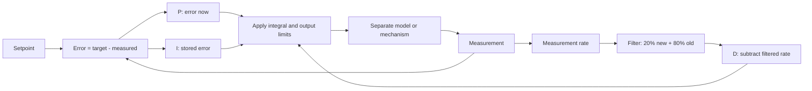

# Tune feedback with evidence

Feedback compares a target with a measured result. The difference is **error**. A PID controller
uses that evidence to choose a correction. Tuning is not guessing until motion looks good. It is a
careful test where you change one value, save the result, and compare it with a goal chosen first.

## Purpose and prerequisites

Complete [Predict Motion with Feedforward](/academy/controls-motor-model-feedforward?path=controls-localization-autonomous)
first. You should be able to read a time graph, name the units in a calculation, and explain why a
prediction and a feedback correction are different jobs.

This lesson follows ARES 11.1.0 and Studio 2.0.3. Its source links are pinned to the exact public
monorepo commit used for review. The browser activities do not run the Kotlin controller.

In this lesson, you will:

- connect P, I, and D to the evidence each term uses;
- trace one step of the current ARES PID calculation;
- compare one-change trials in an invented response model;
- spot output limits, stored-error limits, and reset behavior; and
- plan a student-led robot test without treating a browser graph as physical proof.

## Vocabulary

- **Setpoint:** the target value.
- **Measurement:** the value reported by a sensor or model.
- **Error:** setpoint minus measurement.
- **Proportional term (P):** correction based on error right now.
- **Integral term (I):** correction based on error stored over time.
- **Derivative term (D):** correction based on a rate of change. Current ARES uses a filtered
  measurement rate and subtracts it.
- **Gain:** a number that controls how strongly one term reacts.
- **Deadzone:** a small error range where current ARES returns zero and refreshes its stored rate
  state without adding more integral error.
- **Saturation:** reaching an output limit.
- **Anti-windup:** a rule that keeps the I term from storing more error when that storage would push
  farther into an output limit.
- **Acceptance limit:** a number chosen before a test that defines an acceptable result.

## Worked example

Suppose the target is `1.00`, the measurement is `0.60`, and the loop step is `0.10 s`.

```text
error = setpoint - measurement
error = 1.00 - 0.60 = 0.40

P correction = 0.50 x 0.40 = 0.20
```

Assume the stored error was `0.10`. With an I gain of `0.25`, the proposed stored error and I
correction are:

```text
proposed stored error = 0.10 + (0.40 x 0.10 s) = 0.14
I correction = 0.25 x 0.14 = 0.035
```

Current ARES does **not** calculate D from the change in error. If the measurement moved from
`0.50` to `0.60` in `0.10 s`, its raw measurement rate is `1.00` unit per second. After a reset,
the filter combines 20% of the new rate with 80% of its old rate.

```text
filtered measurement rate = (0.20 x 1.00) + (0.80 x 0.00) = 0.20
D correction = -0.40 x 0.20 = -0.08
PID output before limits = 0.20 + 0.035 - 0.08 = 0.155
```

The minus sign makes D oppose a changing measurement. Using measurement rate also avoids a sudden D
jump when only the setpoint changes. The first calculation after `reset()` uses a rate of zero.

## Visual model



The current source file's opening formula still describes derivative of error. The running
`calculate` code and its focused tests use the filtered derivative-on-measurement path shown above.
When comments and executable evidence disagree, record the disagreement and follow the tested
behavior until the source documentation is corrected.

## Hands-on activity

The response lab below has two parts. The first is a small, invented plant for learning one-change
trials. It uses the common classroom derivative-of-error formula, not the current ARES derivative
filter. The second copies selected arithmetic from the pinned ARES PID source. It uses fixed
classroom cases and does not run Kotlin or a motor.

<controlresponselab />

1. Set feedforward to `0.60`, P to `0.40`, and I and D to zero. Save the final error and peak as
   your baseline.
2. Increase only P in steps of `0.40` for four trials. Stop if the model output reaches its limit.
   Choose one P value using a numeric goal.
3. Restore that P value. Increase only I in small steps. Compare final error, peak, and saturation.
4. Reset again. Restore feedforward and P, leave I at zero, and increase only D. Record what the
   invented classroom formula does. Do not call this result an ARES response.
5. Write one sentence comparing the lab's derivative-of-error model with the current ARES
   derivative-on-measurement calculation.

<arespidtracelab />

Now use the **ARES 11.1.0 source trace** in the same activity:

1. Choose **Worked step**. Confirm the final output is `0.155`.
2. Choose **First after reset**. Explain why the D term is zero.
3. Choose **Output limited**. Compare proposed stored error with stored error used.
4. Choose **Inside deadzone**. Confirm output is zero even though stored error already exists.
5. Choose **Invalid loop time**. Explain why returning zero is the safe result.

These cases expose runtime boundaries that a smooth response graph can hide. They still do not
include continuous angle wrapping, a live controller history, mechanism physics, or sensor noise.

## Checkpoints

- Did you write a goal such as “final error below `0.10`” or “peak below `1.10`” before testing?
- Did exactly one gain change between neighboring trials?
- Did you record all gains, including values that stayed at zero?
- Did you mark trials that reached the output limit?
- Can you point to the source evidence for ARES reset, deadzone, filter, and anti-windup behavior?
- Can you explain why invalid inputs return zero without changing controller state?
- Did you keep browser-model evidence separate from robot evidence?

Current ARES output and integral limits are optional settings. If code does not call
`setOutputLimits` or `setIntegratorRange`, those bounds are not automatically present. The
directional anti-windup rule freezes stored error only when an output limit exists and the error
would push farther into that limit.

## Troubleshooting

If the response crosses the target, report the peak before changing a gain. Overshoot is an
observation, not a complete cause.

If I keeps growing, check whether an integrator range was configured. Then check whether an output
limit exists for the directional anti-windup rule to use. Calling a feature “built in” does not mean
every caller enabled it.

If D jumps or chatters, check the measurement units, loop time, sensor noise, and reset point.
Current ARES filters measurement rate with a fixed `0.20` new-sample weight, but that does not prove
that any sensor or gain is safe for a mechanism.

If a setpoint change produces an unexpected D spike in your own calculation, check whether you used
change in error. Current ARES uses change in measurement, so changing only the target does not create
the same derivative kick.

If the controller returns zero, check for a non-finite measurement, setpoint, loop time, or gain, or
a loop time at or below zero. Also check whether the error is inside a configured deadzone.

## Walk the current source

From the root of the ARES Robotics monorepo, run:

```powershell
rg -n "fun calculate|measurementDerivative|filteredDerivative|proposedError|isSaturated|deadzone" `
  ARESLib-Kotlin/core/src/main/kotlin/com/areslib/control/feedback/PIDController.kt

rg -n "Derivative|deadzone|Integrator|Continuous|NaN|OutputLimits" `
  ARESLib-Kotlin/core/src/test/kotlin/com/areslib/control/PIDControllerTest.kt `
  ARESLib-Kotlin/core/src/test/kotlin/com/areslib/control/feedback/PIDControllerTest.kt `
  ARESLib-Kotlin/core/src/test/kotlin/com/areslib/e2e/tier1/control/PidClampingTier1Test.kt
```

The source file's opening formula describes derivative of error. The executable method and tests
use filtered derivative on measurement. Keep that mismatch in your evidence instead of silently
rewriting one behavior as the other.

## Evidence artifact

Submit:

- three trial tables for P, I, and D, each listing all gains, feedforward, final error, peak, and
  saturation;
- the worked ARES step with error, proposed stored error, filtered measurement rate, each term, and
  final pre-limit output;
- a five-row source-trace table with the selected case, proposed stored error, stored error used,
  D term, final output, and the boundary that explains the result;
- a two-column note labeled **browser model** and **current ARES source** that explains the D-term
  difference; and
- a tuning decision that names the goal, chosen values, two supporting numbers, one missing physical
  effect, and one required robot safety limit.

## Short assessment

1. Which PID term reacts to current error?
2. Which term stores error over time?
3. What rate does current ARES use for its D term?
4. Why is the first derivative result zero after reset?
5. When can the directional anti-windup rule freeze stored error?
6. What does the deadzone do to output and stored derivative state?
7. What does current ARES return when the loop time is invalid?
8. Why can the response lab not approve gains for a physical robot?

A strong answer separates generic PID ideas, current ARES behavior, browser-model evidence, and
physical evidence.

## Extension challenge

Open the pinned `PIDController.kt` and its focused tests from this lesson's source panel. Find one
test for each of these behaviors: filtered D, integral range, output saturation, continuous angle
wrapping, invalid-input fallback, and reset. Build a trace table that links each claim to the exact
test name.

Then design a student-led physical verification plan without running it yet. Name the mechanism,
sensor, units, starting limit, output limit, stop condition, reset point, and saved telemetry. Begin
with the robot disabled for inspection and use a low-output first trial under the team's normal
safety process. Students may verify robot functionality; mentor approval is not required for each
software conclusion. Lead Coach approval applies only when publishing a website post.

Practice the one-change decision record below before planning a Local Sim tuning experiment. Its
fixed numbers teach threshold-based classification; it does not run SysId or tune this response.

<sysidtuninglab />

## Related and next

Return to [Read a Telemetry Graph Like a Scientist](/academy/read-a-telemetry-graph?path=math-for-robotics)
when a graph claim mixes observation with cause. Continue to
[Plan Smooth Motion with Limits](/academy/controls-motion-profiles?path=controls-localization-autonomous)
to learn why a controller should receive reachable setpoints. Later, use bounded telemetry and
acceptance checks during simulation and robot commissioning.
