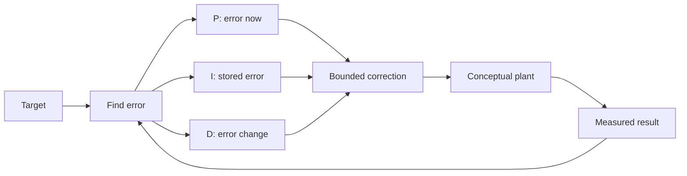

# Tune feedback with evidence

Feedback uses measured error to correct a system while it runs. A PID controller groups three
kinds of correction. Proportional, integral, and derivative terms each respond to a different part
of the error history. Tuning means testing those terms against a clear goal and limit.

## Purpose and prerequisites

Complete [Predict Motion with Feedforward](/academy/controls-motor-model-feedforward?path=controls-localization-autonomous)
first. You should know the difference between a predicted base output and an error correction. You
should also know how to read a time graph and change one setting per trial.

This lesson uses the same invented response lab. Reusing it lets you compare the feedforward and
feedback experiments without learning a new tool. The lab is not a real motor model. Its gains are
not safe values for a physical robot.

## Vocabulary

- **Feedback loop:** a process that measures a result and uses the error to make a correction.
- **Proportional term (P):** correction based on the error right now.
- **Integral term (I):** correction based on stored error over time.
- **Derivative term (D):** correction based on how quickly error is changing.
- **Gain:** a number that controls how strongly one term reacts.
- **Steady-state error:** error that remains after the response has had time to settle.
- **Overshoot:** motion beyond the target.
- **Settling:** reaching and staying near the target.
- **Noise:** unwanted changes in a measurement.
- **Acceptance limit:** a number chosen before a test that defines an acceptable result.

## Worked example

Suppose the target is `1.0` and the measured value is `0.6`. The current error is `0.4`. With a
proportional gain of `0.5`, the P correction is `0.2`.

```text
P correction = proportional gain x current error
P correction = 0.5 x 0.4
P correction = 0.2
```

If a small positive error remains for many samples, the I term can store that history. It may add a
correction that removes the remaining error. Too much stored error can also push the response past
the target.

The D term looks at how fast error changes. It may slow a response that is rushing toward the
target. A noisy measurement can make that change estimate jump, so a real design needs filtering
and a tested sample period.

## Visual model



All three terms start from error. They do not measure safety, motor temperature, current, or a
mechanism collision. Those signals need separate limits and checks.

## Hands-on activity

Open the response lab. Set feedforward to `0.6`, proportional gain to `0.4`, and both other gains to
zero. Record the final error and peak. This is the baseline.

<controlresponselab />

Increase only proportional gain in steps of `0.4`. Use four trials. Stop if the graph becomes hard
to compare or the output reaches its model limit. Choose one proportional value for the next set.

Reset. Restore the chosen proportional value and feedforward `0.6`. Increase only integral gain in
small steps. Compare final error and peak. Explain the tradeoff you observe.

Reset again. Set feedforward and proportional gain to your chosen values. Leave integral at zero.
Increase only derivative gain. Compare the early shape, peak, and final error. Do not assume the D
term must improve every response.

## Checkpoints

Write the goal before each set of trials. A goal might be “reduce final error below 0.10” or “keep
peak below 1.10.” Without a number, words such as smooth or good are hard to test.

Check that one gain changed per trial. Mark output saturation when it occurs. A trial at the output
limit may hide the effect of a larger gain.

Keep the feedforward value in your table. PID feedback does not erase the prediction path. A real
controller often combines both parts.

## Troubleshooting

If the response crosses the target, report the peak before changing a gain. Crossing the target is
an observation. The cause still needs a controlled comparison.

If integral correction keeps growing, reset the lab and use smaller steps. The lesson model bounds
stored error, but real code needs an intentional anti-windup rule.

If derivative gain produces sharp changes, remember that it reacts to error change. A real sensor
may add noise. This simple model does not reproduce a specific encoder or filter.

If every result looks similar, check whether the output is saturated. Open the numeric table and
compare the output column.

## Evidence artifact

Submit three small trial tables. The first changes P, the second changes I, and the third changes D.
Each table must show every gain, feedforward, final error, peak, and whether the output saturated.

Add a short tuning decision. State the goal, the chosen values, and two numbers that support the
choice. Name one missing physical effect and one safety limit that a real test would need.

## Short assessment

1. Which PID term reacts to current error?
2. Which term stores error over time?
3. Which term reacts to changing error?
4. Why should a tuning goal include a number?
5. What can output saturation hide?
6. Why can a conceptual PID graph not approve a robot mechanism?

A strong answer connects each term to its part of the error record. It also separates response
evidence from hardware safety evidence.

## Extension challenge

Design a student-led physical verification plan without running it yet. Name the mechanism, target,
sensor, units, starting limit, stop condition, and saved telemetry. Include a low-output first trial
and a plan for checking the mechanism before each run.

Students may verify robot functionality under the team's normal safety process. A mentor does not
need to approve each software conclusion. The Lead Coach approval gate applies when this website
lesson or another student-authored post is published.

## Related and next

Return to [Read a Telemetry Graph Like a Scientist](/academy/read-a-telemetry-graph?path=math-for-robotics)
when a graph claim mixes observation with cause. Continue next to smooth motion limits, then use
bounded telemetry and acceptance checks during simulation and robot commissioning.
