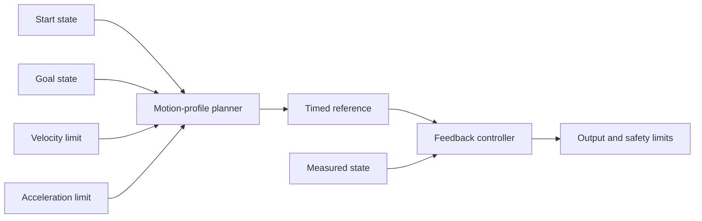

# Plan smooth motion with limits

A controller can chase a final target in one large jump. That request may demand more speed or
acceleration than a mechanism can produce. A motion profile creates smaller position and velocity
setpoints that obey chosen limits on the way to the goal.

## Purpose and prerequisites

Complete [Tune Feedback with Evidence](/academy/controls-pid?path=controls-localization-autonomous)
first. You should understand target, measured value, feedback, and acceptance limits. You should
also be able to compare one-change trials in a table.

This lesson uses a one-dimensional, rest-to-rest profile. It teaches the shape and timing of bounded
setpoints. It does not model a drivetrain, a loaded arm, traction, battery voltage, or motor current.

## Vocabulary

- **Setpoint:** the position or velocity requested at one moment.
- **Motion profile:** a timed list of setpoints between a start and goal.
- **Velocity limit:** the greatest allowed rate of position change.
- **Acceleration limit:** the greatest allowed rate of velocity change.
- **Trapezoidal profile:** accelerate, cruise at a limit, then decelerate.
- **Triangular profile:** accelerate and decelerate without a cruise phase.
- **Rest-to-rest:** start and finish with zero velocity.
- **Constraint:** a limit the planner must obey.
- **Saturation:** reaching a limit so a larger request cannot be followed.
- **Reference:** the planned state that feedback tries to track.

## Worked example

Plan a three-meter rest-to-rest move. Set maximum velocity to `2 m/s` and maximum acceleration to
`1.5 m/s²`. Reaching the velocity limit takes velocity divided by acceleration.

```text
acceleration time = 2 m/s ÷ 1.5 m/s²
acceleration time = 1.33 s
```

The distance covered while accelerating is one-half times acceleration times time squared.

```text
acceleration distance = 0.5 × 1.5 m/s² × (1.33 s)²
acceleration distance = 1.33 m
```

Deceleration needs the same distance. Together, those phases use about `2.67 m`. The move is three
meters, so a short cruise phase remains. The velocity graph has a flat top and is trapezoidal.

For a short move, the mechanism may need to slow before reaching the velocity limit. That graph has
no flat top. It is triangular even though the planner is often called a trapezoid-profile planner.

## Visual model



The profile plans a reference. It does not guarantee that hardware follows the reference. Tracking
error, current, temperature, collisions, and sensor health remain separate evidence.

## Hands-on activity

Open the Motion Profile Lab. Keep the default limits. Record the profile shape, peak velocity,
cruise time, and total time. Open the numeric table and find the acceleration, cruise, deceleration,
and complete phases.

<motionprofilelab />

Change only the move distance. Find one distance that creates a triangular profile and one that
creates a trapezoidal profile. Record both trials.

Reset the lab. Change only maximum velocity in four steps. Watch total time and profile shape. Then
reset again and change only maximum acceleration. Explain which phase changes most clearly.

Choose one trial and draw its velocity graph on paper. Label time in seconds and velocity in meters
per second. Mark where acceleration ends and deceleration begins.

## Checkpoints

Check units before calculating. Velocity uses position per time. Acceleration uses velocity per
time. A value without its unit is not a complete constraint.

Check whether the move reaches the velocity limit. If it does not, call the shape triangular. Do not
invent a cruise phase just because the planner has a maximum velocity setting.

Check the final table row. Position should equal the goal and velocity should be zero in this
rest-to-rest model.

## Troubleshooting

If a shorter move takes longer, confirm that only distance changed. Reset and repeat with the same
velocity and acceleration limits.

If the graph looks flat, open the numeric table. The chart rescales to each trial's peak, so its
height alone cannot compare two different velocity values.

If a real mechanism cannot follow the reference, do not raise every limit at once. Save measured
position, planned position, output, current, and battery voltage. Find the first time the measured
state falls behind.

If a mechanism overshoots, do not blame the profile from one graph. Feedback gains, feedforward,
load, backlash, saturation, and sensor delay may also matter.

## Evidence artifact

Submit a six-row trial table. Include distance, velocity limit, acceleration limit, shape, peak
velocity, cruise time, and total time. Mark the one setting changed in each row.

Add one labeled velocity graph and a short planning note. The note must state a goal, two chosen
limits, and one physical fact the browser model cannot verify.

## Short assessment

1. What does a motion profile produce?
2. When is a profile triangular?
3. What are the three phases of a trapezoidal profile?
4. Why is a planned reference not proof of measured motion?
5. Which units belong to velocity and acceleration?
6. Name two signals needed during a later physical verification.

A strong answer separates planning from tracking. It also treats limits as measured engineering
decisions, not numbers copied from a lesson.

## Extension challenge

Design a rest-to-rest move for a simulated elevator or arm. Choose a distance or angle, velocity
limit, and acceleration limit. Explain what could set each real limit. Examples include motor
speed, current, game-piece stability, frame contact, or a soft mechanism.

Then write a student-led physical verification plan. Begin with a lower output and a clear stop
condition. Students may verify robot function through the team's safety process. Lead Coach review
is required only before publishing this lesson or another website post.

## Related and next

Apply the same planning idea in [Add and Verify Your First FTC Autonomous
Routine](/academy/ftc-starter-first-autonomous?path=controls-localization-autonomous). Continue next
to encoders and odometry, where measured motion is compared with the planned reference.
