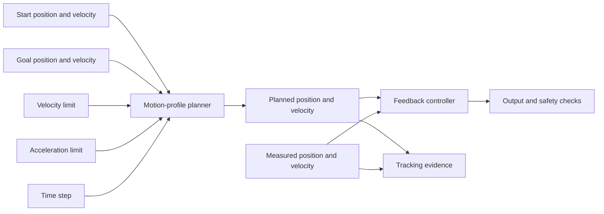

# Plan smooth motion with limits

A controller can chase a final target in one large jump. That request may demand more speed or
acceleration than a mechanism can produce. A motion profile creates smaller position and velocity
setpoints on the way to the goal.

## Purpose and prerequisites

Complete [Tune Feedback with Evidence](/academy/controls-pid?path=controls-localization-autonomous)
first. You should understand targets, measured values, tracking error, units, and one-change trials.

In this lesson, you will:

- explain the speed-up, cruise, and slow-down phases;
- calculate the distance where a cruise phase first becomes possible;
- compare velocity and acceleration limits through controlled trials;
- read planned position, velocity, and acceleration evidence; and
- separate a planned reference from real robot motion.

The browser lab models positive motion on one straight line. Every move starts and ends at rest. The
real ARES profile is more general, but this smaller model makes the main pattern easier to see.

## Vocabulary

- **Setpoint:** the position or velocity requested at one moment.
- **Motion profile:** a timed plan of setpoints between a start and goal.
- **Velocity:** how fast position changes. It includes a direction.
- **Acceleration:** how fast velocity changes. It also includes a direction.
- **Velocity limit:** the greatest allowed speed in the plan.
- **Acceleration limit:** the greatest allowed rate of speed change in the plan.
- **Trapezoidal profile:** speed up, cruise at a limit, then slow down.
- **Triangular profile:** speed up and slow down without a cruise phase.
- **Rest-to-rest:** start and finish with zero velocity.
- **Constraint:** a limit the planner must obey.
- **Saturation:** reaching a limit so a larger request cannot be followed.
- **Reference:** the planned state that feedback tries to track.
- **Tracking error:** planned position minus measured position.
- **Boundary state:** the position and velocity at the start or goal.

A profile is a plan, not a motor command and not a safety guarantee. Feedback follows the plan.
Hardware limits, output guards, and stop conditions remain separate.

## Worked example

Plan a `3 m` rest-to-rest move. Set maximum velocity to `2 m/s` and maximum acceleration to
`1.5 m/s²`.

First find how long it takes to reach the velocity limit.

```text
speed-up time = velocity limit ÷ acceleration limit
speed-up time = 2 m/s ÷ 1.5 m/s²
speed-up time = 1.33 s
```

Next find the distance used while speeding up.

```text
speed-up distance = 0.5 × acceleration × time²
speed-up distance = 0.5 × 1.5 m/s² × (1.33 s)²
speed-up distance = 1.33 m
```

Slowing down from the same speed uses another `1.33 m`. Together, the two ramps need about
`2.67 m`. The planned move is `3 m`, so about `0.33 m` remains for cruising. The velocity graph has
a flat top and is trapezoidal.

### Find the cruise boundary directly

For a positive rest-to-rest move with equal speed-up and slow-down limits, use this shortcut:

```text
cruise boundary distance = velocity limit² ÷ acceleration limit
cruise boundary distance = (2 m/s)² ÷ 1.5 m/s²
cruise boundary distance = 2.67 m
```

A move longer than `2.67 m` includes a cruise phase in this model. A move at or below that distance
is triangular. At the exact boundary, cruise time is zero.

For a `1 m` move with the same limits, the profile cannot reach `2 m/s`. Its peak speed is:

```text
triangular peak speed = √(distance × acceleration limit)
triangular peak speed = √(1 m × 1.5 m/s²)
triangular peak speed = 1.22 m/s
```

The lower peak is not a failure. It is the speed that leaves enough distance to stop at the goal.

### How ARES goes beyond this example

The ARES `TrapezoidProfile` accepts a current position and velocity, a goal position and velocity,
the two constraints, a time step, and a reusable output state. It supports forward and reverse
moves. It also supports nonzero start and goal velocities.

If the mechanism is already moving too fast to stop at a nearby goal, ARES can brake, pass the goal,
reverse, and return. This prevents an impossible instant stop. The browser lab does not model that
case.

ARES checks every input. Invalid time steps, limits, or states cause it to hold the current valid
state instead of jumping to the goal. A goal speed above the velocity limit also holds the current
state. The browser lab throws an error for invalid inputs because its sliders never send them.

ARES writes each result into a provided state object. That design avoids creating new objects in a
fast robot loop. This memory detail matters to robot software, but it does not change the shape you
study here.

## Visual model



The profile plans a reference. It does not guarantee that hardware follows it. Current, voltage,
temperature, collisions, sensor health, and tracking error remain separate evidence.

## Hands-on activity

Work with a partner if possible. One student predicts the result. The other moves one control and
records the evidence. Swap jobs halfway through.

<motionprofilelab />

### Part 1: Read one complete move

1. Reset the lab.
2. Record distance, both limits, shape, peak speed, speed-up time, cruise time, and total time.
3. Compare the displayed cruise boundary with the worked example.
4. Open the numeric table.
5. Find positive acceleration, zero acceleration, negative acceleration, and the complete row.

Positive acceleration speeds up the positive move. Negative acceleration slows it down. The final
row should have zero velocity and zero acceleration.

### Part 2: Cross the cruise boundary

Keep both limits at their default values. Move only the distance control.

1. Find a distance below the displayed boundary.
2. Record its triangular shape and zero cruise time.
3. Find a distance above the boundary.
4. Record its trapezoidal shape and positive cruise time.
5. Move as close to the boundary as the slider allows.

Explain why peak speed changes below the boundary but stays at the velocity limit above it. Do not
add a cruise phase to a triangular move.

### Part 3: Change the velocity limit

Reset. Keep distance and acceleration fixed. Test four velocity limits from low to high. Predict the
shape before each trial.

A low velocity limit is easier to reach, so a cruise phase may appear. A high velocity limit may be
impossible to reach before slowing must begin. Record the new boundary distance each time.

### Part 4: Change the acceleration limit

Reset. Keep distance and velocity fixed. Test four acceleration limits. Record speed-up time,
boundary distance, and total time.

Higher planned acceleration reaches the velocity limit sooner and uses less ramp distance. That may
create a longer cruise phase. It does not prove the robot can safely produce that acceleration.

### Part 5: Prepare tracking evidence

Choose one trial and sketch its velocity graph. Mark speed-up, cruise if present, and slow-down.
Under the graph, list the signals a real test should record:

- planned position and velocity;
- measured position and velocity;
- tracking error;
- controller output;
- battery voltage and motor current; and
- faults, stop reasons, and timestamps.

The browser has only planned values. Leave measured columns blank rather than inventing robot data.

## Checkpoints

- Every number with a physical meaning has a unit.
- Speed-up time equals peak speed divided by the acceleration limit.
- Cruise time is zero for a triangular profile.
- A trapezoidal move is longer than the displayed cruise boundary.
- Planned velocity never exceeds the selected limit.
- Planned acceleration is positive, zero, negative, then zero for a full trapezoidal move.
- The final row equals the goal position with zero velocity and acceleration.
- Changing one control never becomes evidence about an unmeasured physical robot.

Before continuing, explain why a higher velocity limit can still produce the same peak speed on a
short move. The distance may force the planner to slow down before reaching the limit.

## Troubleshooting

If a shorter move takes longer, confirm that only distance changed. Reset and repeat with identical
velocity and acceleration limits.

If a high velocity limit never appears as peak speed, compare the move with the cruise boundary. The
planner may need every available meter for speeding up and slowing down.

If the graph looks equally tall across trials, read the number cards. The graph rescales to each
trial's peak, so pixel height cannot compare separate trials.

If table acceleration changes sign, remember that the move stays positive while acceleration
describes changing velocity. Negative acceleration can mean safe slowing, not reverse motion.

If a real mechanism cannot follow the reference, do not raise every limit. Save planned and measured
states, output, current, and voltage. Find the first time tracking error grows.

If a real mechanism overshoots, do not blame the profile from one graph. Feedback gains,
feedforward, load, backlash, saturation, sensor delay, and structure movement may also matter.

## Evidence artifact

Submit a 12-row trial table:

- one default trial;
- three distance trials around the cruise boundary;
- four velocity-limit trials; and
- four acceleration-limit trials.

Include distance, both limits, shape, peak speed, speed-up time, cruise time, total time, and boundary
distance. Mark the one value changed in each row.

Add one labeled velocity graph and one planned-versus-measured evidence template. Write a claim that
uses at least two rows. State one thing the browser proves and two physical facts it cannot prove.

Students may review the evidence and verify robot function through the team's safety process. A
mentor does not need to approve a valid robot result. Publishing the evidence on the website uses
the separate Lead Coach review workflow.

## Short assessment

1. What does a motion profile produce?
2. When is a rest-to-rest profile triangular?
3. How do you calculate the cruise boundary distance?
4. Why can a high velocity limit remain unreached?
5. What does negative acceleration mean during a positive move?
6. Why is a planned reference not proof of measured motion?
7. How does the real ARES profile respond to invalid limits?
8. Name two cases the real ARES profile supports that this browser lab omits.

## Extension challenge

Design a rest-to-rest move for a simulated elevator or arm. Choose a distance or angle, velocity
limit, and acceleration limit. Calculate the cruise boundary before using the lab. Explain what real
evidence could set each limit.

Then write a student-led physical verification plan. Begin with restrained output, clear space, and
a named stop condition. Include planned and measured signals, current, voltage, faults, and a
rollback value. Do not use the browser slider values as approved hardware limits.

As a software extension, describe how the plan must change for a nonzero starting speed or a reverse
move. Do not claim the browser calculated that case. Point to the current ARES source contract for
the more general behavior.

## Related and next

Apply the same planning idea in [Add and Verify Your First FTC Autonomous
Routine](/academy/ftc-starter-first-autonomous?path=controls-localization-autonomous). Continue to
[Estimate Motion with Odometry](/academy/controls-odometry?path=controls-localization-autonomous),
where measured motion is compared with a planned reference.
