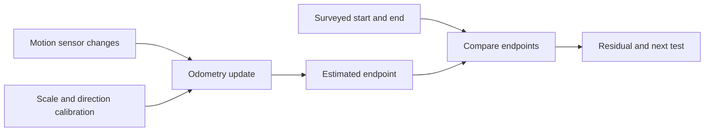

# Estimate motion with odometry

Odometry estimates how a robot pose changes from motion sensors. It can update many times each
second, even when a camera sees no tag. Small scale, direction, or heading mistakes can also build
an estimate that looks smooth but ends in the wrong place.

## Purpose and prerequisites

Complete [Robot Coordinates Without Guesswork](/academy/robot-coordinate-contracts?path=controls-localization-autonomous)
and [Plan Smooth Motion with Limits](/academy/controls-motion-profiles?path=controls-localization-autonomous)
first. You should know field X and Y, heading sign, meters, radians, and the difference between a
planned reference and a measured result.

This lesson compares one surveyed straight route with a simple odometry estimate. It teaches why
calibration needs independent truth. It does not reproduce the full ARES estimator.

## Vocabulary

- **Pose:** field X, field Y, and heading together.
- **Odometry:** a pose change estimated from motion sensors.
- **Encoder scale:** the distance represented by one encoder change.
- **Heading bias:** a repeated offset in measured direction.
- **Surveyed truth:** a pose measured independently from the estimator being tested.
- **Endpoint error:** distance between estimated and surveyed endpoints.
- **Process noise:** uncertainty added while motion is estimated.
- **Calibration:** measure and correct a repeatable difference.
- **Residual:** difference between an estimate and an independent measurement.
- **Covariance:** a numerical description of estimate uncertainty.

## Worked example

A robot follows a surveyed three-meter route along field positive X. Suppose its distance scale is
two percent high. The estimated distance is:

```text
estimated distance = 3.00 m × 1.02
estimated distance = 3.06 m
```

The endpoint is six centimeters too far in X. Now suppose the heading also has a five-degree bias.
Part of the estimated motion points into field Y. The endpoint may miss in two directions even
though the wheels drove a straight route.

One trial cannot show whether the cause is wheel scale, heading, slip, or setup error. Repeated
routes in both directions help separate a repeatable calibration problem from random variation.

## Visual model



Do not use the odometry estimate as the truth used to grade that same estimate. The truth source
must be independent.

## Hands-on activity

Open the lab. Keep all errors at zero. Confirm that the surveyed and estimated endpoints match.
Open the endpoint table and record both field coordinates.

<odometryerrorlab />

Set distance scale error to positive five percent. Keep heading bias at zero. Record estimated X,
estimated Y, and endpoint error. Repeat with negative five percent.

Reset. Set heading bias to five degrees. Repeat with negative five degrees. Describe what changes in
field Y and what stays similar.

Create four final trials with the same calibration errors but different surveyed distances. Decide
whether endpoint error grows with route length. Change only distance during this set.

## Checkpoints

Check the frame before comparing points. Both endpoints must use the same field X, field Y, units,
and heading convention.

Check the truth source. A dashboard value copied from the estimator is not independent truth. Use
surveyed field marks, a tape or laser, or another reviewed measurement method.

Check both route directions. A scale error often follows distance. A setup offset or backlash may
change when direction reverses.

## Troubleshooting

If estimated Y changes during a straight field-X route, inspect heading sign and sensor mounting.
Do not add a second negative sign in a dashboard to hide the error.

If every route is long by a similar percentage, inspect distance scale. If the error changes from
trial to trial, record battery, surface, wheel contact, and test setup before changing constants.

If a camera result disagrees with odometry, do not assume the camera is truth. Check timestamps,
tag count, ambiguity, mounting, and independent field position.

If the lab seems too clean, remember its limit. It applies one exact scale and heading error. Real
measurements include noise, slip, curved motion, and time alignment.

## Evidence artifact

Submit an eight-row calibration table. Include surveyed distance, scale error, heading bias,
estimated X, estimated Y, and endpoint error. Mark which input changed in each row.

Add a route drawing with field axes and both endpoints. Write one observation, one possible cause,
and one next repeated test. State why the surveyed endpoint is independent from odometry.

## Short assessment

1. What three values make a two-dimensional pose?
2. Why must calibration truth be independent?
3. What error can a wrong distance scale create?
4. How can heading bias create field-Y error on a field-X route?
5. Why should teams repeat routes in both directions?
6. Does this lab reproduce ARES vision fusion or covariance?

A strong answer names the coordinate frame and units. It also separates a visible residual from an
untested explanation.

## Extension challenge

Write a student-led calibration plan for six straight routes and six in-place turns. Name the route
lengths, directions, truth method, saved signals, and stop condition. Do not run it until the robot
area and normal team safety checks are ready.

Students can verify robot functionality and review the resulting evidence. Website publication uses
the separate Lead Coach review workflow.

## Related and next

Return to [Robot Coordinates Without Guesswork](/academy/robot-coordinate-contracts?path=controls-localization-autonomous)
if a sign or frame is unclear. Continue next to sensor fusion and uncertainty, where odometry and
camera measurements can support each other without treating either source as perfect truth.
