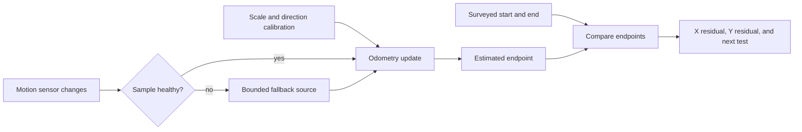

# Estimate motion with odometry

Odometry is a running estimate of robot motion. It can update many times each second, even when a
camera cannot see a field tag. It is useful because the robot always needs a best guess of where it
is. It is also imperfect. A small scale, direction, timing, or heading mistake can grow into a large
miss by the end of a route.

Good localization work asks two questions at the same time:

1. How close is the estimate to an independent measurement?
2. Is the sensor sample healthy enough to use right now?

Calibration helps with the first question. Source health and safe fallback help with the second.

## Purpose and prerequisites

Complete [Robot Coordinates Without Guesswork](/academy/robot-coordinate-contracts?path=controls-localization-autonomous)
and [Plan Smooth Motion with Limits](/academy/controls-motion-profiles?path=controls-localization-autonomous)
first. You should know field X and Y, the CCW-positive heading rule, meters, radians, and the
difference between a planned value and a measured result.

This lesson will help you:

- compare an odometry endpoint with surveyed truth in four field directions;
- separate distance-scale error from heading error;
- explain why one route is not enough for calibration;
- trace the current ARES FTC startup, failover, and recovery rules; and
- plan physical tests without claiming that a browser model proves robot accuracy.

The endpoint lab uses simple geometry. It does not reproduce the full ARES estimator.

This lesson follows ARES 13.0.0, FTC SDK 11.1.0, and Studio 3.1.1. Its source links are pinned to
the exact public monorepo commit used for review. The browser supplies ready-made health results. It
does not read robot sensors or execute the Kotlin runtime.

## Vocabulary

- **Pose:** field X, field Y, and heading together.
- **Odometry:** a pose change estimated from motion sensors.
- **Encoder scale:** the distance represented by one encoder change.
- **Heading bias:** a repeated offset in measured direction.
- **Surveyed truth:** a pose measured without using the estimator being tested.
- **Residual:** estimate minus truth for one value.
- **Endpoint error:** straight-line distance between estimated and surveyed endpoints.
- **Calibration:** measuring and correcting a repeatable difference.
- **Primary source:** the normal sensor used to advance the pose estimate.
- **Fallback source:** another bounded source used when the primary source is not healthy.
- **Stale sample:** a sample that was once valid but is now too old.
- **Rebase:** align a returning source with the current pose before using it again.
- **Process noise:** uncertainty added while motion is estimated.
- **Covariance:** numbers that describe how uncertain an estimate is.

## Worked example

### Distance scale

A robot follows a surveyed three-meter route along field positive X. Suppose its distance scale is
two percent high.

```text
estimated distance = surveyed distance × (1 + scale error)
estimated distance = 3.00 m × 1.02
estimated distance = 3.06 m
```

The X residual is positive 0.06 meter. The estimate is six centimeters beyond the surveyed end.
If the robot repeats the route along field negative X, the estimate should be six centimeters too
far in the negative direction. That sign change is useful evidence. It shows the error follows the
route instead of staying fixed at one field location.

### Heading bias

Now keep the distance scale correct and add a five-degree heading bias. During a positive-X route,
some estimated motion points into positive Y. During a negative-X route, the same signed bias can
push the endpoint toward negative Y. Looking at both X and Y residuals gives more information than
looking only at total endpoint error.

One trial cannot prove whether the cause is encoder scale, pod mounting, wheel slip, a heading sign,
or test setup. A strong calibration set repeats distances, axes, and directions. It changes one
planned variable at a time.

## How current ARES FTC handles source health

The default ARES FTC setup reads a GoBilda Pinpoint computer when one is configured. Its adapter
converts the sample to meters and CCW-positive radians. It checks that position, heading, linear
velocity, and angular velocity are finite. It also rejects speeds and pose jumps beyond its bounds.
A separate age check can mark an old or future-dated sample stale. A sample can be marked starting,
healthy, stale, nonfinite, implausible, or a communication failure. The last trusted pose is kept
when a bad packet arrives, but the bad packet is not called healthy.

The source selector starts as `UNINITIALIZED`. Its first update chooses Pinpoint only when Pinpoint
is present and healthy. Otherwise, it chooses drivetrain fallback. The browser trace now begins in
that same startup state so you can test both first-sample paths.

The source selector reacts in two different ways:

- A bad or missing Pinpoint sample moves to drivetrain fallback at once.
- Pinpoint must then provide five healthy samples in a row before it can return.

One bad recovery sample resets that count. This delay prevents a loose connection from switching
back and forth each loop. When a valid Control Hub IMU is configured, its cached sample supplies
heading information to the fallback. ARES applies that gyro correction only when the cached IMU
sample is valid; the source name alone does not prove that an IMU sample exists.

When fallback begins, ARES starts it from the current fused pose. When Pinpoint is ready to return,
ARES first rebases it to that current pose. It publishes Pinpoint only if re-initialization succeeds
and the next sample is healthy. Otherwise, it stays in fallback. That handoff avoids restoring an
old raw pose from before the outage.

The source name and Pinpoint health are diagnostic evidence. Fallback keeps localization moving,
but it does not mean the failed sensor or calibration problem is fixed. A team should save the
status, inspect the hardware, and repeat the route.

ARES FRC uses a different platform boundary. Its CTRE estimator remains authoritative. The route
and independent-truth ideas in this lesson still apply, but the FTC source buttons in the browser
lab do not describe FRC source selection.

### Read the exact ARES 13.0.0 boundaries

The Pinpoint adapter tests four kinds of evidence before calling a packet healthy:

| Check | Pinned ARES 13.0.0 rule |
| --- | --- |
| Finite values | X, Y, heading, linear velocity, and angular velocity must all be finite. |
| Speed | Linear speed must be at most `8 m/s`. Angular speed must be at most `4π rad/s`. |
| One-packet jump | Distance and heading changes must fit the speed bound plus a `0.75` tolerance. |
| Sample age | A trusted packet must be from `0` through `100 ms` old. |

An invalid packet changes the health label and keeps the last trusted pose. It does not publish the
bad coordinates as healthy evidence.

The source selector is a smaller state machine:

| Starting source | New Pinpoint result | Next source | Recovery count |
| --- | --- | --- | --- |
| `UNINITIALIZED` | present and healthy | `PINPOINT` | `0` |
| `UNINITIALIZED` | missing or unhealthy | `DRIVETRAIN_FALLBACK` | `0` |
| `PINPOINT` | missing or unhealthy | `DRIVETRAIN_FALLBACK` | `0` |
| `DRIVETRAIN_FALLBACK` | missing or unhealthy | `DRIVETRAIN_FALLBACK` | `0` |
| `DRIVETRAIN_FALLBACK` | healthy samples one through four | `DRIVETRAIN_FALLBACK` | `1` through `4` |
| `DRIVETRAIN_FALLBACK` | fifth healthy sample | `PINPOINT` | `0` |

That last row is not the whole handoff. `FtcBaseRobot` next rebases Pinpoint to the fused pose and
reads it again. Failed initialization or an unhealthy rebased sample forces fallback again. The
browser buttons model the selector table, but they do not model that rebase attempt.

## Visual model



Do not use the odometry estimate as the truth used to grade that same estimate. The truth must come
from a separate measurement method.

## Hands-on activity

Work with a partner. One student operates the lab. The other keeps the evidence table and checks
that only one planned input changes per trial. Switch jobs halfway through.

### Part 1: prove the coordinate frame

Open the lab with both errors at zero. Run a three-meter trial in field positive X. Read the result
line and confirm that surveyed truth, estimate, and residual use the same axes and units.

<odometryerrorlab />

Repeat the zero-error trial in positive Y, negative X, and negative Y. Record the expected sign of
each nonzero coordinate before reading the result. If your prediction is wrong, return to the
coordinate lesson before adding errors.

### Part 2: isolate distance scale

Select positive X and set distance scale error to positive five percent. Keep heading bias at zero.
Record estimated X, estimated Y, X residual, Y residual, and endpoint error. Repeat these trials:

1. positive X at negative five percent;
2. negative X at positive five percent;
3. positive Y at positive five percent; and
4. negative Y at positive five percent.

Explain which residual changes sign when route direction changes. Then choose positive X, keep the
error at five percent, and test one, three, and six meters. Decide whether the residual grows with
distance.

### Part 3: isolate heading bias

Reset the lab. Select positive X and set heading bias to positive five degrees. Record both signed
residuals. Repeat at negative five degrees. Then repeat both trials along negative X.

Do not write “the robot turned wrong” unless a robot was measured. The browser only rotates its
estimated direction. Write exactly what the model shows: for example, “The estimated Y residual
changed from positive to negative when the heading-bias sign changed.”

### Part 4: trace startup and source recovery

Reset both labs. Confirm that the source starts `UNINITIALIZED`. Send one healthy sample and confirm
that Pinpoint becomes active. Reset again, mark Pinpoint unavailable, and confirm that fallback is
selected on the first update.

From fallback, send four healthy samples and record why fallback stays active. Send the fifth
healthy sample and confirm that Pinpoint returns.

Repeat the fault. Send two healthy samples, one bad sample, and then inspect the count. Explain why
the count returns to zero. State what the browser proves and what it does not prove. In particular,
the buttons supply a ready-made health result; they do not inspect Pinpoint or an IMU.

## Physical calibration plan

The ARES localization guide calls for repeated, surveyed translation and rotation routes. A useful
student plan includes at least six straight routes across both field axes and directions, plus six
in-place turns in both directions. Use more than one distance or angle. Mark the start and end with
a tape, laser, field marks, or another reviewed method.

Save the route identity, surveyed start, surveyed end, estimated start, estimated end, active source,
source health, IMU availability, battery condition, surface, and time. For a source fault, also save
when fallback started and when the primary source recovered. Do not change constants during a trial
set.

The calibration fitter can estimate process and camera noise from a reviewed data set. It does not
change robot constants automatically. Students review the report, choose a correction, and repeat
the validation route. A smooth graph is not enough; the final estimate still needs independent
truth.

## Checkpoints

Check the frame first. Truth and estimate must use the same field axes, units, start pose, and
heading sign. A number in millimeters cannot be compared directly with a number in meters.

Check the truth source. A dashboard value copied from the estimator is not independent truth. A
camera result is not automatically truth either, especially when camera error is being tested.

Check the sample status. A finite value can still be stale. A recent value can still be an
implausible jump. Keep value, unit, time, health, and source identity together.

Check startup separately from recovery. `UNINITIALIZED` means the selector has not accepted its
first source yet. It is not the same as a recovered Pinpoint source.

Check both route directions. Scale error often follows distance. Mounting offset, backlash, wheel
slip, or a field setup problem may change with direction.

## Troubleshooting

If estimated Y changes during a straight field-X route, inspect heading sign, sensor mounting, and
frame conversion. Do not add a second negative sign in the dashboard to make one route look right.

If every route is long by a similar percentage, inspect distance scale. If the error changes each
trial, record wheel contact, surface, battery, and setup before changing a constant.

If source recovery never reaches five, look for intermittent health failures. The count is designed
to restart after one bad sample. Do not weaken the rule just to hide a connection problem.

If pose jumps when a source returns, inspect whether the source was rebased to the current fused
pose and whether the first rebased sample was healthy. A failed re-initialization must stay in
fallback rather than restore an old raw pose.

If fallback heading does not change as expected, check whether a valid Control Hub IMU is configured
and fresh. `DRIVETRAIN_FALLBACK` names the selected odometry source; it does not certify IMU health.

If the browser lab seems too clean, remember its limit. It applies exact scale and heading errors.
Real data includes noise, slip, curved motion, delayed samples, changing wheel contact, and setup
error.

## Walk the current source

From the root of the ARES Robotics monorepo, run:

```powershell
rg -n "HealthStatus|DEFAULT_MAX_SAMPLE_AGE_MS|MAX_LINEAR_SPEED|isHealthy" `
  ARESLib-Kotlin/ftc-hardware/src/main/kotlin/com/areslib/ftc/drivetrain/PinpointIO.kt

rg -n "UNINITIALIZED|healthyRecoverySamples|forceFallback|reset" `
  ARESLib-Kotlin/ftc-hardware/src/main/kotlin/com/areslib/ftc/drivetrain/FtcOdometrySourceArbiter.kt

rg -n "previousSource|initialize\(|forceFallback|applyControlHubGyroCorrection" `
  ARESLib-Kotlin/ftc-hardware/src/main/kotlin/com/areslib/ftc/FtcBaseRobot.kt
```

Then open the pinned tests from the lesson source panel. Match each browser transition to one
source branch and one test expectation. Record “not modeled” for the rebase and hardware checks.

## Evidence artifact

Submit one packet with three parts:

1. A twelve-row endpoint table covering all four field directions, both scale signs, both heading
   signs, and at least three distances.
2. A source trace showing first-sample startup selection, immediate failover, four held recovery
   samples, the fifth-sample return, and one count reset after a bad sample.
3. A physical test plan naming the truth method, routes, saved signals, safety boundary, and stop
   condition.

For three trials, write one observation, one possible cause, and one next test. Label the possible
cause as unproven. Add a route drawing with field axes and both endpoints.

## Short assessment

1. What three values make a two-dimensional pose?
2. Why must calibration truth be independent?
3. How can a distance-scale error appear on positive-X and negative-X routes?
4. Why are signed X and Y residuals more useful than endpoint error alone?
5. What makes a Pinpoint sample unhealthy in the current ARES FTC boundary?
6. How does the first source update leave `UNINITIALIZED`?
7. What happens on the first unhealthy Pinpoint sample after Pinpoint is active?
8. Why are five healthy recovery samples required in a row?
9. What does rebase mean during a source handoff?
10. Does the fallback source name prove that a valid IMU sample exists?
11. What happens if the fifth healthy sample is followed by a failed Pinpoint rebase?
12. Does this lab run the ARES estimator or prove physical robot accuracy?

A strong answer names the frame and units. It separates measured evidence from a possible cause and
keeps calibration error separate from source-health behavior.

## Extension challenge

Create a student-led commissioning card for one physical robot. Include six straight routes, six
turns, source-health fields, repeated trials, and a stop condition for an unexpected motion or bad
sample. Add a blank place for “student verified,” the date, and the exact software version.

Students can verify robot functionality and review the resulting evidence. Website publication uses
the separate Lead Coach review workflow.

## Related and next

Return to [Robot Coordinates Without Guesswork](/academy/robot-coordinate-contracts?path=controls-localization-autonomous)
if a sign or frame is unclear. Continue to
[Combine Measurements without Hiding Uncertainty](/academy/controls-sensor-fusion?path=controls-localization-autonomous)
to study accepted measurements, rejected measurements, uncertainty, and independent truth.
