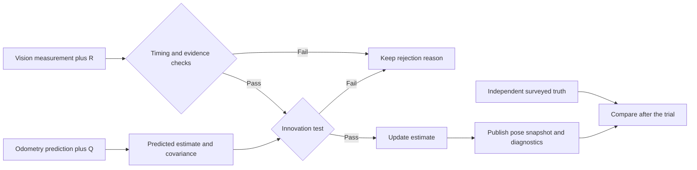

# Combine measurements without hiding uncertainty

Odometry and vision can disagree. Sensor fusion does not pick a winner by sensor name. It uses
timing, test results, and uncertainty to decide whether a measurement should change an estimate.

## Purpose and prerequisites

Complete [Estimate Motion with Odometry](/academy/controls-odometry?path=controls-localization-autonomous)
first. You should understand pose, coordinate frames, residuals, and independent truth.

In this lesson, you will:

- compare the influence of two accepted measurements;
- use a signed residual to show the direction of disagreement;
- reject a vision measurement without deleting its evidence;
- test the result against an independent truth value; and
- connect a simple one-dimensional model to the real ARES estimator.

The interactive lab uses a weighted average on one straight line. It helps you see one idea at a
time. It is not the three-dimensional ARES Extended Kalman Filter, or EKF.

## Vocabulary

- **Sensor fusion:** combine evidence from more than one source.
- **Estimate:** a value calculated from the evidence available so far.
- **Uncertainty:** a claim about how much a measurement may vary.
- **Variance:** uncertainty squared. The lesson uses it to calculate weight.
- **Influence:** the share of an accepted result caused by one source.
- **Residual:** new measurement minus earlier estimate. Its sign shows direction.
- **Prediction:** the estimate before a new measurement arrives.
- **Update:** a changed estimate after an accepted measurement arrives.
- **Covariance:** a set of uncertainty values and relationships used by an estimator.
- **Process noise, Q:** uncertainty added while the robot predicts its own motion.
- **Measurement noise, R:** uncertainty assigned to an outside measurement, such as vision.
- **Innovation test:** a check for whether new evidence is believable given its uncertainty.
- **Reject:** keep the current estimate and record why the new evidence was not used.
- **Independent truth:** a separate measurement used only to test the result.

Uncertainty is not a score that a sensor earns forever. It is a claim that must match repeated tests.
A small uncertainty says, “Measurements like this usually land close to the real value.”

## Worked example

Odometry reports `2.0 m` with uncertainty `0.5 m`. Vision reports `4.0 m` with uncertainty `0.25 m`.
The lesson gives greater influence to smaller uncertainty. It uses inverse variance.

```text
odometry weight = 1 ÷ 0.5² = 4
vision weight = 1 ÷ 0.25² = 16
total weight = 4 + 16 = 20

odometry influence = 4 ÷ 20 = 20%
vision influence = 16 ÷ 20 = 80%

weighted result = (2 × 4 + 4 × 16) ÷ 20
weighted result = 3.6 m
signed residual = vision - odometry = 4 - 2 = +2 m
```

The result lies between the two accepted measurements. It is nearer vision because vision claimed
less uncertainty. A positive residual means vision was farther along the number line than odometry.

Now suppose independent truth is `2.2 m`. The fused result is `1.4 m` away from truth, even though
the math was correct. That evidence suggests at least one uncertainty claim or measurement was poor.
Never tune uncertainty just to force one trial to look good. Repeat the test and find the cause.

### How ARES goes beyond this example

ARES predicts a full robot pose and its covariance. Motion adds process uncertainty, called `Q`.
An outside measurement arrives with measurement uncertainty, called `R`. The estimator calculates a
residual and a gain that controls the update.

ARES also checks whether the residual is reasonable for the stated uncertainty. This is an
innovation test. A measurement that fails the check is rejected and leaves a diagnostic reason.

Vision can arrive late. ARES keeps a short pose history so an accepted camera observation can update
the matching capture time. It then carries that correction forward. Comparing delayed vision only
with the newest pose would make a moving robot appear wrong.

Some FRC robots use an outside estimator as the authority. In that mode, ARES does not fuse the same
measurement a second time. The lab does not model this ownership rule.

## Visual model



Notice that independent truth connects only to the final comparison. If surveyed truth entered the
fusion calculation, it would no longer be an independent check.

## Hands-on activity

Work in pairs if possible. One student moves controls. The other predicts each result and records
evidence. Swap roles after Part 2.

<sensorfusionlab />

### Part 1: Find each source's influence

1. Reset the lab and keep ambiguity below `0.20`.
2. Record both positions, uncertainties, influence percentages, signed residual, and result.
3. Change only vision uncertainty through four values.
4. Predict which direction the result will move before each change.
5. Reset. Change only odometry uncertainty through four values.

Explain why a smaller uncertainty creates a larger influence in this lesson. Confirm that the two
influence percentages add to `100%` when vision is accepted.

### Part 2: Separate disagreement from uncertainty

Create two trials with the same positions but different uncertainty pairs. The signed residual should
stay the same while the influence changes.

Next, create two trials with the same uncertainties but different positions. The influence should
stay the same while the signed residual changes.

Set ambiguity above `0.20`. Vision should be rejected. Check that odometry influence becomes `100%`
and vision influence becomes `0%`. Open the measurement table. The rejected vision value must remain
visible with its decision. Rejected evidence is still useful for debugging.

### Part 3: Challenge an uncertainty claim

1. Reset the lab.
2. Choose an independent truth value that differs from both sensors.
3. Give the less accurate source a very small uncertainty.
4. Record the fused result and its error from truth.
5. Reverse the uncertainty claims and repeat.
6. Change only independent truth. Confirm that the fused result does not move.

The last check matters. Truth tests the result but does not help create it. Write one sentence about
which uncertainty claim matched the evidence better. Do not call either source “good” from one trial.

### Part 4: Check the calculation

Ask a partner to reproduce one accepted row using the worked-example rule. Compare the hand result
with the lab. If they differ, check that each uncertainty was squared before finding its weight.

## Checkpoints

- Uncertainty must be positive. Zero would claim perfect knowledge and breaks this lesson rule.
- Accepted influence percentages must add to `100%`, except for small display rounding.
- The accepted weighted result must stay between the two measurements.
- Signed residual must change sign when vision moves from one side of odometry to the other.
- Rejected vision must remain visible with a reason and `0%` influence.
- Moving independent truth must change only the reported error from truth.
- Every recorded value must include a unit when it has one.

Before continuing, explain the difference between “small uncertainty” and “verified accuracy.” A
small uncertainty is only a strong claim until independent evidence supports it.

## Troubleshooting

If the result does not move toward vision, check whether ambiguity rejected vision. Then compare the
two uncertainty values. Smaller uncertainty gets more influence in this lab.

If the residual sign seems backward, use the lesson rule: `vision - odometry`. A negative residual
means vision is lower on the number line. Other tools may choose a different sign, so read their
contract before comparing logs.

If truth changes the fused result, reset and repeat. In this model, truth is a judge, not an input.
Report that behavior as a software defect if the result still moves.

If a real robot estimate jumps, inspect timestamps, units, coordinate frames, and rejection details
before changing noise values. Do not use larger uncertainty to hide loose hardware or a scale error.

If one source always controls the result, compare both units and uncertainty values. Centimeters and
meters cannot be mixed. Also check whether an outside estimator owns the final FRC pose.

## Evidence artifact

Submit a table with at least 12 trials:

- four vision-uncertainty trials;
- four odometry-uncertainty trials;
- one accepted and one rejected ambiguity trial; and
- two independent-truth challenge trials.

Include positions, uncertainty values, ambiguity, decision, signed residual, both influence shares,
result, truth, and error from truth. Add a short claim supported by two rows. State one limit of the
lab and one diagnostic you would inspect on the real robot.

Students may review this evidence and verify robot function using the team's safety process. A mentor
does not need to approve a valid robot result. Publishing evidence on the website uses the separate
Lead Coach review workflow.

## Short assessment

1. Why does `0.25 m` uncertainty receive more influence than `0.50 m` in the worked example?
2. What information does the sign of a residual provide?
3. Why is zero uncertainty invalid?
4. What evidence should remain after a vision measurement is rejected?
5. Why must independent truth stay outside the fusion calculation?
6. What do `Q` and `R` describe in the real estimator?
7. Why does capture time matter for delayed vision?
8. When should ARES avoid fusing an accepted measurement a second time?

## Extension challenge

Design a stationary field test around one surveyed pose. Collect repeated odometry and camera
measurements without using camera output as truth. List the signals, timestamps, units, and rejection
reasons you would save.

Predict what a useful spread plot would look like. Explain how repeated error can help test a proposed
`R` value. Then describe why driving repeated surveyed routes is better evidence for `Q` than watching
one successful path.

Do not change production robot noise values during this lesson. Prepare a recommendation, evidence,
and rollback plan for team review. Students can run the safe test and verify the result.

## Related and next

Continue to [Use AprilTags and Reject Bad Vision Measurements](/academy/controls-vision?path=controls-localization-autonomous).
Return to [Estimate Motion with Odometry](/academy/controls-odometry?path=controls-localization-autonomous)
if the prediction source, coordinate frame, or surveyed-truth process is unclear.
