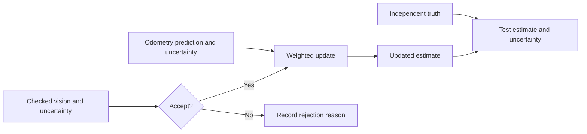

# Combine measurements without hiding uncertainty

Odometry and vision can disagree. Sensor fusion does not pick a winner by name. It uses measurement
quality, timing, and uncertainty to decide whether and how each source can update an estimate.

## Purpose and prerequisites

Complete [Estimate Motion with Odometry](/academy/controls-odometry?path=controls-localization-autonomous)
first. You should understand pose, independent truth, residual, and repeated tests.

This lesson uses a one-dimensional weighted average. It teaches the effect of stated uncertainty.
It is not the three-dimensional ARES Extended Kalman Filter, or EKF.

## Vocabulary

- **Sensor fusion:** combine measurements while keeping their uncertainty visible.
- **Estimate:** a value calculated from available evidence.
- **Uncertainty:** a number that describes expected measurement spread.
- **Variance:** uncertainty squared in this lesson's weighting rule.
- **Weight:** how strongly one accepted measurement affects the result.
- **Residual:** the difference between a measurement and the earlier estimate.
- **Prediction:** the estimate before a new measurement arrives.
- **Update:** a corrected estimate after an accepted measurement.
- **Reject:** preserve the current estimate and record why data was not used.
- **Independent truth:** a separate measurement used to test the final estimate.

## Worked example

Odometry reports `2.0 m` with uncertainty `0.5 m`. Vision reports `4.0 m` with uncertainty `0.25 m`.
The lesson model gives greater weight to smaller uncertainty. It uses inverse variance.

```text
odometry weight = 1 ÷ 0.5² = 4
vision weight = 1 ÷ 0.25² = 16
weighted result = (2 × 4 + 4 × 16) ÷ (4 + 16)
weighted result = 3.6 m
```

The result lies between the measurements and nearer vision. That does not prove vision was correct.
Independent truth is still needed to test the result and the uncertainty choices.

## Visual model



## Hands-on activity

Open the lab. Keep ambiguity below the lesson limit. Record both positions, both uncertainty values,
the residual, and the result.

<sensorfusionlab />

Change only vision uncertainty. Use four trials. Explain why the accepted result moves toward or
away from vision. Reset, then change only odometry uncertainty.

Create two trials with the same residual but different uncertainty pairs. Create two more with the
same uncertainties but different residuals. Keep ambiguity accepted during these comparisons.

For a final set, choose one odometry position and one vision position. Make vision uncertainty
small, then large. Predict the result before moving the slider. Circle the source nearer the result
after each trial. Repeat with odometry uncertainty. This gives four trials with the same positions.

Ask a partner to reproduce one row using the worked-example rule. Compare the calculated value with
the lab. If the values differ, check whether uncertainty was squared before finding each weight.

## Checkpoints

Check that uncertainty is positive. Zero uncertainty would claim perfect knowledge and breaks this
lesson rule. Check that the result stays between accepted measurements.

Name the value you changed in every trial. Do not describe the weighted result as truth. It remains
an estimate until independent evidence tests it.

Check the ambiguity decision before studying the weight. A rejected vision measurement has no
weight in this lesson. Its position and uncertainty still remain in the table as diagnostic data.

## Troubleshooting

If the result does not move, check whether vision was rejected. If the result moves the wrong way,
compare the two uncertainty values. Smaller uncertainty receives greater weight here.

If a real estimator jumps, inspect timestamps and rejection diagnostics before changing noise
values. Delayed data must update the matching history point. Larger noise should not hide a repeated
mounting or scale error.

If one source always controls the result, compare uncertainty values and units. An uncertainty in
centimeters cannot be mixed with a position in meters without conversion. Write every unit in the
trial table.

## Evidence artifact

Submit an eight-row table with positions, uncertainties, ambiguity, decision, residual, and result.
Add two sentences: one explains weighting, and one states why the result is not verified truth.

## Short assessment

1. Which accepted measurement receives more weight in this lesson?
2. What is a residual?
3. Why is zero uncertainty invalid?
4. What should happen to rejected data?
5. Why is independent truth still needed?

## Extension challenge

Design a repeated stationary test with one surveyed position. List the signals and rejection reasons
you would save. Explain how you would decide whether the stated uncertainty matches the spread.

Students may review fusion evidence and verify robot function using the team's safety process.
Website publication uses the separate Lead Coach review workflow.

## Related and next

Continue to [Use AprilTags and Reject Bad Vision Measurements](/academy/controls-vision?path=controls-localization-autonomous).
Return to the odometry lesson if the prediction source or coordinate frame is unclear.
