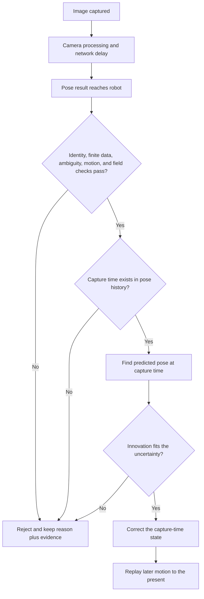

# Use AprilTags and reject bad vision measurements

An AprilTag camera can help a robot find its field pose. It can also report old, unclear, or
impossible data. A safe estimator does not trust a pose just because a camera produced it. It checks
the evidence, saves a clear reason when a check fails, and only then updates the robot's estimate.

## Purpose and prerequisites

Complete [Combine Measurements without Hiding
Uncertainty](/academy/controls-sensor-fusion?path=controls-localization-autonomous) first. You should
know prediction, update, residual, uncertainty, and independent truth.

By the end, you will be able to:

- explain why an image belongs to its capture time instead of its receipt time;
- trace the main ARES vision checks in a sensible order;
- read a rejection reason without hiding the rest of the evidence; and
- plan a private, repeatable camera test at surveyed field points.

The lab uses a short checklist and straight-line math. ARES performs more checks and uses a full
pose estimator. The lab does not solve an image or reproduce that estimator.

## Vocabulary

- **AprilTag:** a marker with a known ID and field pose.
- **Field layout:** the reviewed map that pairs each tag ID with a field pose.
- **Capture time:** when the camera recorded an image.
- **Receipt time:** when the robot received the processed result.
- **Latency:** the delay between capture and receipt.
- **Ambiguity:** a score that shows when more than one tag-pose answer may fit.
- **Residual:** measured value minus predicted value at the same time.
- **Innovation:** the multi-part residual used by the pose estimator.
- **Outlier:** data that does not fit the checked model and uncertainty.
- **Field bound:** a limit that keeps the whole robot inside the field contract.
- **History replay:** fix an earlier pose, then repeat the motion that came after it.
- **Rejection reason:** a saved explanation for data that was not used.

## Worked example

**Compare the same moment.**

Suppose the estimator says the robot was at `2.80 m` when an image was captured. The camera result
for that image says `2.90 m`. The correct residual is:

`2.90 m - 2.80 m = +0.10 m`

Now suppose the robot was moving at `1.2 m/s`, and the camera needed `250 ms` to send the result.
First turn milliseconds into seconds: `250 ms = 0.25 s`. The robot travels about:

`1.2 m/s × 0.25 s = 0.30 m`

The current estimate at receipt is about `3.10 m`. Comparing the old camera image with this newer
pose gives:

`2.90 m - 3.10 m = -0.20 m`

That second residual has the wrong size and direction because it compares two different moments.
ARES finds the stored pose at capture time, applies the accepted correction there, and replays the
later motion. If the capture time is older than the stored history, ARES rejects it as
`vision_too_old`.

## How the ARES checks fit together

ARES has two useful layers of checks. The hardware-facing filter asks whether the measurement is
physically believable. It checks valid numbers, ambiguity when the camera supplies it, allowed tag
IDs, camera distance, and the robot footprint inside field bounds. It also checks heading
disagreement, fast turning, and a hard collision or shock.

The estimator then asks whether the measurement fits its saved state and uncertainty. It requires
pose history, at least one tag, positive uncertainty values, a valid statistical threshold, and a
capture time inside history. It scales camera uncertainty using distance, tag count, viewing angle,
and ambiguity. Last, it compares the three-part innovation for `x`, `y`, and heading with the
combined uncertainty.

These checks answer different questions. Low ambiguity does not prove the tag ID, field map,
timestamp, or pose is correct. A pose inside the field can still disagree too much with recent
motion. Passing every gate means “usable by this policy,” not “perfect truth.”

Some useful ARES reason names are:

| ARES reason or status              | Plain-language meaning                                | First thing to inspect                        |
| ---------------------------------- | ----------------------------------------------------- | --------------------------------------------- |
| `REJ_INVALID` or `nan_measurement` | A required number is missing or not finite.           | Camera output and unit conversion             |
| `REJ_AMBIG` or `high_ambiguity`    | The camera found a weak or competing solution.        | View angle, lighting, focus, and tag size     |
| `REJ_BOUNDS`                       | The robot footprint would lie outside the field.      | Field frame, layout, and camera mount         |
| `REJ_DIST`                         | The reported pose is farther than the policy allows.  | Distance units and current pose               |
| `REJ_YAW`                          | Camera heading and robot heading differ too much.     | Heading frame and mount rotation              |
| `REJ_RATE`                         | The robot is turning too fast for this update.        | Angular-rate telemetry and motion blur        |
| `REJ_SHOCK`                        | A hard motion event makes the frame less trustworthy. | Acceleration data and collision timing        |
| `vision_too_old`                   | Capture time is older than saved pose history.        | Camera clock, latency, and history length     |
| `mahalanobis_rejected`             | Innovation is too large for the stated uncertainty.   | Residuals, uncertainty, and independent truth |

Do not tune by raising every limit until all data passes. A rejection can reveal a bad frame,
incorrect units, a stale clock, a wrong field map, or an uncertainty model that needs better tests.

## Visual model

Read it from top to bottom. The camera result arrives in the present, but the comparison moves back
to capture time. Every failed branch keeps a reason. The accepted branch returns to the present by
replaying later motion.

## Hands-on activity

Open the lab below. The controls are keyboard and touch friendly.

<visionuncertaintylab />

### Part 1: trace rejection order

1. Start with every gate on. Record the accepted decision.
2. Turn off only **Pose and uncertainty are finite**. Record the first reason.
3. Reset. Repeat for each of the other five gates.
4. Turn off the field-layout gate and the innovation gate together.
5. Explain why the first reason stays stable while the second failed check remains visible.

Make this evidence table:

| Trial | Failed gate or gates        | Prediction | First reason | Other failed checks | Decision |
| ----- | --------------------------- | ---------- | ------------ | ------------------- | -------- |
| 1     | None                        |            |              |                     |          |
| 2     | Finite data                 |            |              |                     |          |
| 3     | Known target                |            |              |                     |          |
| 4     | Ambiguity                   |            |              |                     |          |
| 5     | Capture time                |            |              |                     |          |
| 6     | Field bounds                |            |              |                     |          |
| 7     | Innovation                  |            |              |                     |          |
| 8     | Known target and innovation |            |              |                     |          |

### Part 2: test latency math

1. Set speed to `0.0 m/s`. Change the delay. What stays the same?
2. Set speed to `1.2 m/s` and delay to `250 ms`. Check the worked example.
3. Keep the delay fixed and raise speed. Watch the receipt-time residual.
4. Keep speed fixed and raise delay. Record the distance traveled during the delay.
5. Explain why the capture-time residual stays fixed in this simple model.

The correct answer is not that latency is harmless. The camera pose still needs a valid capture
timestamp, enough stored history, and a tested uncertainty model. The point is that delay must be
handled at the right time boundary.

## Checkpoints

- Say which time belongs to the image and which time belongs to delivery.
- Show that `milliseconds ÷ 1000` converts delay to seconds.
- Confirm that tag IDs match the reviewed field layout.
- Confirm that all positions use the same field frame and meter units.
- Keep ambiguity marked unavailable when the platform does not provide it. Do not invent zero.
- Keep rejected rows and named reasons in the test record.
- Use surveyed points or another independent reference when judging accuracy.

Before a physical test, inspect the camera mount and tag layout. Secure the robot on a clear field.
Start while stopped, then use slow planned motion. Students may run the test and verify robot
behavior through the normal team safety process.

## Troubleshooting

**Every frame says no target or stale frame.** Check camera connection, fresh frame IDs, timestamps,
and whether the tag is visible. A repeated old frame is not new evidence.

**Vision is always rejected for ambiguity.** Improve lighting, focus, tag size, and view angle.
Confirm whether the camera actually reports ambiguity before changing policy.

**Vision is rejected at field bounds.** Check meters versus inches, the field origin, alliance
transforms, field-layout version, and camera mount. ARES checks the rotated robot footprint, not only
its center point.

**Vision is rejected while turning or after a hit.** Compare the rejection time with angular-rate and
acceleration telemetry. The motion guards are meant to avoid blur and collision-corrupted evidence.

**Vision is too old.** Compare capture and receipt timestamps. Check camera clock handling and saved
history length. Do not replace capture time with receipt time just to pass the gate.

**The statistical check rejects good surveyed poses.** Save residuals, tag count, distance, view
angle, ambiguity availability, and stated uncertainty. Repeat the same test before changing the
threshold. One surprising frame is not enough evidence for a new policy.

## Evidence artifact

Submit the eight-row decision table and a latency table with at least four speed-delay pairs. Add:

- capture time and receipt time;
- tag ID and field-layout version;
- camera result and predicted capture-time pose;
- residual, stated uncertainty, decision, and first reason;
- any other failed checks; and
- an independent surveyed position for a physical test.

Add one paragraph that separates **observation** from **explanation**. For example, “Five far-angle
frames had `REJ_AMBIG`” is an observation. “The camera exposure caused every rejection” is an
explanation that still needs a controlled test.

Do not put faces, student names, email addresses, school records, or screens with private data in the
artifact. Crop or blur private details only when the approved team process allows the image to be
used.

## Short assessment

1. Why must vision be compared with the pose at capture time?
2. At `2.0 m/s`, how far can a robot move during `150 ms` of delay?
3. Name four checks beyond ambiguity.
4. Why can a low-ambiguity pose still be wrong?
5. Why should rejected evidence and its reason remain visible?
6. What independent evidence could test the final field pose?

## Extension challenge

Plan a stationary camera test at three surveyed field poses. At each pose, collect near and far
views, at least two view angles, tag count, lighting notes, capture delay, and every rejection
reason. Repeat each condition instead of keeping only the best frame.

Then plan one slow-motion test. State the maximum speed, clear-field boundary, stop condition, and
signals you will save. Predict which results would support your uncertainty settings and which
would show that they need more work.

This lab cannot calibrate the camera, inspect the robot, or prove a physical pose. Students can use
the evidence to verify robot function. Website publication alone uses the separate Lead Coach
review workflow.

## Related and next

Use these checks in [Build and Verify Your First FTC Autonomous
Routine](/academy/ftc-starter-first-autonomous?path=controls-localization-autonomous). Revisit
[Decide Whether Camera Evidence Is
Trustworthy](/academy/camera-evidence-and-uncertainty?path=ai-ml-foundations) for a beginner version
that also applies to ordinary photos and charts.
