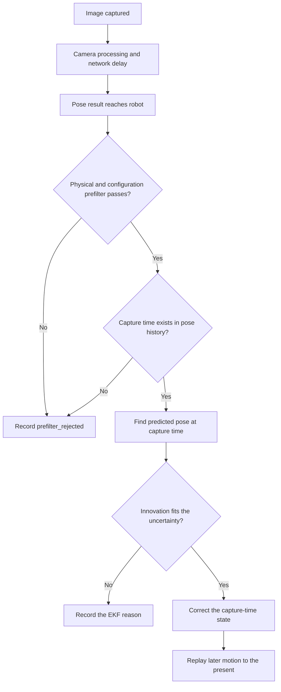

# Use AprilTags and reject bad vision measurements

An AprilTag camera can help a robot find its field pose. It can also report old, unclear, or
impossible data. A safe estimator does not trust a pose just because a camera produced it. It checks
the evidence, saves a clear reason when a check fails, and only then updates the robot's estimate.

## Purpose and prerequisites

Complete [Combine Measurements without Hiding
Uncertainty](/academy/controls-sensor-fusion?path=controls-localization-autonomous) first. You should
know prediction, update, residual, uncertainty, and independent truth.

By the end, you will be able to:

- explain why an image belongs to its capture time instead of its receipt time;
- trace the main ARES vision checks in a sensible order;
- separate the lab's teaching explanations from current ARES runtime reasons;
- use a rejection reason without pretending it names every failed check; and
- plan a private, repeatable camera test at surveyed field points.

This lesson matches ARES 12.0.0 and Studio 3.0.0. Its source links point to one reviewed commit in
the ARES Robotics monorepo.

The lab uses a short checklist and straight-line math. Its detailed gate explanations are teaching
aids. Current ARES reports a generic reason for its first prefilter, then more specific reasons from
the estimator. The lab does not solve an image or reproduce that estimator.

## Vocabulary

- **AprilTag:** a marker with a known ID and field pose.
- **Field layout:** the reviewed map that pairs each tag ID with a field pose.
- **Capture time:** when the camera recorded an image.
- **Receipt time:** when the robot received the processed result.
- **Latency:** the delay between capture and receipt.
- **Ambiguity:** a score that shows when more than one tag-pose answer may fit.
- **Residual:** measured value minus predicted value at the same time.
- **Innovation:** the multi-part residual used by the pose estimator.
- **Outlier:** data that does not fit the checked model and uncertainty.
- **Field bound:** a limit that keeps the whole robot inside the field contract.
- **History replay:** fix an earlier pose, then repeat the motion that came after it.
- **Rejection reason:** a saved explanation for data that was not used.

## Worked example

**Compare the same moment.**

Suppose the estimator says the robot was at `2.80 m` when an image was captured. The camera result
for that image says `2.90 m`. The correct residual is:

`2.90 m - 2.80 m = +0.10 m`

Now suppose the robot was moving at `1.2 m/s`, and the camera needed `250 ms` to send the result.
First turn milliseconds into seconds: `250 ms = 0.25 s`. The robot travels about:

`1.2 m/s × 0.25 s = 0.30 m`

The current estimate at receipt is about `3.10 m`. Comparing the old camera image with this newer
pose gives:

`2.90 m - 3.10 m = -0.20 m`

That second residual has the wrong size and direction because it compares two different moments.
ARES finds the stored pose at capture time, applies the accepted correction there, and replays the
later motion. If the capture time is older than the stored history, ARES rejects it as
`vision_too_old`.

The camera adapter subtracts latency once before dispatch. If another layer subtracts it again, the
frame appears older than it was. If no layer subtracts it, receipt time can be mistaken for capture
time.

## How the ARES checks fit together

ARES uses two layers. First, the Store finds the saved pose at the image's capture time. A
`VisionOutlierFilter` prefilter checks its configuration and all required finite values. It checks
ambiguity only when the camera says ambiguity is available. It checks a tag ID only when the
configured allowlist is not empty. It can also check reported tag distance, pose distance, target
height, roll, pitch, heading disagreement, the rotated robot footprint, turn rate, and shock.

That prefilter returns only `true` or `false`. It does not publish the exact failed sub-check. If a
non-empty batch has no frame left after this layer, the Store records `prefilter_rejected`. The
lab keeps its specific gate explanations visible so students can reason about the checklist, but
those explanations are not current ARES runtime strings.

Next, the Store chooses uncertainty values. It uses each positive camera-reported standard
deviation when available. Otherwise it uses configured values or defaults of `0.05 m`, `0.05 m`,
and `0.1 rad`. MegaTag2 is treated as a translation-only update: heading gets almost no influence.
The current default NIS limit is about `9.21` for this two-part update. A full three-part pose uses
`18.0` by default in the Store. These values are software defaults, not proof that they fit a
physical camera.

The EKF then checks history, tag count, uncertainty, covariance, capture time, and normalized
innovation squared, or NIS. It scales uncertainty using distance, tag count, viewing angle, and
ambiguity. These checks answer different questions. Low ambiguity does not prove the tag ID, field
map, timestamp, or pose is correct. Passing every gate means “usable by this policy,” not “truth.”

The prefilter compares pose with saved pose at capture time. Its turn-rate and shock guards use the
current drive state instead of replayed motion at capture time. Keep that boundary visible when
diagnosing a delayed frame near a fast turn or impact.

These are current runtime reason names:

| Runtime reason                                    | Plain-language meaning                                  |
| ------------------------------------------------- | ------------------------------------------------------- |
| `prefilter_rejected`                              | The Boolean physical/configuration prefilter removed it. |
| `empty_history`                                   | The Store has no pose sample for delayed replay.         |
| `high_ambiguity` or `nan_measurement`             | Ambiguity is too high, or the pose contains `NaN`.       |
| `no_tags`, `invalid_std_devs`, `invalid_threshold` | A required estimator input is not usable.                |
| `vision_too_old`                                  | Capture time is older than saved pose history.           |
| `non_positive_definite_innovation_covariance`     | The combined uncertainty cannot be used safely.          |
| `invalid_innovation` or `mahalanobis_rejected`    | NIS is invalid or above the selected threshold.          |
| `external_filter_rejected`                        | A platform-owned estimator rejected the frame.           |

When a platform estimator already fused the frame, ARES can set `fuseIntoPoseEstimator = false`.
ARES keeps filtered diagnostics without correcting its own pose a second time.

Do not tune by raising every limit until all data passes. A rejection can reveal a bad frame,
incorrect units, a stale clock, a wrong field map, or an uncertainty model that needs better tests.

## Visual model

Read it from top to bottom. The camera result arrives in the present, but the comparison moves back
to capture time. The prefilter reason is generic. The EKF reason is more specific. The accepted
branch returns to the present by replaying later motion.

## Hands-on activity

Open the lab below. The controls are keyboard and touch friendly.

<visionuncertaintylab />

### Part 1: trace rejection order

1. Start with every gate on. Record the accepted decision.
2. Turn off only **Pose and motion inputs are finite**. Record both explanations.
3. Reset. Repeat for each of the other six gates.
4. Turn off the ID-allowlist gate and the NIS gate together.
5. Explain why the lab shows both failed checks while ARES publishes one last runtime reason.

Make this evidence table:

| Trial | Failed gate or gates | Learning explanation | Runtime reason | Other failed checks | Decision |
| ----- | -------------------- | -------------------- | -------------- | ------------------- | -------- |
| 1     | None                 |                      |                |                     |          |
| 2     | Finite data          |                      |                |                     |          |
| 3     | ID allowlist         |                      |                |                     |          |
| 4     | Ambiguity            |                      |                |                     |          |
| 5     | Distance/geometry    |                      |                |                     |          |
| 6     | Turn rate/shock      |                      |                |                     |          |
| 7     | Capture time         |                      |                |                     |          |
| 8     | NIS                  |                      |                |                     |          |
| 9     | ID allowlist and NIS |                      |                |                     |          |

### Part 2: test latency math

1. Set speed to `0.0 m/s`. Change the delay. What stays the same?
2. Set speed to `1.2 m/s` and delay to `250 ms`. Check the worked example.
3. Keep the delay fixed and raise speed. Watch the receipt-time residual.
4. Keep speed fixed and raise delay. Record the distance traveled during the delay.
5. Explain why the capture-time residual stays fixed in this simple model.

The correct answer is not that latency is harmless. The camera pose still needs a valid capture
timestamp, enough stored history, and a tested uncertainty model. The point is that delay must be
handled at the right time boundary.

## Checkpoints

- Say which time belongs to the image and which time belongs to delivery.
- Show that `milliseconds ÷ 1000` converts delay to seconds.
- Confirm that tag IDs match the reviewed field layout.
- Confirm that all positions use the same field frame and meter units.
- Keep ambiguity marked unavailable when the platform does not provide it. Do not invent zero.
- Keep rejected rows, runtime reasons, and your checked evidence in the test record.
- Use surveyed points or another independent reference when judging accuracy.

Before a physical test, inspect the camera mount and tag layout. Secure the robot on a clear field.
Start while stopped, then use slow planned motion. Students may run the test and verify robot
behavior through the normal team safety process.

## Troubleshooting

**Every frame says no target or stale frame.** Check camera connection, fresh frame IDs, timestamps,
and whether the tag is visible. A repeated old frame is not new evidence.

**Vision looks like it is always rejected for ambiguity.** Current Store diagnostics may show only
`prefilter_rejected`. Confirm whether the camera reports ambiguity, then inspect lighting, focus,
tag size, view angle, the ID allowlist, geometry, and motion evidence before changing policy.

**Vision is rejected at field bounds.** Check meters versus inches, the field origin, alliance
transforms, field-layout version, and camera mount. ARES checks the rotated robot footprint, not only
its center point.

**Vision is rejected while turning or after a hit.** Compare the rejection time with angular-rate and
acceleration telemetry. The motion guards are meant to avoid blur and collision-corrupted evidence.

**Vision is too old.** Compare capture and receipt timestamps. Check camera clock handling and saved
history length. Do not replace capture time with receipt time just to pass the gate.

**The statistical check rejects good surveyed poses.** Save residuals, tag count, distance, view
angle, ambiguity availability, and stated uncertainty. Repeat the same test before changing the
threshold. One surprising frame is not enough evidence for a new policy.

## Evidence artifact

Submit the nine-row decision table and a latency table with at least four speed-delay pairs. Add:

- capture time and receipt time;
- tag ID and field-layout version;
- camera result and predicted capture-time pose;
- residual, stated uncertainty, decision, and first reason;
- any other failed checks; and
- an independent surveyed position for a physical test.

Add one paragraph that separates **observation** from **explanation**. For example, “Five far-angle
frames were prefilter rejected while reported ambiguity was above the configured limit” is an
observation. “The camera exposure caused every rejection” is an explanation that still needs a
controlled test.

Do not put faces, student names, email addresses, school records, or screens with private data in the
artifact. Crop or blur private details only when the approved team process allows the image to be
used.

## Short assessment

1. Why must vision be compared with the pose at capture time?
2. At `2.0 m/s`, how far can a robot move during `150 ms` of delay?
3. Name four checks beyond ambiguity.
4. Why can a low-ambiguity pose still be wrong?
5. Why does `prefilter_rejected` not identify one exact physical check?
6. How does MegaTag2 change heading influence and the NIS check?
7. What independent evidence could test the final field pose?
8. Which prefilter inputs use capture-time history, and which motion inputs come from current state?

## Extension challenge

Plan a stationary camera test at three surveyed field poses. At each pose, collect near and far
views, at least two view angles, tag count, lighting notes, capture delay, and every rejection
reason. Repeat each condition instead of keeping only the best frame.

Then plan one slow-motion test. State the maximum speed, clear-field boundary, stop condition, and
signals you will save. Predict which results would support your uncertainty settings and which
would show that they need more work.

This lab cannot calibrate the camera, inspect the robot, or prove a physical pose. Students can use
the evidence to verify robot function. Website publication alone uses the separate Lead Coach
review workflow.

## Related and next

Use these checks in [Build and Verify Your First FTC Autonomous
Routine](/academy/ftc-starter-first-autonomous?path=controls-localization-autonomous). Revisit
[Decide Whether Camera Evidence Is
Trustworthy](/academy/camera-evidence-and-uncertainty?path=ai-ml-foundations) for a beginner version
that also applies to ordinary photos and charts.
