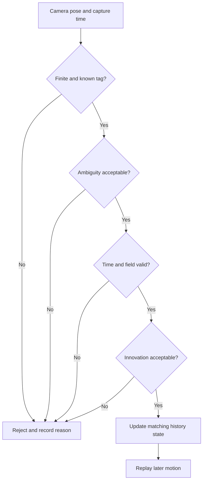

# Use AprilTags and reject bad vision measurements

An AprilTag camera can report a field pose after a robot has already moved. A safe estimator checks
quality, timing, field bounds, and disagreement before using that measurement. Rejection is useful
diagnostic evidence, not a failure to hide.

## Purpose and prerequisites

Complete [Combine Measurements without Hiding Uncertainty](/academy/controls-sensor-fusion?path=controls-localization-autonomous)
first. You should understand prediction, update, residual, uncertainty, and independent truth.

The lab shows one ambiguity rule and a simple weighted update. ARES uses more checks. The lesson
does not reproduce AprilTag solving, camera latency, or the ARES EKF.

## Vocabulary

- **AprilTag:** a known visual marker with an ID and surveyed field pose.
- **Capture time:** when the image was recorded, not when the result arrived.
- **Latency:** delay between capture and use.
- **Ambiguity:** uncertainty between possible tag-pose solutions.
- **Innovation:** difference between predicted and measured state.
- **Outlier:** data too inconsistent with the checked model and uncertainty.
- **Field bound:** a limit that rejects poses outside the field contract.
- **History replay:** correct an earlier state, then repeat later motion updates.
- **Rejection reason:** a stored explanation for unused data.
- **Diagnostic:** evidence used to understand system behavior.

## Worked example

Suppose odometry predicts `2.8 m` and vision reports `3.3 m`. The residual is `0.5 m`. A low
ambiguity does not automatically make vision correct. The estimator must also check tag identity,
finite values, timestamp, field bounds, uncertainty, and statistical disagreement.

If ambiguity exceeds the allowed value, this lesson rejects vision and keeps the odometry result.
ARES records a reason such as high ambiguity instead of silently pretending the update happened.

## Visual model

## Hands-on activity

Open the lab. Raise ambiguity slowly until the decision changes. Record the first rejected setting,
the residual, and the result before and after rejection.

<sensorfusionlab />

Reset. Keep ambiguity accepted and move vision farther from odometry. This lesson still accepts it
because the model does not include the full innovation test. Write that missing check beside your
result.

Next, keep both positions fixed and change vision uncertainty. Explain how uncertainty and
acceptance answer different questions.

Make a six-row decision table. Use three accepted ambiguity values and three rejected values. Keep
both positions fixed. Predict each decision before moving the slider. Record whether the result uses
vision or stays at odometry.

For one accepted row, list five real ARES checks missing from the lab. For one rejected row, explain
why keeping the position and reason is better than deleting the row.

## Checkpoints

Check capture time versus receipt time. A delayed image belongs with the robot state at capture.
Check that a rejected measurement leaves a visible reason.

Do not replace unavailable ambiguity with a made-up perfect score. Some platform APIs do not expose
it. Record availability and use the other reviewed checks.

Check the tag ID and field layout version. A clear image of the wrong or misplaced tag can still
produce a believable but incorrect pose. Check that all positions share the same field frame.

## Troubleshooting

If vision is always rejected, inspect tag IDs, camera mounting, field layout, timestamps, ambiguity,
and the named rejection reason. Do not simply raise every threshold.

If pose snaps while moving, verify latency compensation and history replay. If a mirrored pose looks
plausible, inspect field layout and alliance transforms at their named boundaries.

If ambiguity is unavailable, do not set it to zero. Mark it unavailable. Then rely on the checks the
platform can support, such as tag validity, finite data, field bounds, time, and innovation.

## Evidence artifact

Submit six trials with positions, uncertainty, ambiguity, decision, residual, result, and reason.
Add a rejection-flow diagram with one real ARES check that the lab omits.

Below the diagram, write one sentence about privacy. Camera evidence should avoid faces, names,
school records, or screens with student information unless the approved team process permits them.

## Short assessment

1. Why does capture time matter?
2. What does ambiguity describe?
3. Name three checks beyond ambiguity.
4. Why should a rejection reason remain visible?
5. Does low ambiguity prove a field pose is correct?

## Extension challenge

Plan a stationary camera test at three surveyed field poses. Include near and far views, tag count,
lighting notes, fresh-frame checks, and saved rejection diagnostics. Keep student privacy out of the
images and logs.

Students may analyze and verify robot behavior using normal team safety practices. Website
publication uses the separate Lead Coach review workflow.

## Related and next

Apply these checks when building autonomous routines. Revisit [Decide Whether Camera Evidence Is
Trustworthy](/academy/camera-evidence-and-uncertainty?path=ai-ml-foundations) for a beginner version
that also applies to ordinary photos and charts.
