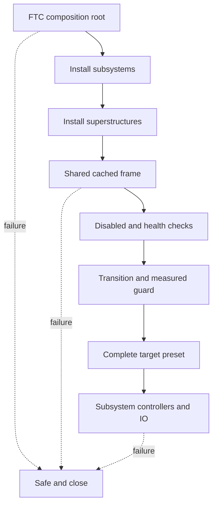

# Coordinate subsystems and fail safe

## Purpose and prerequisites

A subsystem controls one robot area. A **superstructure** coordinates complete robot postures across
more than one subsystem. The FTC composition root connects those parts to the shared ARES loop. In
this lesson, you will trace both jobs and test a small coordinator model.

Complete [Author a Code-First or Hybrid Subsystem](/academy/programming-code-subsystem?path=programming-with-ares)
and [State, Actions, and Reducers](/academy/redux-state-actions-reducers?path=programming-with-ares).
Use source and simulation first. This lesson does not prove real wiring, tuning, or motion.

## Vocabulary

- **Composition root:** the place that builds and connects the robot's main parts.
- **Superstructure:** a coordinator for complete targets across several subsystems.
- **Posture:** one named set of subsystem targets, such as stowed or ready to score.
- **Transient posture:** a short, checked state used while moving between postures.
- **Guard:** measured evidence required before a transition may continue.
- **Cached port:** a typed state value and health signal read without touching hardware.
- **Fallback:** a safer state chosen after a fault, bad input, or disabled policy.
- **Latched failure:** a failure that blocks later output until the robot instance restarts.

## Worked example

Suppose a robot must move from `STOWED` to `SCORE`. Raising an elevator at once could cross another
part's space. The coordinator first requests a `CLEARANCE` posture. It waits for fresh, valid
feedback that the pivot reached its safe zone. Only then does it request the complete `SCORE`
preset.

The superstructure does not replace either subsystem controller. Each subsystem still checks its
own limits, feedback, faults, and safe output. The physical adapter remains the last stop. If the
clearance guard is false or unhealthy, the coordinator must not guess that the path is clear.

The current ARES runtime checks disabled policy and cached-port health before requested motion. It
uses explicit transition priority. It resolves the full target preset before dispatching any target
action. This avoids half of a posture being applied after a later target fails its check.

## Visual model

The composition root owns setup and frame order. The superstructure owns coordination. Subsystems
still own their mechanism rules.

## Hands-on activity

1. Open the pinned FTC `AresRobot.kt` composition root.
2. Find where generated subsystems are installed.
3. Find where generated superstructures are installed.
4. Draw the setup path. Add the rollback path for failed setup.
5. Trace one update frame from shared refresh through output writes.
6. Mark the latched failure check that blocks later frames.
7. Open the pinned superstructure runtime contract.
8. Put its ten runtime steps into groups: policy, health, transitions, targets, tasks, and snapshot.
9. Explain why a measured transient posture is safer than a timed delay for physical clearance.
10. Use the lab below to evaluate several invented frames.

<superstructurestatelab />

Try score from stowed, score with a healthy guard, score with bad ports, and score while disabled.
Predict the next posture before pressing the step button.

## Checkpoints

- Can you separate composition, coordination, and subsystem control?
- Does disabled policy run before requested motion?
- Does bad cached evidence choose a known fallback?
- Is a complete preset checked before any target action is sent?
- Do transient postures use measured guards instead of assumed time?
- Does a frame failure stop later writes from quietly restarting?

## Troubleshooting

| Symptom | Check |
| --- | --- |
| Only one mechanism reaches a posture | Check complete target preflight and action failures. |
| Robot moves while a port is unhealthy | Check the port health rule and final subsystem gate. |
| Two automatic transitions compete | Give each exit a unique, explicit priority. |
| A time delay stands in for clearance | Add a measured transient posture and guard. |
| A failed frame writes again later | Trace the shared and season failure latches. |
| Setup returns a partly built robot | Close created services and fail the whole composition step. |
| Simulation looks correct but robot does not | Check wiring, polarity, calibration, limits, and physical clearance. |

## Evidence artifact

Create two diagrams. The first shows setup, rollback, frame order, and safe close in the FTC
composition root. The second shows one posture request, its transient posture, measured guard,
complete target preset, and subsystem safety boundaries.

Add a transition table with current posture, request, port health, guard, expected next posture, and
reason. Run source-backed unit or simulator tests for healthy, unhealthy, disabled, and failed-action
cases. Keep compilation, runtime tests, simulation, and physical observation as separate evidence.

Students may test real motion through the team's normal safety procedure. Start disabled. Clear or
restrain the mechanisms, reduce output, and keep a stop control within reach. Check one transition at
a time. Record only motion that a student truly observed.

## Short assessment

1. What job belongs to a superstructure instead of one subsystem?
2. Why should health fallbacks run before requested motion?
3. Why must a complete target preset pass checks before dispatch?
4. What makes a transient posture stronger than a fixed delay?
5. What evidence is still missing after a simulator test passes?

## Extension challenge

Design a three-posture coordinator for a real team mechanism or a clearly labeled practice design.
List each subsystem target and health port. Add one transient posture, one measured guard, one fault
fallback, and one explicit recovery route. Do not invent proof that physical parts are clear. Mark
which values must be measured on the robot before the route can be used.

## Related and next

Review [Read Hardware Once and Write Safe Outputs](/academy/programming-io-caching?path=programming-with-ares)
to see where cached ports begin. Next, use
[Test Robot Logic Across Mocks and Simulation](/academy/programming-tests-parity?path=programming-with-ares)
to separate shared contract evidence from physical proof.
