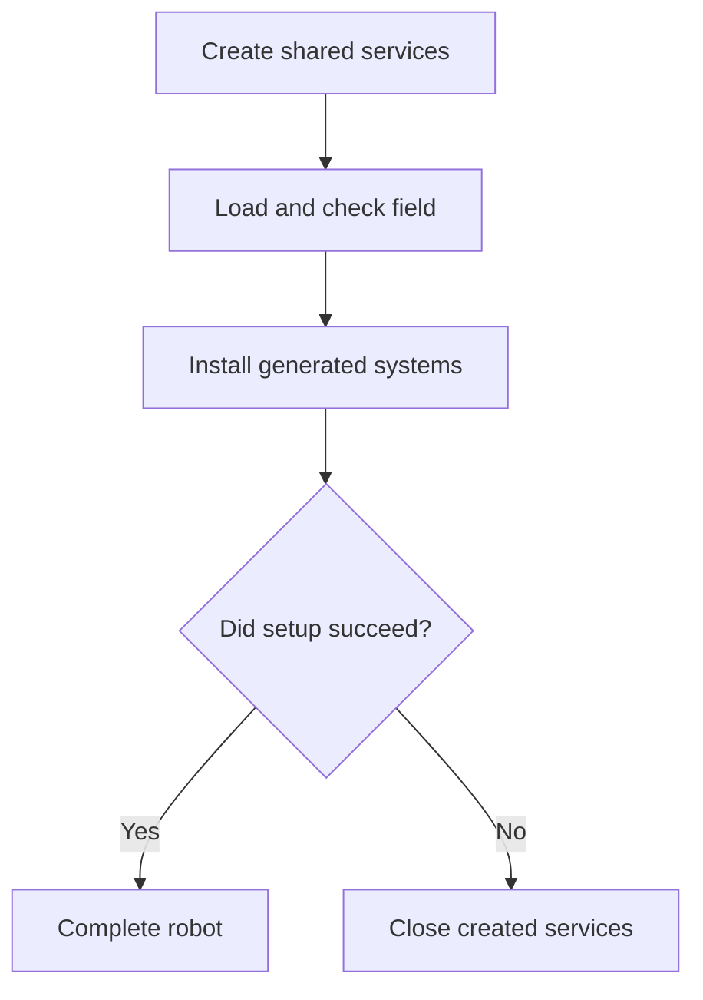

# See how the current FTC robot starts and stops safely

This lesson reads the checked-in `AresRobot` file from the current ARES source. That file is the
**composition root**. It connects shared robot services, generated subsystems, the season field,
and the FTC loop.

Complete this trace with source code and simulation. A successful trace does not prove that a real
mechanism is wired or tuned safely.

## What you will learn

- how generated systems join the robot;
- what happens during one update frame; and
- how a failure keeps later frames from writing outputs.

## Robot construction

The generated registries install systems made by Robot Builder. Their `.aressubsystem` documents
state whether a device is required at startup and what its safe output is. Those rules do not live
in a second handwritten list.

If setup fails, `AresRobot` closes services that were already created and throws the error. It does
not return a half-built robot.

## Trace one update frame

1. Check whether an earlier shared or season failure is latched.
2. Run the shared update. It reads registered inputs and computes power protection.
3. Read cached sensor state for generated subsystems.
4. Write subsystem outputs using this frame's power scale.
5. Send low-rate Driver Station telemetry.

If a step throws, the code remembers the failure, tries to safe both subsystem and platform
outputs, and throws again. A later loop cannot quietly start normal writes. Recovery needs a new
OpMode robot instance.

## Source-reading activity

Draw the setup path and the five update steps. Add a red arrow from every step that can fail to the
safe-output path. For one generated subsystem, find the descriptor fields for startup policy and
safe output. Ask a teammate to check your arrows against the pinned source.

## Check your understanding

1. Why should setup never return a partly built robot?
2. What does a latched failure prevent?
3. Which document owns a generated device's safe output?
