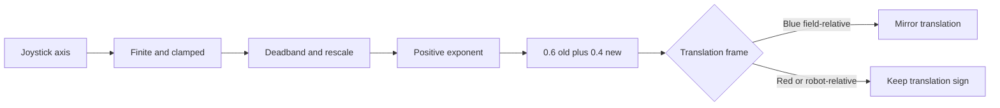

# Shape FTC driver input without losing direction

## Purpose and prerequisites

The current `AresDriveController` turns joystick input into a smooth drive request. It keeps driver
intent separate from direct hardware access. This lesson traces that math while protecting the
meaning of field and robot coordinates.

Complete [Use Units and Coordinate Frames](/academy/robot-coordinate-contracts?path=controls-localization-autonomous)
and [Use Actions and Pure Reducers](/academy/redux-state-actions-reducers?path=programming-with-ares)
first. You can complete the calculation and interaction without a robot.

## Vocabulary

- **Axis:** one direction reported by a joystick.
- **Clamp:** limit a value to a stated range.
- **Deadband:** a small center region treated as zero.
- **Rescale:** map the values outside deadband back to the full output range.
- **Exponent:** a power that changes the response curve.
- **Smoothing:** combine the new request with the previous output.
- **Field-relative:** translation is stated in field directions.
- **Robot-relative:** translation is stated from the robot's current front and left.
- **Alliance perspective:** the driver view used to orient field-relative translation.
- **Frame:** the coordinate viewpoint that gives a value meaning.

## Worked example

For each axis, the pinned controller changes a non-finite value to zero and clamps other input from
`-1` to `1`. A magnitude below `0.05` becomes zero. Values outside that center region are rescaled:

```text
rescaled magnitude = (input magnitude - 0.05) ÷ 0.95
```

For input `0.50`, the rescaled magnitude is about `0.4737`. With exponent `3`, the shaped value is
about `0.1063`. The first smoothed output starts from zero:

```text
new smooth value = 0.6 × old smooth value + 0.4 × shaped value
new smooth value = 0.6 × 0 + 0.4 × 0.1063 ≈ 0.0425
```

The small first output is expected. Repeating the same input moves the smoothed value toward the
shaped value. Because the calculation happens once per loop, loop rate affects response over real
time.

## Visual model



The FTC gamepad adapter maps negative left-stick Y to field X and negative left-stick X to field Y.
Negative right-stick X becomes counter-clockwise-positive rotation. In field-relative mode, the blue
driver view flips both translation axes. Rotation does not flip. Robot-relative mode does not use
alliance mirroring.

## Hands-on activity

1. Start with joystick input `0.50`, exponent `3`, and previous smooth value `0`.
2. Predict the bounded, rescaled, shaped, and smoothed values.
3. Open the lab and compare each step with your work.
4. Move the input to `0.03`. Explain why the output becomes zero.
5. Move the input to `1.00`. Confirm that the curve can still reach full scale.
6. Restore input `0.50` and move the previous smooth value above zero. Explain the new result.
7. Choose blue alliance in field-relative mode. Record which sign changes.
8. Keep blue alliance and choose robot-relative mode. Explain why the sign returns.
9. Reset the model and test a negative input.

<driverinputcurvelab />

Create a separate sign table for X, Y, and rotation. Begin with the physical gamepad axes, show the
adapter negations, and state the final ARES frame. Keep rotation separate from translation so an
alliance rule cannot accidentally flip it.

## Checkpoints

- Are non-finite values replaced with zero before later math?
- Is every finite input clamped to the normalized range?
- Does the deadband rescale preserve full output?
- Is the exponent positive, with the pinned fallback when it is invalid?
- Does smoothing use the previous stored output?
- Are field-relative and robot-relative commands named explicitly?
- Does blue alliance mirror both translation axes but not rotation?

## Troubleshooting

| Symptom | Check |
| --- | --- |
| Small stick noise moves the request | Check the `0.05` deadband and whether the value is rescaled afterward. |
| Full stick cannot reach full output | Check the divide-by-`0.95` rescale before the exponent. |
| First loop is smaller than expected | Include the previous value and the `0.4` new-value weight. |
| Response changes with loop rate | The fixed smoothing weight runs once per loop; compare loop timing. |
| Blue controls point backward | Check that only field-relative translation is mirrored and both axes change together. |
| Rotation reverses by alliance | Remove alliance mirroring from rotation. |
| Simulator signs look correct but robot does not | Check motor mapping, direction, heading, and physical frame through the team safety procedure. |

## Evidence artifact

Submit a five-row axis table. Include raw input, bounded input, deadband output, exponent, shaped
value, previous smooth value, new smooth value, alliance, frame, and final translation. Use at least
one noise input, one negative input, and one full-scale input.

Add a frame diagram for joystick, robot, and field directions. State whether each arrow is a
software definition, simulator observation, or physical observation. Do not call an arrow physically
verified unless a bounded student test recorded that exact result.

## Short assessment

1. What problem does deadband solve?
2. Why is the remaining range rescaled after deadband?
3. What does a larger positive exponent do near the center?
4. Why does blue alliance change field translation but not rotation?
5. Why can simulation not approve physical driving direction?

## Extension challenge

Calculate five repeated loop steps for a constant input. Feed each new smooth value into the next
row as the previous value. Graph shaped value and smooth value by step. Explain convergence without
claiming a real-time response, because the lesson does not supply loop timing.

## Related and next

Continue to drivetrain comparison and bounded physical commissioning. Revisit the coordinate
transform lab when robot motion and field motion are confused. Use telemetry to record requested
axes, chosen frame, heading, and final command without logging student identity.
