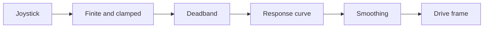

# Shape FTC driver input without losing direction

The current `AresDriveController` turns joystick input into a smooth drive request. It keeps driver
intent separate from direct hardware access. You can finish this lab with math and simulation.

## What you will learn

- how deadband removes small stick noise;
- how a curve and filter change the command; and
- which directions change with alliance or drive mode.

## The shaping path



For each axis, the code first changes a non-finite value to zero. It clamps other values from `-1`
to `1`. A magnitude below `0.05` becomes zero. Values above that edge are rescaled so full stick
still equals one. The signed magnitude is raised to the chosen positive exponent. If that exponent
is invalid, the code uses `3.0`.

The next filter is:

```text
new smooth value = 0.6 × old smooth value + 0.4 × shaped value
```

This happens once per loop, so loop speed affects how fast the filter responds.

## Keep the coordinate frame

The FTC adapter maps negative left-stick Y to field X. It maps negative left-stick X to field Y.
Negative right-stick X becomes counter-clockwise-positive rotation.

In field-relative mode, the blue driver view flips both translation axes. Rotation does not flip.
Robot-relative mode does not use alliance mirroring.

## Calculate and test

1. Start with an old smooth value of zero.
2. Calculate the first smooth X value for inputs `0.03`, `0.50`, and `1.00` with exponent `3.0`.
3. Predict X, Y, and rotation when switching from red to blue in field-relative mode.
4. Make the same prediction in robot-relative mode.
5. Compare your signs and trends with simulator telemetry.

Small number differences can come from loop timing. A sign or frame mismatch needs investigation.
Students must separately check motor mapping, direction, heading, Driver Station behavior, and the
emergency stop by following the team's physical-robot safety procedure.

## Check your understanding

1. What problem does deadband solve?
2. Why does alliance change translation but not rotation?
3. Why is simulation not enough to approve physical driving?
