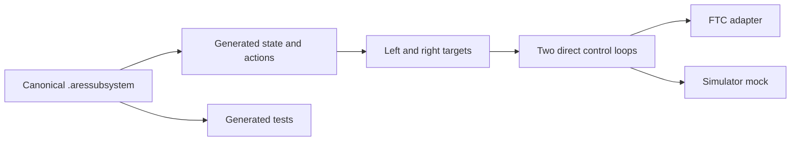

# Author GUI-owned FTC indicator lights

## Purpose and prerequisites

This lesson follows one real GUI-owned subsystem from its descriptor to generated robot code. The
Lightbot example has two independently controlled goBILDA indicator lights. You will inspect their
state, outputs, tests, simulator evidence, and physical-test limits.

Complete [Follow a Robot Request from Input to Output](/academy/robot-input-to-output?path=programming-with-ares)
and [Simulation Is Not Hardware Validation](/academy/simulation-is-not-hardware-validation?path=testing-debugging-commissioning).
Use the pinned descriptor as source evidence. Do not edit generated files to complete the activity.

## Vocabulary

- **Descriptor:** a structured `.aressubsystem` file that records the subsystem contract.
- **Declarative:** describing what the system contains instead of hand-writing every generated file.
- **Target field:** state that names the output the controller should try to apply.
- **Direct control:** a target value passes through bounds to one actuator output.
- **Safe output:** the value used when the subsystem must stop or remain neutral.
- **Mock I/O:** a test or simulator adapter that follows the same contract without physical devices.
- **Generated artifact:** code or tests produced from the canonical descriptor.

## Worked example

The checked-in descriptor names `indicator` for the left device and `indicator2` for the right
device. Each hardware entry has a safe output of zero. The state fields are `leftColor` and
`rightColor`. Their checked-in default values are 0.472 and 0.611.

Two direct control loops keep the channels separate. The left target feeds only the left indicator.
The right target feeds only the right indicator. Both outputs stay between zero and one. This shape
lets a test catch code that changes both sides when only one target changed.

## Visual model

The descriptor uses `DECLARATIVE_GENERATED` and `GENERATED_DO_NOT_EDIT`. Robot Builder owns the
canonical document. Generated Kotlin is a checked result, not the editing surface.

## Hands-on activity

1. Open the indicator-light subsystem in Robot Builder.
2. Find both hardware-map names and the left and right visual placements.
3. Confirm that both hardware entries use zero as the safe output.
4. Find `leftColor` and `rightColor` in state.
5. Confirm that each target uses normalized units and bounds from zero to one.
6. Match each direct control loop to one target and one actuator.
7. Confirm that the project requests generated mock I/O and generated tests.
8. Open generated-artifact details without editing a managed file.
9. Run **Verify and build** and save the result.
10. In Local Simulator, change one side at a time and record both applied outputs.
11. Stop the simulation and confirm that both displayed outputs return to the safe state.

Use the concept preview below. Change only the left target, then only the right target. Turn the
concept outputs off and compare the numeric results.

<subsystemdescriptorlab />

This preview is invented teaching content. It does not load the real descriptor, generate code, or
run an adapter. Use Robot Builder, generated tests, and Local Simulator for project evidence.

## Checkpoints

- Can you name the one canonical file that students edit?
- Do the left and right targets remain separate through the full trace?
- Does each actuator have an explicit safe output?
- Are generated tests and a simulator mock requested in the descriptor?
- Have you kept simulated color separate from physical color and brightness claims?

## Troubleshooting

| Symptom | Check |
| --- | --- |
| Both sides change together | Match each loop's target field and actuator ID. |
| Hardware name is missing | Check the descriptor connection and the FTC hardware map. |
| Generated code is stale | Save the descriptor, regenerate, and review the diff. |
| Build reports an invalid target | Check type, unit, default, minimum, and maximum. |
| Simulator shows no light | Confirm generated mock support and visual placement. |
| Stop leaves an output active | Check safe output, lifecycle test, and adapter behavior. |

## Evidence artifact

Create a descriptor evidence table with one row for each light. Record its hardware ID, hardware-map
name, target field, control loop, safe output, and visual placement. Add the generated verification
result and one Local Simulator trial where only one target changes.

Then list the physical facts still unknown. These include real wiring, side placement, brightness,
visible color, secure installation, and safe-off behavior on the device. Keep that list with the
project evidence so simulation is not mistaken for physical validation.

Students may verify the real lights using the team's normal safety procedure. Keep the robot
disabled while matching hardware names. Use small hold-to-run steps and an easy-to-reach emergency
stop for powered checks. Website posts use a separate Lead Coach editorial workflow.

## Short assessment

1. Why are there two target fields and two control loops?
2. Which file should be edited to change this generated subsystem?
3. What does a zero safe output mean in this descriptor?
4. What can the simulator mock show?
5. What must still be checked on the physical robot?

## Extension challenge

Add a third output-only light in a branch or temporary project. Give it a unique ID, target, loop,
safe output, and placement. Predict the files and tests that generation should change. Compare your
prediction with the generated diff, then discard or review the experiment through the team's normal
Git workflow.

## Related and next

Continue to code-first and hybrid subsystem ownership when a generated descriptor cannot express
the needed behavior. Study cached I/O before connecting a new actuator. Study superstructures only
after each subsystem can reach and hold its own safe target independently.
