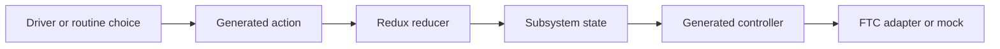

# Follow GUI-owned FTC indicator lights

Lightbot has two goBILDA indicator lights. Robot Builder owns their canonical subsystem document.
This lab follows that document through generated state, actions, control, simulation, and physical
checking. Do not edit generated code to finish the lab.

## What you will learn

- how one GUI-owned subsystem becomes working robot code;
- why the two light targets stay separate; and
- what simulation can and cannot prove.

## Read the descriptor

The descriptor names `indicator` on the left and `indicator2` on the right. Each device has a safe
output of zero. Separate `leftColor` and `rightColor` targets feed separate control loops. Changing
one side must not change the other.

The ownership is `DECLARATIVE_GENERATED` and `GENERATED_DO_NOT_EDIT`. The project asks for a mock
and generated tests. `requiredAtStartup` is false, but each light must still turn off safely.

## Trace the flow

1. Open the indicator-light subsystem in Robot Builder.
2. Find both hardware names, target fields, placements, limits, and safe outputs.
3. Open generated-artifact details. Find the definition, registry, tests, and adapter boundary.
4. Run **Verify & build**. Read the evidence for startup, stop, separate targets, failed writes,
   simulation, and the FTC lifecycle.
5. In Local Simulator, change one side at a time. Record both applied outputs.
6. Stop the simulation and confirm that both targets return to their safe state.

## Check the physical lights

Students can follow the team's robot-safety procedure to check the real lights. Keep the robot
disabled while matching hardware names to physical sides. Then use small hold-to-run steps with an
easy-to-reach emergency stop. Record safe-off behavior and each side's response.

Simulation cannot prove wiring, brightness, color accuracy, or safe installation.

## Check your understanding

1. Which file should you edit to change this generated subsystem?
2. Why are there two target fields?
3. What physical facts remain unknown after simulation?
