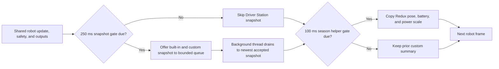

# Build bounded FTC Driver Station telemetry

## Purpose and prerequisites

Driver Station telemetry helps a student understand the robot during a match or test. It must stay
small, readable, and separate from control. This lesson traces the current ARES FTC season helper
into the shared FTC telemetry manager. You will model its two rate limits and design one useful
status line without hiding invalid data.

This lesson applies to the ARES 15.0.4 shared library and ARES FTC 15.0.5 season source. Complete
[Telemetry, Control State, and Offline Logs](/academy/telemetry-and-control?path=testing-debugging-commissioning)
and [Coordinate Subsystems and Fail Safe](/academy/ftc-season-composition-and-safe-lifecycle?path=ftc-robot-with-ares)
first. No robot is required for the activity.

## Vocabulary

- **Driver Station telemetry:** short status text shown to the drive team.
- **Source state:** the owned robot value copied into a display field.
- **Cadence:** how often a step is allowed to run.
- **Rate limit:** a rule that skips work until enough time has passed.
- **Snapshot:** one collected group of display values.
- **Queue:** a bounded waiting area between two pieces of code.
- **Latest-wins:** keeping newer accepted evidence instead of displaying every older snapshot.
- **Truncation:** removing characters past a fixed display limit.
- **Invalid sample:** a value that cannot support the normal display claim.
- **Control path:** code that can change actuator intent or output.
- **Observation path:** code that copies values for people or logs to inspect.

## Two different rate domains

The season `AresTelemetryHelper` refreshes its short summary no more than once every `100 ms`. That
is at most `10 Hz`. It uses `RobotClock`, so tests and simulation can use the same time source as the
robot runtime.

The shared `FtcTelemetryManager` builds Driver Station snapshots no more than once every `250 ms`.
That is at most `4 Hz`. It offers each accepted snapshot to a queue with room for three. A
background thread drains accepted snapshots to the newest one before calling the FTC telemetry
display.

These rates are not the robot-control rate. The control loop may run much faster. A skipped display
update must not skip a sensor read, state update, safety action, or output write.

## What the current season helper copies

The helper copies these fields into the shared custom Driver Station map:

| Display field | Current source | Display rule |
| --- | --- | --- |
| Alliance | Redux drive state | use the stored alliance name |
| EKF Pose X | Redux estimated pose | copy X in the source frame |
| EKF Pose Y | Redux estimated pose | copy Y in the source frame |
| EKF Pose Deg | Redux estimated heading | convert radians to degrees for display |
| Battery V | shared power manager | show invalid, low, or normal state |
| Power Scale | shared power manager | copy the active bounded scale |

Battery handling is explicit. A non-finite value or a value at or below zero becomes `INVALID`. A
finite value below `11.5 V` becomes a low-voltage label. A larger finite value remains a normal
display value. The label is an observation aid. It does not replace the power manager or prove the
battery is healthy.

Custom values also have a boundary. The season helper converts a value to text and stores only the
first `150` display characters. This keeps one message from growing without a limit. It does not
make private or unsafe text suitable for display.

## Worked example

Suppose robot frames reach the season facade at `1000`, `1040`, `1100`, `1150`, and `1250 ms`.
Inside each frame, the shared base update runs before the season helper refresh.

At `1000 ms`, the shared manager may queue its built-in snapshot before a season summary exists.
The helper then creates summary generation 1. At `1040 ms`, neither rate gate is due. At `1100 ms`,
the helper creates generation 2, but the shared 250 ms gate is still closed. At `1250 ms`, the
shared manager can queue generation 2. The helper then creates generation 3 for a later snapshot.

The display may therefore show an older accepted summary. That is expected for a low-rate
observation path. Control still uses current owned state.

## Visual model

The arrows show current call order and cadence gates. They do not show thread timing, network
delay, or when a phone screen paints the text.

## Hands-on activity

1. Open the pinned `AresTelemetryHelper.kt` source.
2. Find the `100 ms` helper period and its `RobotClock` call.
3. List every Redux or power-manager value copied by the helper.
4. Find the finite, zero, and low-voltage branches.
5. Find the `150`-character custom-text limit.
6. Open the pinned `FtcTelemetryManager.kt` source.
7. Find the `250 ms` snapshot gate and the queue capacity of three.
8. Find the non-blocking queue offer and the background drain to the newest accepted snapshot.
9. Open `AresRobot.update` and confirm that the shared update runs before the season helper.
10. Use the lab below. Advance every loop and read each row.

<ftctelemetrycadencelab />

11. Select a normal, low, zero, and non-number battery sample. Record the display result.
12. In a local text editor, type an invented message longer than 150 characters. Mark the first
    150 characters that the helper would keep. Do not use a name, email, phone number, ID, or secret.
13. Write one observation that the display supports and one cause it cannot prove.
14. Reset the lab and ask another student to explain why generation 2 is queued at `1250 ms`.

The lab is a deterministic TypeScript model of selected source rules. It does not run the Kotlin
robot, FTC SDK, queue thread, Wi-Fi link, or Driver Station app.

## Choose useful display fields

A useful status line answers a drive-team question. Give it a stable name, value, unit, source, and
meaning. Keep it short enough to scan while the robot is disabled or between actions.

Good fields often include a mode, ready state, measured value, freshness state, fault, or active
limit. Avoid full logs, long stack traces, private identity, credentials, or unbounded text. Logs
and diagnostic exports have separate storage and review paths.

Never read hardware only to fill a display line. Copy a value already owned by the current state or
cached input. A display getter that performs a new device read can make one robot frame internally
inconsistent and add hidden bus work.

## Checkpoints

- Is the display field copied from owned state or a cached input?
- Does it have a stable label and a clear unit?
- Is the helper cadence separate from the shared Driver Station cadence?
- Can every rate-limited step skip without changing control?
- Does invalid data remain visibly invalid?
- Is a low label kept separate from a cause or repair claim?
- Is custom text capped at 150 display characters?
- Can a full queue or delayed thread leave older display evidence without affecting control?
- Are student identity, credentials, and private device details absent?
- Does the evidence claim stop at what the display actually showed?

## Troubleshooting

| Symptom | First check |
| --- | --- |
| A status line updates slower than 10 Hz | Remember the shared Driver Station snapshot gate is at most 4 Hz. |
| The newest helper value is not displayed yet | Check call order, the 250 ms gate, queue acceptance, and background thread timing. |
| A long message ends early | The current season helper stores only the first 150 characters. |
| Battery shows `INVALID` | Check whether the source is finite and above zero before blaming the battery. |
| Battery shows `LOW` | Record the measured value and time; the label alone does not identify a cause. |
| Pose heading looks wrong | Confirm the source is CCW-positive radians and conversion to display degrees happens once. |
| Driver Station text freezes but control continues | Inspect the observation path; do not connect its recovery to actuator control. |
| Adding telemetry changes loop behavior | Remove hardware reads, blocking I/O, large formatting, or other work from the control path. |
| A private detail appears in telemetry | Stop sharing the display or capture, remove the field, and review the source boundary. |

## Evidence artifact

Create one Driver Station telemetry card. Include the field label, source owner, type, unit,
cadence, valid range, invalid display, character bound, and reason the drive team needs it. Add the
source revision and the exact code path that copies the value.

Then attach one cadence table from the lab. Mark helper refresh, snapshot queue, displayed
generation, and every skipped step. State that the result is a teaching model rather than robot
evidence.

Students may verify the display and robot behavior through the team's normal safety process. Keep
the robot disabled while reviewing text-only status. If a later test requires motion, use the
student-led bounded procedure for that mechanism. If the result becomes a website post, send it
through the website's normal post approval workflow.

## Short assessment

1. Why are the 100 ms and 250 ms gates different?
2. Which gate refreshes the season custom summary?
3. Why may the Driver Station show an older accepted summary?
4. Why must a skipped telemetry step leave control unchanged?
5. How does the helper display invalid battery data?
6. Why is a 150-character limit useful but not a privacy control?
7. Why should telemetry copy cached state instead of reading hardware again?
8. What can a low-voltage label prove, and what can it not prove?

## Extension challenge

Design three status fields for an invented mechanism. Include a requested state, a measured cached
state, and a fault or freshness state. Choose a display cadence and explain why it is slower than
the control loop. Add a bounded message rule and an invalid-data rule.

Next, design a queue-pressure test for the real FTC telemetry manager. State which thread produces
snapshots, which thread consumes them, how a full queue is observed, and how the test proves that
control never waits for Driver Station output. Do not claim that this plan is already implemented.

## Related and next

- Continue with [Compare Logs and Replay a Failure](/academy/testing-logs-replay?path=testing-debugging-commissioning)
  when short live status is not enough evidence.
- Use [Read Hardware Once and Write Safe Outputs](/academy/programming-io-caching?path=programming-with-ares)
  before adding a new measured display field.
- Review [Telemetry, Control State, and Offline Logs](/docs/telemetry-and-control) for NT4 topics,
  local logs, and offline boundaries.
- Return to [Coordinate Subsystems and Fail Safe](/academy/ftc-season-composition-and-safe-lifecycle?path=ftc-robot-with-ares)
  to trace the complete current season frame.
