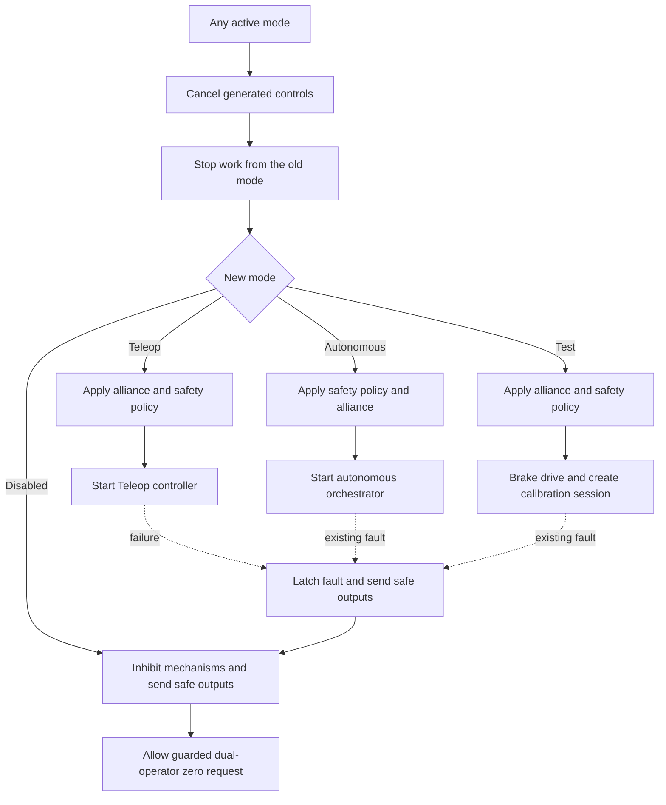

# Keep FRC mode changes safe

## Purpose and prerequisites

An FRC robot can move through Disabled, Autonomous, Teleop, Test, and Simulation. A mode change is
not only a screen label. The robot must stop old work, keep real faults latched, check mechanism
health, and start only the controller that belongs to the new mode.

In this lesson, you will trace those handoffs in the current ARES FRC season code. Complete
[State, Actions, and Reducers](/academy/redux-state-actions-reducers?path=frc-robot-with-ares)
and [Read Hardware Once and Write Safe Outputs](/academy/programming-io-caching?path=frc-robot-with-ares)
first. The software activity does not prove that a physical mechanism is wired, homed, clear, or
safe to move.

## Vocabulary

- **Mode callback:** a WPILib function that runs when a mode starts, repeats, or ends.
- **Handoff:** the work that stops one mode and prepares the next mode.
- **Safety inhibit:** state that blocks mechanism output for a known reason.
- **Latched fault:** a failure that stays active across mode changes until a guarded recovery clears it.
- **Homing:** giving a relative-position mechanism a deliberate reference at a known physical zero.
- **Composition root:** the place that builds and connects the robot's main parts.
- **Periodic update:** work that repeats on a fixed schedule while the robot program runs.
- **Ground truth:** the simulated pose from the physics model, kept separate from the estimator.

## Worked example

### Teleop fails, then Autonomous is selected

Suppose a Teleop controller throws an error. The current `teleopPeriodic` catches that failure and
passes a reason to `mechanismCommissioning.latchFault`. The controller stores a latched safety
fault and calls `safeHardware()`.

The drive team then disables the robot and selects Autonomous. `disabledInit` cancels generated
controls, stops autonomous and SysId work, applies the disabled inhibit, and sends safe outputs.
`autonomousInit` checks the mechanism safety policy before starting the autonomous orchestrator.
It does **not** erase the old fault just because the mode changed. The existing regression test
checks this exact rule.

That behavior is important: changing modes is not evidence that the cause of a failure went away.

## Visual model

### Mode handoff map



The diagram is a reading aid. The pinned Kotlin source and tests remain the authority.

## What each callback owns

| Callback | Stops or clears | Checks or prepares | Starts or repeats |
| --- | --- | --- | --- |
| `disabledInit` | Generated controls, auto, SysId, controller rumble | Sets mechanism inhibit and safe output | Nothing that commands normal motion |
| `disabledPeriodic` | Nothing extra | Reads the guarded homing request | Safe-zero recovery only when its rules pass |
| `teleopInit` | Generated controls, auto, SysId | Current alliance and mechanism safety | Teleop initialization |
| `teleopPeriodic` | Latches on a caught failure | Uses current input and generated controls | Teleop control work |
| `autonomousInit` | Generated controls and SysId | Mechanism safety and current alliance | Autonomous orchestrator |
| `autonomousPeriodic` | Nothing extra | Uses current autonomous state | One autonomous step |
| `autonomousExit` | Autonomous work | Nothing extra | Nothing |
| `testInit` | Generated controls, auto, SysId, old calibration | Current alliance, mechanism safety, drive brake | A new localization calibration session |
| `testPeriodic` | Nothing extra | Guarded homing request and calibration state | Drive and calibration controls |
| `testExit` | SysId and calibration session | Restores vision fusion | Nothing |

`robotPeriodic` is separate from this table. It updates both controller snapshots and dashboard
input. While Disabled, it also checks for an alliance change at a bounded cadence. A registered
20 ms ARES update handles the main robot frame, checks commissioning health, records calibration
data, and updates tuning and SysId work.

## The fault latch is stronger than a temporary inhibit

The commissioning controller tracks configuration, homing, tuning, and fatal update health. A
temporary inhibit may clear when those checks are healthy. A separate latched fault does not clear
through that path.

Current hardware permission needs all of these facts:

1. The mechanism configuration is complete and healthy.
2. Every required relative mechanism is homed.
3. No fatal robot-update failure exists.
4. The temporary inhibit is clear.
5. The persistent fault latch is clear.

If a real mechanism loses its homing reference, a tuning update fails to reach every motor, or a
controller reset breaks configuration, the periodic health check fails closed.

### Guarded safe-zero recovery

The current season robot accepts its safe-zero recovery request only on the rising edge of a
dual-operator control combination. Both controllers hold Back and Start. The Driver Station must
report Disabled, and Test must not be enabled. The code calls `safeHardware()` before it asks the
relative mechanisms to accept their known zeros.

The button combination does not find the physical zero. Students first place the cowl, intake
pivot, and climber at their documented zero stops through the team's normal safety procedure. The
software clears the latch only when homing, configuration, and fatal-update checks are healthy.

## Simulation keeps truth and estimate separate

`simulationPeriodic` uses `RobotClock`, limits the physics time step to at most 0.05 seconds,
dispatches physics actions, and sends the simulated odometry observation through Redux. The
Dyn4j visualization publishes ground truth separately. It does not overwrite estimator telemetry.

This can show that the software mode and state flow behave as expected. It cannot show that a real
limit, zero stop, CAN configuration, or mechanism clearance is correct.

## Hands-on activity

1. Open the pinned `ARESRobot.kt`.
2. Find `disabledInit`. List every old activity it stops.
3. Find `teleopInit`, `autonomousInit`, and `testInit`.
4. Circle the safety-policy call in each enabled mode.
5. Find the caught error in `teleopPeriodic` and trace it to `latchFault`.
6. Open `FrcMechanismCommissioningController.kt`.
7. Write the five hardware-permission facts in your own words.
8. Find why a healthy temporary policy cannot erase a separate fault latch.
9. Trace the guarded homing request from the two controllers to `ClearMechanismSafetyFault`.
10. Open `ARESRobotTimedBehaviorRegressionTest.kt`.
11. Find the test that carries a Teleop fault through Autonomous.
12. Mark the point where Disabled dual-operator recovery clears the latch.
13. Find the simulation test that keeps pose in Redux state.

Run the focused tests without a roboRIO or powered mechanism:

```powershell
cd ARES-FRC
.\gradlew.bat test --tests "com.areslib.frc.ARESRobotTimedBehaviorRegressionTest"
```

Record the source revision, command, result, and one physical claim this test cannot prove.

## Checkpoints

- Does a new mode stop work owned by the old mode?
- Does Disabled send safe outputs and clear controller rumble?
- Do enabled modes apply the mechanism safety policy before normal mechanism work?
- Can a mode change erase a latched fault? It should not.
- Is safe-zero recovery limited to its guarded Disabled request?
- Are simulator truth and estimator state kept separate?
- Can you name the evidence that is still missing before physical motion?

## Troubleshooting

| Symptom | Check |
| --- | --- |
| A mechanism starts when a mode is selected | Check old-work cancellation, safety policy, inhibit state, and the output adapter. |
| A fault disappears after switching modes | Check that the persistent latch is not replaced by a temporary inhibit. |
| Recovery works while enabled | Check the Disabled and not-Test gate plus the rising-edge rule. |
| Recovery buttons do nothing | Check both controllers, the rising edge, Driver Station mode, homing results, and configuration health. |
| Autonomous keeps running after a mode exit | Check `autonomousExit`, Disabled cleanup, and generated-control cancellation. |
| Test calibration leaves vision fusion off | Check `testExit` and session cleanup. |
| Simulation pose looks right but estimator defects are hidden | Check that ground truth is not written onto estimator topics. |
| Unit tests pass but a mechanism moves the wrong way | Stop the test and check wiring, polarity, zero reference, limits, and physical clearance. |

## Evidence artifact

Create a mode-handoff review sheet with:

- one row for Disabled, Teleop, Autonomous, Test, and Simulation;
- the work stopped before each mode begins;
- the safety checks and state prepared by each mode;
- the controller or session that starts;
- the route from a caught failure to safe output;
- the guarded route that may clear a fault;
- the focused test command and result; and
- one remaining physical risk that software tests cannot remove.

Students may verify robot functionality through the team's normal safety procedure. Begin
Disabled, clear or restrain mechanisms, reduce output, keep a stop control ready, and check one
handoff at a time. Record only what was actually observed. Website posts use the separate Lead
Coach editorial workflow before publication.

## Short assessment

1. Why should a latched fault survive a change from Teleop to Autonomous?
2. What is the difference between a temporary safety inhibit and a persistent fault latch?
3. Why does the recovery request require Disabled mode and two operators?
4. What old work does `disabledInit` stop?
5. What does the FRC lifecycle regression test prove, and what can it not prove?
6. Why should simulator ground truth stay separate from estimator telemetry?

## Extension challenge

Choose one additional FRC service, such as a camera session, compressor policy, or data recorder
that actually exists in your project. Make a mode-ownership table for it. State which callback
starts it, which callback stops it, what happens on failure, and how a test could prove the handoff.
Do not invent a service or claim that a software test checked physical hardware.

## Related and next

Continue to [Simulation Is Not Hardware Validation](/academy/simulation-is-not-hardware-validation?path=frc-robot-with-ares)
to separate software, simulator, and physical evidence. Then use [Telemetry, Control State, and
Offline Logs](/academy/telemetry-and-control?path=frc-robot-with-ares) and [Test Robot Logic Across
Mocks and Simulation](/academy/programming-tests-parity?path=frc-robot-with-ares) to design a narrow
claim. Compare the lifecycle with [Coordinate Subsystems and Fail
Safe](/academy/ftc-season-composition-and-safe-lifecycle?path=programming-with-ares) only when you
also need the FTC season pattern.
