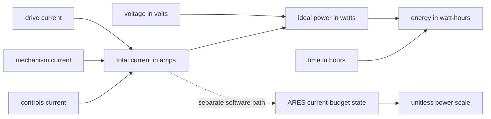

# Voltage, current, power, and energy

## Purpose and prerequisites

Voltage, current, power, and energy answer different questions. Mixing them up can make a robot
test hard to explain. In this lesson, you will first use ideal classroom math. Then you will trace
one current-budget step from the current ARES source.

Complete [Use Rates and Units to Describe Motion](/academy/rates-units-and-motion?path=math-for-robotics)
first. You should be able to multiply decimals and convert minutes to part of an hour.

You can complete this software lesson without touching a battery or powered robot. The numbers in
the first activity are invented lesson data. The ARES activity copies one pinned software profile.
Neither activity approves a battery, wire, connector, fuse, breaker, or motor.

## Vocabulary

- **Voltage:** electrical potential difference, measured in volts (V).
- **Current:** electrical charge flow, measured in amperes or amps (A).
- **Power:** the rate of electrical energy transfer, measured in watts (W).
- **Energy:** power added over time, often measured in watt-hours (Wh).
- **Load:** a device or group of devices that uses electrical power.
- **Voltage sag:** a voltage drop while a source is under load.
- **Stall:** a motor condition where the shaft is not turning.
- **Current budget:** a software estimate or measurement used to limit total demand.
- **Power scale:** a unitless number from zero to one that reduces an output request.
- **Hysteresis:** a recovery margin that prevents fast state changes near a boundary.
- **Evidence boundary:** a clear statement of what a calculation or test does and does not prove.

## Worked example

An invented lesson system uses 12 volts. Its three loads use 8 amps, 4 amps, and 1 amp at the same
time. Add the currents first.

```text
total current = 8 A + 4 A + 1 A = 13 A
power = voltage × current
power = 12 V × 13 A = 156 W
time = 5 min ÷ 60 min/h = 0.0833 h
energy = power × time
energy = 156 W × 0.0833 h = 13 Wh
```

Power is a rate at one moment. Energy includes time. If the ideal load stays unchanged for ten
minutes, it uses twice the watt-hours.

The calculation does not mean a real battery stays at 12 volts. It also does not mean each motor
holds one current. Motor current changes with command, speed, load, wiring, and battery voltage.

## Visual model



The solid path is ideal unit math. The dotted path is a bridge to robot software. A power scale is
not a measurement in amps or watts. It is an output limit chosen by a software state machine.

## Hands-on activity

Open the explorer below. Keep the default values and copy the total current, power, and energy.

<powerbudgetexplorer />

1. Change only drive current from 8 amps to 10 amps.
2. Predict the new total current before reading the result.
3. Explain why both watts and watt-hours change.
4. Reset the explorer.
5. Set every current to zero. Confirm that power becomes zero while voltage remains present.
6. Restore one current. Explain why voltage and current are different inputs.
7. Create one more invented setup and label every input as lesson data.

This explorer performs arithmetic only. It does not estimate a motor, read an FTC device, or run
the ARES current-budget code.

## Bridge to the current ARES source

The pinned `CurrentBudgetManager.ftcDefaults()` profile uses these software values:

| Source value | Pinned value | Meaning in this source profile |
| --- | ---: | --- |
| warning current | 16.0 A | enter warning from healthy |
| critical current | 20.0 A | enter critical from healthy or warning |
| minimum power scale | 0.30 | scale used in critical |
| hysteresis | 2.0 A | extra recovery margin |

These are values in one ARES source revision. They are not current league rules, a fuse approval,
or a hardware rating for your robot.

The focused source test steps through 16, 17, and 20 amps with no registered motor slots. It passes
each value as the optional measured-current contribution:

| Prior state | Current input | Next state | Power scale | Source behavior |
| --- | ---: | --- | ---: | --- |
| healthy | 16.0 A | warning | 1.000 | warning begins at the boundary |
| warning | 17.0 A | warning | 0.825 | scale falls across the warning band |
| warning | 20.0 A | critical | 0.300 | critical uses the minimum scale |

At exactly 16 amps, the state is warning while the scale is still 1.0. State and scale answer
different questions. The state records the budget zone. The scale records the output limit.

Recovery depends on the prior state. Warning returns to healthy only below 14 amps. Critical moves
to warning only below 18 amps. At exactly 14 or 18 amps, the source keeps the more limited state.

### Activity 2: trace the ARES state machine

Use the code-derived tracer below. It copies the fixed FTC profile and state transition order from
the pinned `CurrentBudgetManager` source.

<currentbudgetlab />

1. Start with prior state **Healthy** and choose 16 amps.
2. Record the warning state and 100% scale.
3. Change the prior state to **Warning** and choose 17 amps.
4. Predict the scale, then compare it with 82.5%.
5. Keep warning and try 14 amps, then 13.5 amps.
6. Explain why only the lower value returns to healthy.
7. Choose prior state **Critical** and compare 18 amps with 17.5 amps.
8. End with prior state **Warning** and 20 amps.

The tracer evaluates one step at a time. Select the displayed next state as the next prior state if
you want to build a longer trace.

## Walk the source and run the focused test

From the ARES monorepo root, locate the fixed FTC profile and its test.

```powershell
rg -n "ftcDefaults|warningCurrentAmps|criticalCurrentAmps|hysteresisAmps" `
  ARESLib-Kotlin/core/src/main/kotlin/com/areslib/control/safety/CurrentBudgetManager.kt

rg -n "FTC defaults enforce" `
  ARESLib-Kotlin/core/src/test/kotlin/com/areslib/control/safety/CurrentBudgetManagerTest.kt
```

Run the focused test class from `ARESLib-Kotlin`.

```powershell
Set-Location ARESLib-Kotlin
.\gradlew.bat :core:test `
  --tests "com.areslib.control.safety.CurrentBudgetManagerTest"
```

Record the repository commit, command, test class, and pass or fail result. A passing test is
software evidence for that source revision. It is not a current measurement from the team robot.

## How FTC connects the evidence

The pinned `FtcPowerManager` samples battery voltage at a bounded rate. It also advances the
software current budget and can use a plausible installed current sensor. It applies the strictest
available power scale to registered motors.

That runtime path is more detailed than either web activity. It includes a brownout guard, motor
current estimates, optional current evidence, cached reads, and output scaling. The ideal explorer
does not reproduce it. The current-budget tracer covers only the fixed state-machine step.

## Checkpoints

- Can you name the unit for voltage, current, power, and energy?
- Did you convert minutes to hours before calculating watt-hours?
- Can you explain why a power scale has no electrical unit?
- Can you separate invented lesson values from pinned source-profile values?
- Can you explain why 16 amps can mean warning with a 100% scale?
- Can you explain why recovery depends on the prior state?
- Can you name physical facts that neither web activity proves?

## Troubleshooting

| Symptom | Check |
| --- | --- |
| Energy is far too large | Divide minutes by 60 before multiplying by watts. |
| Power is labeled Wh | Power uses watts. Energy over time can use watt-hours. |
| Zero current does not make ideal power zero | Check whether another load is still above zero. |
| Warning is treated as measured current | Warning is a software state; current is measured in amps. |
| Warning will not recover at 14 A | The source uses a strict less-than check; try below 14 A. |
| Critical will not recover at 18 A | The source uses a strict less-than check; try below 18 A. |
| A source profile is treated as a legal rating | Stop and attach current official rules and component data. |
| A unit test is treated as robot proof | Separate software, simulation, and physical evidence. |

## Evidence artifact

Submit two records.

The first record is an ideal unit table. Include voltage, each current, total current, power, time
in hours, and energy. Label every input as invented lesson data.

The second record is an ARES state trace. Include prior state, current input, next state, scale,
source commit, and focused test result. Label the values as a source-pinned software profile.

End with three evidence boundaries:

1. what the ideal calculation proves;
2. what the ARES source test proves; and
3. what a restrained physical test would still need to measure or observe.

Students may inspect the source, run the test, and verify robot functionality through the team's
normal safety process. Start disabled, keep the work area clear, and use bounded commands. Website
posts use the separate Lead Coach review flow.

## Short assessment

1. What unit measures voltage?
2. What unit measures current?
3. A 10-volt lesson source supplies 3 amps. What is ideal power?
4. Why does energy need a time value?
5. What is the pinned ARES state at 16 amps when the prior state is healthy?
6. Why is the scale still 1.0 at that boundary?
7. What current must warning fall below to recover to healthy in this profile?
8. Name three facts missing from both web activities.

The numeric power answer is 30 watts. Good explanations keep units, software state, official
requirements, and physical evidence separate.

## Extension challenge

Create two invented setups with the same power but different voltage and current. Show both
multiplications. Explain why equal ideal power does not make the real systems equal.

Then build a five-row current-budget trace. Begin healthy, enter warning, reach critical, recover to
warning, and recover to healthy. Record every prior state, input, next state, and scale. Explain how
hysteresis changes the recovery path.

## Related and next

Continue to [Batteries, Breakers, Fuses, and Brownouts](/academy/electrical-battery-protection?path=electrical-systems-diagnostics)
to compare voltage evidence, current evidence, and physical protection. Revisit
[Read a Telemetry Graph Like a Scientist](/academy/read-a-telemetry-graph?path=math-for-robotics)
before diagnosing voltage sag from a real run.
