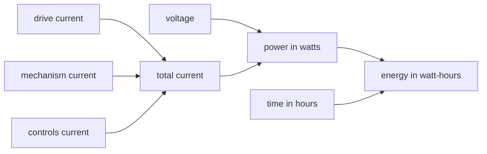

# Voltage, current, power, and energy

Electrical words can sound alike, but they answer different questions. Voltage describes an
electrical difference. Current describes charge flow. Power describes how fast electrical energy is
being transferred. Energy adds that transfer over time. Keeping the ideas separate makes later
wiring and diagnostic work easier.

## Purpose and prerequisites

The purpose is to build a safe math model before working near a robot electrical system. Complete
[Use rates and units to describe motion](/academy/rates-units-and-motion?path=math-for-robotics)
first. You should be able to multiply decimals and read a value with its unit.

This lesson uses invented values. You will not connect a battery, probe a wire, or choose a real
protection device. Those tasks need current league rules, component specifications, the correct
tools, and a bounded physical procedure.

## Vocabulary

- **Voltage:** electrical potential difference, measured in volts.
- **Current:** electrical charge flow, measured in amperes or amps.
- **Power:** energy transfer rate, measured in watts.
- **Energy:** power added over time, often measured in watt-hours.
- **Load:** a device or group of devices that uses electrical power.
- **Circuit:** a complete path for electrical current.
- **Voltage sag:** a drop in measured voltage while a source is under load.
- **Stall current:** high motor current when the shaft is not turning.
- **Budget:** an estimate that combines expected values before a test.

## Worked example

An invented lesson system uses 12 volts. Its three example loads use 8 amps, 4 amps, and 1 amp. Add
the currents because the model treats them as active at the same time.

```text
total current = 8 A + 4 A + 1 A = 13 A
power = voltage × current
power = 12 V × 13 A = 156 W
energy for 5 minutes = 156 W × (5 ÷ 60) hours = 13 Wh
```

The power value is a rate. It says how fast energy is transferred at that moment. The energy value
includes time. Running the same ideal load for ten minutes would use twice the watt-hours.

This does not mean a real 12-volt battery will stay at exactly 12 volts. It also does not mean every
load holds one current. Motors can change current as speed and load change.

## Visual model



The model moves from measurements to calculations. It does not contain wire size, connector rating,
heat, fuse behavior, battery condition, or legal robot rules. Those facts belong in later lessons and
real evidence records.

## Hands-on activity

Open the explorer below. Keep the default values and copy the total current, power, and energy. Then
change only drive current from 8 amps to 10 amps. Explain which outputs changed and why. Reset the
model before the next trial.

<powerbudgetexplorer />

Next, set all three currents to zero. Power should become zero even though voltage is still present in
the model. This shows that voltage and current are different measurements. Restore one current and
observe the result.

Create a third invented setup. Label every number as lesson data. Predict the result before moving a
control. Compare the prediction with the displayed calculation. If they differ, show the arithmetic
that explains the difference.

## Checkpoints

After adding current, confirm that the result uses amps. After multiplying voltage and current,
confirm that the result uses watts. Convert minutes to a fraction of an hour before calculating
watt-hours.

Ask a partner to point to every input in your power result. Then ask which real facts are missing.
Your answer should include at least voltage change under load, current changes, wiring loss, and a
component or rule limit.

## Troubleshooting

If the energy value is too large, check the time conversion. Five minutes is 5 divided by 60 hours,
not 5 hours. If power has the unit watt-hours, separate power from energy and repair the unit.

If turning current to zero does not make power zero, check whether another load remains above zero.
If two students get different totals, compare which loads were treated as active at the same time.

Never repair a concept-model mismatch by inventing a real component rating. Record the missing fact
as a source request. Use current official rules and manufacturer documentation before a later lesson
makes a real hardware choice.

## Evidence artifact

Submit three power-budget records. Each record needs voltage, the three currents, total current,
power, time, and energy. Mark all values as invented lesson data. Add one sentence that describes the
math pattern and one sentence that lists a model limit.

Finish with this boundary statement: “This calculation does not approve real robot hardware.” List
a battery, wire, connector, breaker, fuse, and motor as examples. That keeps the classroom model
separate from a physical electrical decision.

## Short assessment

1. What unit measures voltage?
2. What unit measures current?
3. A 10-volt lesson source supplies 3 amps. What is ideal power?
4. Why does energy need a time value?
5. Name three facts missing from this concept model.

The numeric answer is 30 watts. Your final answer should explain why the same voltage does not always
mean the same power and why a real system needs measured evidence.

## Extension challenge

Create two invented setups with the same power but different voltage and current values. Show the
multiplication for both. Explain why equal calculated power does not make the real systems equal.

Then compare one setup for two minutes and ten minutes. Keep power fixed. Predict the energy ratio
before using the explorer, and explain the result with units.

## Related and next

Continue in the Electrical Systems and Diagnostics path with battery protection, wiring, actuators,
sensors, and fault isolation after those lessons complete source review. Revisit [Read a telemetry
graph like a scientist](/academy/read-a-telemetry-graph?path=math-for-robotics) before diagnosing
voltage sag. A graph can show the drop, but another signal is needed to support its cause.
