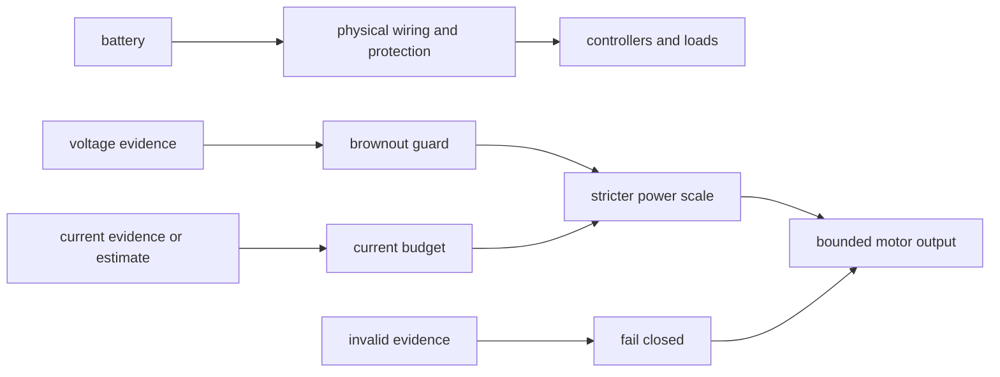

# Batteries, breakers, fuses, and brownouts

## Purpose and prerequisites

A robot battery supplies electrical energy. Wires and protection devices carry or interrupt current.
Robot software may also reduce output when measured voltage or estimated current becomes unsafe. The
physical and software layers help in different ways; neither layer replaces the other.

In this lesson, you will trace those layers and step through a source-pinned ARES brownout pattern.
Complete [Voltage, Current, Power, and Energy](/academy/electrical-voltage-current-power?path=electrical-systems-diagnostics)
first. You will not handle a battery, open a power path, choose a protection rating, or move a robot.

## Vocabulary

- **Battery:** an energy source with terminals and a rated operating range.
- **Polarity:** which connection is positive and which is negative.
- **Breaker:** a resettable device that opens a circuit under specified conditions.
- **Fuse:** a replaceable device that opens a circuit when its element responds to excess current.
- **Brownout:** a low-voltage condition that can limit or interrupt controller operation.
- **Voltage sag:** a voltage drop while the source is under load.
- **Current budget:** an estimate or measurement of current used by several loads.
- **Power scale:** a number from zero to one used to reduce a requested actuator output.
- **Hysteresis:** a recovery margin that prevents fast switching near a boundary.
- **Fail closed:** move to the safer blocked state when required input is invalid.

## Worked example

The pinned ARES `BrownoutGuard` has an FTC example profile. Its warning value is `10.0 V`, its
critical value is `8.2 V`, and its recovery margin is `0.4 V`. These are software defaults in one
source revision. They are not current league rules or a battery specification.

A healthy guard receives `9.1 V`. That is below warning but above critical, so the next state is
warning. The example scale changes along a straight line from full scale at warning to `0.30` near
critical. At the midpoint, the calculation is:

```text
ratio = (9.1 - 8.2) ÷ (10.0 - 8.2) = 0.5
scale = 0.30 + 0.5 × (1.00 - 0.30) = 0.65
```

Now start in warning at `10.2 V`. The state stays warning because recovery needs more than `10.4 V`.
That margin prevents one noisy sample from rapidly switching between warning and healthy.

## Visual model



ARES exposes voltage, total current, and a power scale through a shared `PowerManager`. FTC and FRC
adapters can obtain their evidence differently. The robot code still needs valid units, current
sources, thresholds, and tests for the selected platform.

## Hands-on activity

1. Draw the visual model and circle the physical protection layer.
2. Underline the two software evidence paths: voltage and current.
3. Open the sandbox below with prior state set to healthy.
4. Test `10.5 V`, `9.1 V`, and `8.2 V`. Record the state and scale for each.
5. Set the prior state to warning and test `10.2 V` and `10.5 V`.
6. Explain why the two results differ even though both are above the warning value.
7. Set the prior state to critical and find the first tenth of a volt that leaves critical.
8. Make a three-column table: physical protection, software guard, and missing evidence.
9. Put breaker, fuse, polarity, and wire rating in the physical column.
10. Put voltage state, current budget, scale, and invalid-input behavior in the software column.
11. Put current rules, real component ratings, wiring inspection, and physical tests in missing evidence.
12. Write one claim that this lesson supports and three claims it does not support.

<brownoutsandbox />

The state selector represents the guard's prior state. It is not a robot mode. The web model takes
one sample at a time and does not simulate the battery or motor loads that caused the voltage.

## Checkpoints

- Are volts, amps, and the unitless scale kept separate?
- Does critical voltage create a blocked motor-output scale in the example?
- Does recovery cross the threshold plus its hysteresis margin?
- Are software thresholds labeled as pinned ARES example values?
- Are breaker, fuse, wire, and battery choices left to current official sources?
- Does invalid evidence move to a blocked result instead of a healthy result?
- Is physical testing absent from the activity and its claims?

## Troubleshooting

| Symptom | Check |
| --- | --- |
| Warning does not recover at exactly 10.0 V | Recovery needs the warning value plus the hysteresis margin. |
| Critical changes to warning too soon | The value must be greater than critical plus the recovery margin. |
| A scale is treated as measured current | Scale has no unit. Current is measured in amps. |
| A lower scale is called a fuse | Software output scaling and a physical fuse are different layers. |
| One low voltage sample is called a bad battery | Load, wiring, measurement, battery condition, and time evidence are still missing. |
| A rule value is copied from this lesson | Stop. Attach and review the current official league documents first. |

## Evidence artifact

Submit the annotated layer diagram, five state-step records, and the three-column table. Add the
exact ARES source revision, example thresholds, and a sentence explaining hysteresis. Label every
sandbox result as **source-pinned software example**.

Finish with an unresolved-source note. This lesson cannot name legal batteries, required protection
devices, allowed wire, or device ratings until current FTC and FRC electrical rules are reviewed.
The official-reference request stays open and must not be replaced by remembered season values.

## Short assessment

1. How does a breaker or fuse differ from a software power scale?
2. What is a brownout?
3. Why does hysteresis use a different recovery boundary?
4. What should happen when voltage evidence is invalid?
5. Name four sources needed before choosing real electrical parts.

Good answers separate physical protection, software response, measured evidence, source rules, and
physical verification. A software guard can reduce a command, but it cannot inspect wiring or make
an illegal part legal.

## Extension challenge

Create a five-row state trace. Begin healthy, move through warning and critical, then recover. For
each row, record prior state, voltage, next state, scale, and reason. Use the sandbox one row at a
time. Explain why a stateful trace cannot be replaced by one threshold comparison.

Then compare the brownout guard with a current budget. List evidence each one needs, one failure it
can respond to, and two failures it cannot diagnose alone. Do not invent current thresholds.

## Related and next

Return to [Voltage, Current, Power, and Energy](/academy/electrical-voltage-current-power?path=electrical-systems-diagnostics)
for ideal power math. Continue to wiring, motors, sensors, buses, and diagnostics as their official
sources or authentic team evidence complete review. Use [Read a Telemetry Graph Like a Scientist](/academy/read-a-telemetry-graph?path=math-for-robotics)
to compare voltage with time and load evidence without claiming a cause from one signal.
