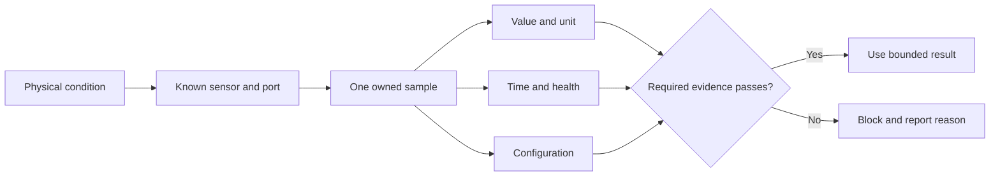

# Choose and read robot sensors

## Purpose and prerequisites

A sensor turns a physical condition into data. Robot code needs more than the number. It also needs
the unit, identity, sample time, health, and a rule for missing evidence. In this lesson, you will
compare sensor jobs and trace one cached distance sample.

Complete [Voltage, Current, Power, and Energy](/academy/electrical-voltage-current-power?path=electrical-systems-diagnostics)
and [Read Hardware Once and Write Safe Outputs](/academy/programming-io-caching?path=programming-with-ares).
No powered robot is required for the source and concept work.

## Vocabulary

- **Sensor:** a device that measures a physical condition.
- **Signal:** the value and meaning produced by a sensor.
- **Unit:** the scale used by a value, such as meters or radians.
- **Sample:** one sensor observation at one time.
- **Freshness:** whether a sample is recent enough for its job.
- **Validity:** whether the system has reason to accept the sample.
- **Range:** the values a device or contract can report usefully.
- **Topology:** the stable record of a device, parent controller, port, bus, and identity.

## Worked example

A distance sensor reports `0.75`. That number is not complete evidence. The contract must say that
the unit is meters. The sample also needs a time and health state. If it is 20 milliseconds old and
the allowed age is 100 milliseconds, it may be fresh enough for one control rule.

If the same value is marked disconnected, the robot must not treat `0.75` as a new measurement. If
the sensor is offline, the pinned ARES distance interface can report `NaN` or positive infinity.
Control code must not turn those values into a real distance. It should keep the failure visible and
choose the stated safe behavior.

Different jobs need different sensors. A beam break can answer whether an object blocks a path. A
distance sensor estimates range. A color sensor reports channels and intensity. An IMU measures
motion and heading data. Choose from the needed evidence, not from the longest feature list.

## Visual model

Do not replace a failed required sensor with zero unless zero is a separate, verified physical
meaning and the contract clearly says so.

## Hands-on activity

1. Choose one robot question, such as “Is a game piece present?”
2. State the physical condition that must be measured.
3. Compare a beam break, distance sensor, color sensor, and camera for that narrow job.
4. Choose the simplest signal that can answer the question with useful evidence.
5. Record the expected value type, unit, range, and sample rate.
6. Add its stable name, controller, port or bus, and required/optional policy.
7. Define valid, invalid, stale, disconnected, and out-of-range behavior.
8. Mark the one refresh point that owns the device read.
9. Use the lab below to test one invented distance sample.
10. Write the safe control response for every blocked result.

<sensorsignallab />

Try a stale age, disconnected health, missing configuration, and negative distance. Say why each
case is blocked before reading the lab result.

## Checkpoints

- Does the sensor answer the actual robot question?
- Are the value and unit explicit?
- Is identity tied to the right controller, port, or bus?
- Is the sample read once and cached for the loop?
- Are freshness and validity separate from the numeric value?
- Does a missing required sensor block instead of inventing data?

## Troubleshooting

| Symptom | Check |
| --- | --- |
| Number looks normal but control is wrong | Check unit, sign, frame, age, and health. |
| Offline sensor appears as a distance | Reject `NaN`, infinity, invalid health, and stale data. |
| Two parts of the loop see different values | Remove hidden reads outside the refresh owner. |
| Wrong device answers on a shared bus | Check stable identity, address, bus, and parent controller. |
| Color changes with room light | Record lighting, surface, range, and a real calibration test. |
| Distance jumps at an edge | Keep the raw evidence visible and test filtering separately. |
| Mock always reports healthy | Add stale, invalid, disconnected, and out-of-range cases. |

## Evidence artifact

Create a sensor decision card. Include the robot question, chosen sensor kind, topology identity,
value type, unit, useful range, refresh owner, maximum age, health states, safe fallback, and test
plan. Add source links for the interface and topology fields.

Build a test table with healthy, stale, invalid, disconnected, out-of-range, and wrong-identity
cases. Record the expected state and output rule. Run hardware-free contract tests first. Keep a
separate row for physical placement, wiring, surface, light, and range checks.

Students may test a real sensor through the team's normal safety process. Keep actuators disabled
while checking raw values. Move only the test object or sensor by hand when safe. Record distance,
angle, lighting, target, and the observed result. Do not claim a reliable range from one sample.

## Short assessment

1. Why is a numeric sensor value not enough by itself?
2. What is the difference between freshness and validity?
3. Why should a sensor read have one owner per loop?
4. What should happen when a required sensor is disconnected?
5. Which physical facts remain unknown after a mock test passes?

## Extension challenge

Design a two-sensor check for one real robot question. State what each sensor adds and how their
failures stay separate. Write a truth table for both healthy, first failed, second failed, and both
failed. Do not combine them into one “good” flag that hides which evidence is missing.

## Related and next

Continue to buses, addresses, and hardware mapping. Later, use telemetry and logs to compare sensor
evidence over time. Use the vision lessons when the robot question truly requires camera data.
