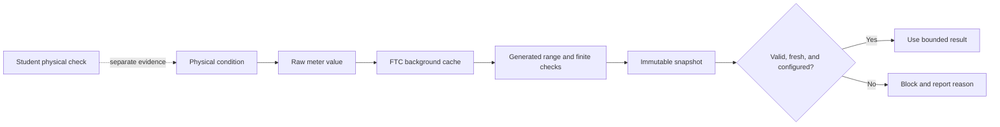

# Choose and read robot sensors

## Purpose and prerequisites

A sensor turns a physical condition into data. A number by itself is not enough evidence. Robot
code also needs to know what the number means, where it came from, and whether it is safe to use.

This lesson separates three current ARES layers:

1. a raw sensor value,
2. a cached FTC value, and
3. a generated subsystem snapshot with explicit health evidence.

Complete [Voltage, Current, Power, and Energy](/academy/electrical-voltage-current-power?path=electrical-systems-diagnostics)
and [Read Hardware Once and Write Safe Outputs](/academy/programming-io-caching?path=programming-with-ares)
first. No powered robot is required for the source and model work.

By the end, you will be able to explain what each layer proves, choose a sensor for one robot
question, and plan a student-led physical check.

## The important correction: three different evidence layers

Current ARESLib does not attach a timestamp and health report to every raw sensor property. Those
fields appear at a higher subsystem layer. Keep the layers separate.

| Layer                        | Current ARES example              | What it provides                                                                                | What is still missing                                                                             |
| ---------------------------- | --------------------------------- | ----------------------------------------------------------------------------------------------- | ------------------------------------------------------------------------------------------------- |
| Raw interface                | `DistanceSensorIO.distanceMeters` | One value in meters; `NaN` or positive infinity may mean offline or out of range                | Age, configuration health, useful range, and physical accuracy                                    |
| FTC cache                    | `FtcDistanceSensor`               | A background read about every 20 ms and the latest cached meter value; read errors become `NaN` | A public last-update time, a separate health field, and proof that the target is sensed correctly |
| Generated subsystem snapshot | Generated IO and immutable state  | Finite/range checks, `feedbackValid`, `feedbackTimestampMs`, and `configurationHealthy`         | Physical placement, wiring, surface effects, and proof on the actual robot                        |

A finite cached number is useful, but it is not automatically fresh. A generated subsystem can
make the stronger freshness claim because it records when a complete snapshot was received and
compares that time with its allowed age.

Hand-authored code must build the same evidence on purpose. It does not receive generated snapshot
fields merely because it implements `DistanceSensorIO`.

## Vocabulary

- **Sensor:** a device that measures a physical condition.
- **Signal:** a value and its meaning.
- **Sample:** one sensor observation.
- **Cache:** stored data that can be read without polling the device again.
- **Validity:** whether the required checks accepted a sample.
- **Freshness:** whether an accepted sample is recent enough for its job.
- **Configuration health:** whether required device setup succeeded.
- **Range:** the values a device or software contract accepts for one use.
- **Sentinel value:** a special value, such as `NaN`, that marks missing or failed evidence.
- **Topology:** the stable record of a device, parent controller, port, bus, and identity.

## Read the current source contract

The current `DistanceSensorIO` interface is intentionally small. It exposes one property:
`distanceMeters`. Its comment says the value is measured in meters. It may return `NaN` or positive
infinity when the target is out of range or the sensor is offline.

That contract does **not** expose `lastUpdatedMs`, `connected`, or `configured`. Code that needs
those facts must own them at another boundary.

The current FTC adapter polls in a background thread. It catches a device-read exception and stores
`NaN`. Its getter returns the cached value instead of making another I2C call. This reduces blocking
in the robot loop, but its public contract still has no sample timestamp.

The generated distance-sensor scaffold is stronger. It declares a distance measurement in meters
with a default accepted range from 0 through 10 meters. Generated physical and mock adapters require
the reading to be finite and inside that configured range before committing the cached snapshot.
They then set `feedbackValid` and record `feedbackTimestampMs` with `RobotClock`.

When the subsystem copies the IO snapshot into immutable state, it also compares the snapshot age
with the subsystem feedback timeout. A failed or old snapshot remains visible as invalid state.

## Visual model



The dashed path matters. A source review or simulation cannot prove that a real beam, surface, wire,
mount, or target behaves as expected.

## Worked example

Suppose a distance sensor shows `0.75`.

At the raw interface, you know only that the reported value is 0.75 meters. It is finite, so it is
not one of the documented offline or out-of-range sentinels. You still do not know its age.

At the FTC cache, you know the value came from the adapter's latest background read. You still
cannot calculate age from the public cached value alone.

At a generated subsystem snapshot, assume these facts:

- distance: `0.75 m`,
- feedback valid: `true`,
- snapshot age: `20 ms`,
- maximum age: `100 ms`, and
- configuration healthy: `true`.

That snapshot has enough represented evidence for the lesson's software rule. If the age changes to
`120 ms`, the numeric distance does not change, but the snapshot becomes stale and must be blocked.

If the value becomes `NaN`, the generated read rejects it before committing a new valid snapshot.
If configuration health is false, a finite value still does not permit control.

## Hands-on activity

Work with a partner if possible. One student predicts each result. The other changes the model and
records the reason. Swap roles halfway through.

1. Choose one robot question, such as “Is a game piece within intake range?”
2. State the physical condition that must be measured.
3. Compare a beam break, distance sensor, color sensor, and camera for that one question.
4. Choose the simplest signal that can answer it.
5. Record the value type and unit.
6. Record the stable device name, controller, port or bus, and required/optional policy.
7. Open the lab and select **Raw distance interface**.
8. Enter `0.75 m`. Explain why it is a value-only result.
9. Try a blank or non-number field. Record why it is blocked.
10. Select **FTC cached adapter**. Explain why caching does not create a timestamp.
11. Select **Generated subsystem snapshot**.
12. Test a healthy `0.75 m` sample at age `20 ms` with a `100 ms` limit.
13. Make the snapshot stale.
14. Restore the age, then turn off configuration health.
15. Restore configuration, then mark the refresh as failed.
16. Try `-0.1 m` and `10.1 m`. Compare the result with the generated 0–10 m scaffold.
17. Write the safe control response for each blocked result.
18. List the physical facts the model cannot test.

<sensorsignallab />

Do not replace failed required evidence with zero. Zero might be a real distance. A failure must stay
distinguishable from a valid zero reading.

## Source walk and hardware-free checks

Use the pinned source links for this lesson. In a current ARESLib checkout, locate the same
boundaries with:

```powershell
rg -n "distanceMeters|feedbackValid|feedbackTimestampMs|configurationHealthy" `
  core/src/main codegen/src/main ftc-hardware/src/main
```

Run focused library checks without a robot:

```powershell
.\gradlew.bat :core:test --tests "com.areslib.hardware.sensor.ThreadedSensorsTest"
.\gradlew.bat :codegen:test --tests "com.areslib.codegen.SubsystemKotlinGeneratorTest"
```

Passing these checks proves only the tested software behavior. It does not prove a physical sensor,
wiring path, mount, or target.

## Evidence artifact

Create a sensor decision card with three sections.

### 1. Device choice

Record the robot question, sensor kind, stable identity, connection, value type, unit, and useful
physical range. Explain why a simpler sensor would or would not answer the question.

### 2. Software snapshot

Record the refresh owner, accepted numeric range, validity rule, timestamp owner, maximum age,
configuration rule, and blocked behavior. Mark whether the code is generated or hand-authored.

### 3. Physical check

Record target material, distance, angle, lighting, wiring, placement, robot state, and observed
result. Keep actuators disabled while viewing raw sensor values. Use the team's normal safety
process before moving any mechanism.

Students may verify the sensor and robot behavior. Website publishing is a separate editorial task
and uses the Lead Coach review flow.

## Checkpoints

- Can you name the evidence layer you are using?
- Does the sensor answer the actual robot question?
- Are value and unit explicit?
- Is the read cached instead of hidden inside a getter?
- Does the snapshot keep validity separate from freshness?
- Is configuration health separate from the numeric value?
- Does missing required evidence block instead of inventing data?
- Are software, simulation, and physical results recorded in separate columns?

## Troubleshooting

| Symptom                                         | Check                                                                                                     |
| ----------------------------------------------- | --------------------------------------------------------------------------------------------------------- |
| Finite number is treated as automatically fresh | Find the timestamp owner. The raw and FTC cached distance contracts do not expose one.                    |
| Offline sensor appears as a real distance       | Reject `NaN`, infinity, and failed snapshot validity.                                                     |
| Old value survives after a read problem         | Keep the prior value for diagnosis, but set validity false and do not use it for control.                 |
| Two parts of a loop see different values        | Remove hidden device reads and use one owned snapshot.                                                    |
| Generated range rejects a real device value     | Review the descriptor range against the sensor datasheet and actual task. Do not simply remove the check. |
| Wrong device answers on a shared bus            | Check stable identity, address, bus, and parent controller.                                               |
| Color changes with room light                   | Record lighting, surface, range, and a physical calibration test.                                         |
| Distance jumps at an edge                       | Keep raw evidence visible and test filtering as a separate step.                                          |
| Mock always looks healthy                       | Add failed refresh, stale age, bad configuration, and out-of-range cases.                                 |

## Short assessment

1. What does `DistanceSensorIO.distanceMeters` prove?
2. What evidence does the raw interface not provide?
3. Why does a cached value not automatically have a known age?
4. Which generated fields support a freshness decision?
5. Why are validity and configuration health separate?
6. What should happen when a required generated snapshot is stale?
7. Which facts still require a student physical check?

## Extension challenge

Design a hand-authored snapshot for one beam break or distance sensor. Include a cached value,
`feedbackValid`, `feedbackTimestampMs`, `configurationHealthy`, and a maximum age. Write six cases:
healthy, read failed, stale, disconnected, out of range, and wrong identity.

Then design a two-sensor check for one real robot question. Keep each sensor's failure reason
separate. Do not collapse both devices into one “good” flag that hides missing evidence.

## Related and next

Continue to [USB, I2C, CAN, Addresses, and Device Identity](/academy/electrical-buses-addresses?path=electrical-systems-diagnostics)
to study connection identity. Then use [Map Hardware and Diagnose a Dead Device](/academy/electrical-hardware-map-diagnostics?path=electrical-systems-diagnostics)
to trace a failure without guessing. Use the vision lessons only when the robot question truly needs
camera data.
