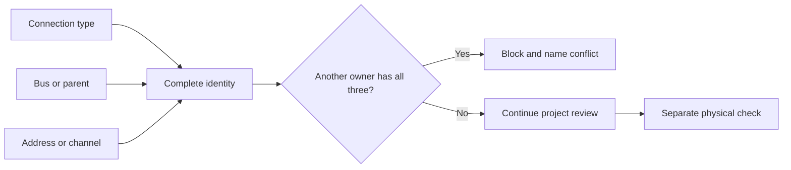

# USB, I2C, CAN, addresses, and device identity

## Purpose and prerequisites

A robot can have many devices, but software must know which device owns each name, bus address, or
controller channel. This lesson teaches a simple identity record and a safe way to diagnose a
collision. Complete [Choose and Read Robot Sensors](/academy/electrical-sensors?path=electrical-systems-diagnostics)
first. No powered robot is required for the lesson model.

ARES 13 keeps the shared topology wire format in the `telemetry-schema` module. The format has a
schema version plus a device ID, parent ID, port, CAN ID, CAN bus, bus position, and connection
type. A subsystem connection can also store an FTC hardware-map name or an FRC channel. Not every
device uses every field. The useful fields depend on the platform and connection.

## Vocabulary

- **Device identity:** the complete record software uses to distinguish one device from another.
- **Bus:** a shared communication path used by more than one device.
- **Address:** a number or label that identifies a device on a bus.
- **Channel:** one numbered connection on a controller.
- **Parent controller:** the hub, module, or controller that owns a port or channel.
- **CAN:** a shared message bus used by many robot controllers and devices.
- **I2C:** a shared bus used by addressed sensors and other small devices.
- **USB:** a host-to-device connection that can also connect hubs or adapters.
- **Collision:** two records claiming the same identity where only one owner is allowed.
- **Topology:** a stable map of devices and their connections.

## Worked example

Imagine two lesson motors. Both records say connection type `CAN`, bus `rio`, and device ID `20`.
Those three fields make the same identity. Software cannot safely treat the two records as different
owners. The configuration should be blocked and the conflict should name both owners.

Now change the second ID to `21`. The two records no longer collide in this narrow check. Changing
the second bus instead could also separate the software identities. That does not prove the real
wiring or device settings are correct. It only removes this one duplicate record.

ARES Studio applies the same central idea when it reviews CAN ownership: it normalizes the bus name,
pairs that bus with the CAN ID, and reports when another subsystem already owns the pair. The
hardware setup guide adds an important warning. ARES can block duplicate configuration values, but
students still need to compare physical labels, controller settings, and the project documents.

## Visual model

A number by itself is not a complete identity. Channel 1 on one controller is not automatically the
same as channel 1 on another controller. CAN ID 20 on one named bus is not automatically the same
record as CAN ID 20 on a different named bus. The full connection context matters.

## Hands-on activity

1. Draw two invented device cards named Device A and Device B.
2. Give each card a connection type, bus or parent controller, and number.
3. Predict whether the records collide.
4. Use the troubleshooter below and enter the same records.
5. Make one field different and explain why the result changes.
6. Restore all three fields to the same values and read the blocked reason.
7. Change only capitalization and extra spaces in one bus name. Notice that the model still treats
   the labels as the same bus.
8. Reset the lab before making a second example with I2C or controller channels.
9. Write which additional project and physical checks the lab cannot perform.

<busaddresstroubleshooter />

Next, make a hardware identity table for one existing source-backed robot document. Do not invent a
real robot connection. Use only reviewed project records. Include stable software name, device kind,
platform, connection type, parent or bus, address or channel, required/optional policy, and evidence
source. Mark every unknown as unknown.

## Checkpoints

- Does every device have one stable software name?
- Does the record include connection type and parent or bus?
- Is the address or channel tied to that context?
- Did the review compare the whole project, not only one subsystem file?
- Does a conflict name both owners and block the draft?
- Are configuration review and powered physical testing recorded separately?

## Troubleshooting

| Symptom | Check |
| --- | --- |
| Two devices respond as one | Compare type, bus or parent, and address across the full project. |
| Code cannot find an FTC device | Compare the hardware-map name letter for letter with the project record. |
| One FRC device disappears after adding another | Check for duplicate CAN ownership on the same normalized bus. |
| A sensor works on one port but not another | Record the parent controller and port; do not keep only the number. |
| The GUI accepts a draft but hardware still fails | Check physical labels, wiring, controller setup, and current official documentation. |
| A conflict appears after combining subsystems | Review the combined inventory; separate files can each look valid alone. |
| A number seems outside an allowed range | Stop and use the current platform, league, and manufacturer source. This lab does not set ranges. |

## Evidence artifact

Create a connection inventory with one row per reviewed device. Add the source path and pinned commit
for each row. Then create a conflict report with these columns: first owner, second owner, connection
type, bus or parent, number, result, and next action. A useful report explains the evidence instead
of saying only “device broken.”

For a physical check, students may compare labels and configuration through the team's normal safety
process. Keep actuators disabled while inspecting identity information. Do not move a mechanism just
to test an address. Record who checked the label, which source was used, and what remained unknown.

## Short assessment

1. Why is a number alone not a complete device identity?
2. What three fields does the lesson model compare?
3. When can the same number appear without colliding in this model?
4. Why must separate subsystem documents be checked as one inventory?
5. What physical facts remain unknown after the lab reports no duplicate?

## Extension challenge

Design a paper review for three subsystems that each have two devices. Include at least two
connection types. Add one hidden collision, exchange the inventory with a partner, and ask them to
find it. Then explain which check could be automated and which physical evidence still needs a
student to inspect it.

## Related and next

Continue to batteries, protection, wiring, and connectors. Later, use the diagnostics lessons to
separate a missing device from a wrong identity, power fault, loose connection, or unhealthy signal.
Return to [Author a Code-First or Hybrid Subsystem](/academy/programming-code-subsystem?path=programming-with-ares)
when a subsystem needs explicit platform connection fields.
