# Wire, connectors, polarity, and strain relief

## Purpose and prerequisites

A wiring plan connects a named source to a named device. It also records polarity, connector or
termination, route, movement, support, protection, and a way to inspect the result. A line on a
diagram is not enough by itself.

In this lesson, you will review an invented connection while the energy source stays isolated.
Complete [Batteries, Breakers, Fuses, and Brownouts](/academy/electrical-battery-protection?path=electrical-systems-diagnostics)
first. You will not cut wire, attach a connector, open a battery path, test continuity, or energize a
device. Current official rules, component sources, team procedures, and proper tools govern that work.

## Vocabulary

- **Conductor:** material that carries electrical current through a circuit.
- **Insulation:** material around a conductor that helps prevent unwanted contact.
- **Connector:** a matched interface used to join electrical paths.
- **Termination:** the prepared end that joins a conductor to a connector or device.
- **Polarity:** the required positive and negative relationship between connections.
- **Pinout:** a sourced map of a connector's pins and their functions.
- **Strain relief:** support that keeps a pull or bend from reaching a termination.
- **Service loop:** planned extra length that allows safe movement or service without sharp tension.
- **Routing:** the chosen path for a wire or cable.
- **Continuity:** an unbroken electrical path, checked later with an approved method.

## Worked example

An invented distance sensor record says its stable name is `front-range`. Its connection record says
`I2C`, parent `control-hub`, address `0x30`. A paper wiring plan that says only “connect sensor” is
incomplete.

The plan should identify the device and canonical connection. It should point to an approved pinout
for power, ground, and signals. It should mark the route, moving zones, sharp edges, support points,
service need, and strain relief. It should also name the current source for any conductor or
protection choice.

Passing those paper checks does not prove the sensor is connected. The plan cannot see swapped
polarity, loose strands, hidden damage, a partly seated connector, or a different physical device.

## Visual model

```mermaid
%% aria: An isolated energy source and canonical device identity lead to sourced polarity and connection details. The plan adds routing, movement, strain relief, and protection sources. Review creates a physical inspection plan, not proof that wiring is correct.
flowchart LR
  I["source isolated"] --> D["canonical device identity"]
  D --> P["sourced polarity and pinout"]
  P --> C["connector or termination plan"]
  C --> R["route, movement, and strain relief"]
  R --> S["current protection sources"]
  S --> V["later physical inspection plan"]
```

ARES keeps each connection in an owning drivebase or subsystem document. Hardware Setup combines
those records into one inventory. It checks names, buses, addresses, channels, safe outputs, and
review state. It does not scan a robot or prove that the physical wiring matches the records.

## Hands-on activity

1. Choose one invented sensor, motor controller, or servo connection.
2. Give it a stable name and a complete connection identity.
3. Draw an isolated source, controller, connector, cable route, and device.
4. Mark polarity or direction-sensitive pins as “source required.” Do not guess a color or pinout.
5. Mark one moving zone, one edge or pinch concern, and one support location.
6. Add a service-loop or movement note only if the invented layout needs one.
7. Record the exact source needed for conductor, connector, and protection choices.
8. Use the checklist below from top to bottom.
9. Stop at the first missing item and add the requested evidence to your paper plan.
10. Repeat until every lesson check is present.
11. Write a separate physical inspection list that would come later under the team procedure.
12. Add three failure types the paper review cannot find.

<wiringdiagnosticlab />

The boxes describe your record. They do not read a diagram, inspect a device, or confirm a source
link. Another student must be able to locate each claim in the submitted artifact.

## Checkpoints

- Does the plan begin with the energy source isolated?
- Does device identity match the current canonical inventory?
- Does every polarity or pin claim point to an approved source?
- Are connector and termination named without inventing a rating?
- Are movement, edges, support, service, and strain relief considered?
- Are protection and conductor choices blocked until current sources are attached?
- Is physical inspection a later evidence level instead of a checked box?
- Are private labels, student data, and credentials absent from the artifact?

## Troubleshooting

| Symptom | Check |
| --- | --- |
| Two devices share a label | Return to canonical stable identity before reviewing the route. |
| A wire color is treated as proof | Use the sourced pin or terminal function; inspect the real termination later. |
| The connector is named but the pinout is missing | Attach an approved source and mark every required function. |
| A route crosses a moving part | Revise the route and mark support, clearance, and movement needs. |
| A cable pulls at the connector | Plan strain relief and service access before physical work. |
| The paper checks pass but the device is absent | Move to the ordered software and physical diagnostic process. |
| Someone proposes a wire or fuse size from memory | Stop and attach current league and component sources. |

## Evidence artifact

Submit the invented wiring diagram, completed ordered checklist, and later physical inspection list.
Include stable identity, source isolation, polarity source, connector source, route, moving zones,
support, strain relief, protection-source request, revision, and unresolved facts.

This lesson still needs approved close-up team photos showing real polarity, routing, connectors, and
strain relief without private labels. The tracked media request remains open. Do not create a fake
team wiring photo or use an unlabeled internet image as team evidence.

## Short assessment

1. Why is a wire color weaker evidence than a sourced pin function?
2. What does strain relief protect?
3. What belongs in a complete device identity?
4. Why can a paper checklist not prove continuity or polarity?
5. Name four current sources needed before real wiring choices are made.

Good answers separate canonical configuration, a sourced paper plan, physical inspection, electrical
measurement, and powered behavior. One layer can guide the next without claiming its result.

## Extension challenge

Create two routes for the same invented cable. Compare length, moving zones, service access, support,
and strain relief. Choose one as a paper preference and list the real dimensions still needed.

Then write a six-step physical inspection proposal without performing it. Include isolation, identity,
visual inspection, an approved unpowered measurement, correction, and a fresh review. Do not invent
meter settings or energizing steps.

## Related and next

Continue later with motor and servo selection after manufacturer sources complete review. Use [USB,
I2C, CAN, Addresses, and Device Identity](/academy/electrical-buses-addresses?path=electrical-systems-diagnostics)
for connection identity. Use [Map Hardware and Diagnose a Dead Device](/academy/electrical-hardware-map-diagnostics?path=electrical-systems-diagnostics)
when the canonical plan and observed software behavior disagree.
