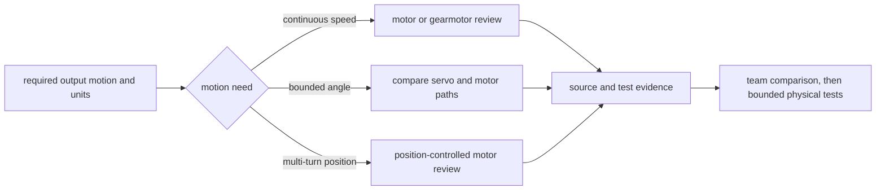

# Choose motors, gearmotors, and servos

## Purpose and prerequisites

An actuator turns electrical energy into robot motion. A useful choice starts with the motion the
robot needs. It does not start with a favorite product.

In this lesson, you will compare motor, gearmotor, and servo paths. You will build a paper evidence
record for one made-up mechanism. Complete [Wire, Connectors, Polarity, and Strain Relief](/academy/electrical-wiring-connectors?path=electrical-systems-diagnostics)
and [Build Motion with Arms, Elevators, Intakes, and Linkages](/academy/mechanical-mechanisms?path=mechanical-design-fabrication)
first. You will not choose, wire, power, or command a real device.

## Vocabulary

- **Actuator:** a device that creates physical motion.
- **Motor:** a device that can provide continuous rotation.
- **Gearmotor:** a motor joined to a reduction that changes its output speed and torque.
- **Servo:** an actuator with a position command interface and its own internal control.
- **Transmission:** gears, belts, chain, cable, or other parts between an actuator and its load.
- **Load:** the force or torque that the mechanism asks the actuator to provide.
- **Feedback:** measured information about position, speed, current, or another state.
- **Homing:** finding a trusted reference before position commands are used.
- **Safe neutral:** the output state used when motion should stop or a check fails.
- **Specification:** a sourced limit or measured behavior published for an exact device.

## Worked example

A made-up intake needs a roller to turn until the operator releases a button. The required output is
continuous rolling motion. A motor or gearmotor comparison is a reasonable starting path. That is
not a finished choice.

The team still records the roller speed range, transmission, load estimate, current and thermal
limits, feedback needs, safe neutral, and physical boundaries. Every product claim must point to a
current manufacturer source for the exact part.

A second made-up task needs a small gate to move between two known angles. A sourced servo and a
position-controlled motor are both possible starting paths. The evidence decides which path is
worth testing. The word “servo” alone does not prove the range, load, speed, life, or safety of a
real device.

## Visual model

ARES uses separate software contracts for motors and servos. `MotorIO` exposes power, scaled power,
voltage control, current when available, velocity, position, and encoder reset. Its safe state sets
power to zero. `ServoIO` exposes a position command and logs that position. These interfaces help
code depend on shared behavior instead of a vendor library.

The contracts do not contain a product data sheet. They do not know the mechanism load, gear wear,
mounting strength, travel boundary, or exact device range. Students must attach those facts from
current sources and verify the finished mechanism.

## Hands-on activity

1. Invent one mechanism task that uses no real team design or private data.
2. State the required output motion and unit.
3. Choose continuous speed, bounded angle, or multi-turn position in the sorter.
4. Record the suggested starting path. Do not call it a selected part.
5. Draw the actuator, transmission, load, moving part, and possible travel boundary.
6. Write the proposed ratio or say that a direct-drive path still needs review.
7. List the exact manufacturer facts needed for each device under comparison.
8. Add feedback, homing, and invalid-signal needs.
9. Add the safe neutral and a response for a failed limit or feedback check.
10. Check each box only when the paper record contains that evidence.
11. Stop at the first missing item and complete that paper task.
12. List four facts that still need an authentic physical test.

<motorservoselector />

The result is an evidence path. It is not a product recommendation. A complete paper record means
the team can compare sourced options and plan small tests.

## Checkpoints

- Does the output need include speed, angle, position, or travel with a unit?
- Is the transmission path clear?
- Does each real product claim cite the exact manufacturer source?
- Are feedback and homing needs separate from the command?
- Is the safe neutral defined?
- Are hard and soft boundaries included where motion can reach a limit?
- Are load, current, heat, strength, life, and clearance still open for real evidence?
- Does the record avoid student names, credentials, and private robot details?

## Troubleshooting

| Symptom | Check |
| --- | --- |
| “Use a servo” is the whole decision | Write the output range, load, speed, duty, feedback, and source needs. |
| A motor turns but the output does not match | Check the transmission, direction, slip, and output units. |
| Position is trusted at startup | Record how a reference is known and what happens before homing succeeds. |
| A limit is only a line in code | Add the physical boundary, sensor validity, safe neutral, and test plan. |
| A data sheet value is copied from memory | Attach a current source for the exact part and operating condition. |
| A simulated command looks correct | Keep load, current, heat, life, strength, and clearance open for physical tests. |

## Evidence artifact

Submit the motion requirement, drawing, completed sorter record, and a comparison table. Give the
table one row per possible actuator path. Include motion range, units, transmission, source links,
feedback, homing, limits, safe neutral, and facts that need tests.

Mark every row **candidate for comparison**. Do not mark a row selected, safe, legal, or proven.
Current manufacturer specifications are still an open source request for this curriculum. The
lesson will not invent ratings or recommend a real product without them.

## Short assessment

1. How is a gearmotor different from a motor by itself?
2. Why can a bounded-angle task have more than one starting path?
3. What does `MotorIO.safe()` do in the reviewed ARES contract?
4. What key feedback does `ServoIO` not prove about a physical device?
5. Name five evidence items needed before a team compares real actuators.

Good answers separate a motion need, software interface, manufacturer source, and physical test.
`MotorIO.safe()` sets motor power to zero. A servo position command does not prove actual position,
range, load ability, health, or safe motion.

## Extension challenge

Create two paper paths for the same bounded-angle task. Give one path a sourced servo interface and
the other a motor, transmission, and position feedback. Compare the evidence each path needs. Then
write the smallest future test that could reject one option without testing the whole mechanism.

## Related and next

Use [Choose and Read Robot Sensors](/academy/electrical-sensors?path=electrical-systems-diagnostics)
to plan feedback quality and freshness. Use [Read Hardware Once and Write Safe Outputs](/academy/programming-io-caching?path=programming-with-ares)
to keep input reads and output writes ordered. Continue to [Author a Code-First or Hybrid Subsystem](/academy/programming-code-subsystem?path=programming-with-ares)
when the mechanism needs state, control, IO, simulation, lifecycle, and tests.
