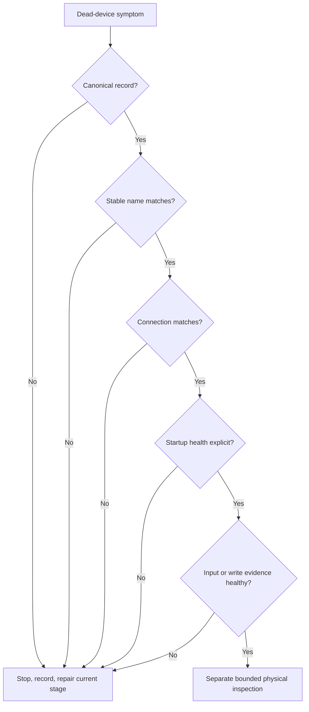

# Map hardware and diagnose a dead device

## Purpose and prerequisites

“The motor is dead” is a symptom, not a root cause. The problem could be a missing project record,
wrong name, wrong port or bus, startup failure, stale input, failed write, wiring fault, power fault,
or damaged device. This lesson teaches an ordered diagnostic record.

Complete [Choose and Read Robot Sensors](/academy/electrical-sensors?path=electrical-systems-diagnostics),
[USB, I2C, CAN, Addresses, and Device Identity](/academy/electrical-buses-addresses?path=electrical-systems-diagnostics),
and [Read Hardware Once and Write Safe Outputs](/academy/programming-io-caching?path=programming-with-ares)
first. Keep the robot disabled unless the team's safety procedure reaches a specific bounded test.

## Vocabulary

- **Symptom:** an observed problem that may have several possible causes.
- **Root cause:** the fact that explains why the problem occurred.
- **Canonical inventory:** the reviewed project record for every expected device and connection.
- **Hardware map:** the platform configuration that connects software names to physical devices.
- **Topology:** the versioned device, parent, port, bus, and address relationships shared by the robot and Studio.
- **Health:** an explicit state such as healthy, stale, invalid, or disconnected.
- **Required device:** a device whose failed startup blocks the system.
- **Optional device:** a device whose absence is reported but may permit bounded operation.
- **Failed write:** an output request the adapter could not apply.
- **Diagnostic record:** preserved evidence, checks, results, and next actions.

## Worked example

The intake does not respond. A student first opens the exact project and finds the canonical intake
motor record. The record says the stable software name is `intake_motor`. The configured FTC
hardware map says `intakeMotor`. Those names do not match.

The student keeps the robot disabled and records a stable-name mismatch. They do not change motor
direction, replace the motor, or raise an output limit. Those actions do not test the first visible
problem. After repairing the configuration through the normal review flow, the student repeats
startup and checks health again.

If the names had matched, the next check would compare parent hub and port or bus and address. A
matching configuration would still not prove power, wiring, or physical operation. The diagnostic
path crosses into those checks only through a separate, bounded physical procedure.

## Visual model

The order prevents random part swapping. It does not guarantee that the first failed check is the
only fault. After a repair, restart the sequence and keep earlier evidence.

## Hands-on activity

1. Choose one invented symptom, such as “distance value stopped changing.”
2. Write at least four possible causes without selecting a winner.
3. Open the diagnostic lab with all checks selected.
4. Turn off the canonical-inventory check and record the next action.
5. Reset. Turn off connection identity and output write together.
6. Explain why the earlier connection mismatch is reported first.
7. Reset. Turn off only cached-input evidence.
8. Write which value, unit, timestamp, validity, and health details you would preserve.
9. Restore all checks. Explain why “no fault found” does not prove the physical device works.

<hardwaretopologydiagnostic />

Next, use a reviewed source-only project example. Do not connect to the robot. Trace one device from
subsystem record to combined inventory and platform configuration. Record the exact source commit,
stable name, parent, connection, required/optional policy, cached fields, and safe output behavior.

## Checkpoints

- Is the symptom written without guessing a cause?
- Is the exact project and current revision identified?
- Does the combined inventory contain one owner for the device?
- Do stable name and connection match the platform configuration?
- Are required and optional startup failures different and visible?
- Are stale input and failed output writes reported separately?
- Does every repair restart the ordered check?
- Is physical inspection kept outside the software-only claim?

## Troubleshooting

| Symptom | Check |
| --- | --- |
| Device is absent at startup | Check current inventory, exact name, connection, and required/optional policy. |
| Wrong device responds | Check duplicate names, parent hub, port, bus, address, and channel. |
| Value is frozen | Check refresh ownership, timestamp, validity, health, connection, and source unit. |
| Command changes but mechanism does not | Check whether the output adapter reported a successful write before physical diagnosis. |
| Error disappears after restart | Preserve the original log and startup health; an intermittent fault is still evidence. |
| Simulator works but hardware does not | Move to configuration and bounded physical checks; simulator evidence cannot prove wiring. |
| Several changes were made at once | Restore a known revision and test one controlled change at a time. |

## Evidence artifact

Create a diagnostic ticket with the symptom, first time observed, exact project revision, expected
device identity, ordered checks, evidence source, first failed boundary, repair, retest, and remaining
unknowns. Do not include student names, email addresses, account IDs, or credentials in logs or
screenshots.

If an approved Studio screenshot becomes available, annotate only the relevant inventory and
diagnostic fields. Remove private paths, tokens, student data, and unrelated project details. Until
then, keep the authentic screenshot request open rather than drawing a fake Studio result.

## Short assessment

1. Why is “dead motor” a symptom instead of a root cause?
2. Why should the combined inventory be checked before one subsystem alone?
3. How is stale input different from a failed output write?
4. Why must the sequence restart after a repair?
5. What physical facts remain unknown after every represented software check passes?

## Extension challenge

Create a fault tree for one device with configuration, communication, input, output, power, and
physical-mechanism branches. Use the lab to practice separating evidence without claiming that a
software selection proves a physical cause.

<faulttreelab />

If the fault tree reaches a wiring-plan branch, use the optional paper checklist below. It can order
source, identity, polarity, connector, routing, strain-relief, and protection-source questions. It
cannot inspect or energize the physical connection.

<wiringdiagnosticlab />

For each leaf in your real tree, name the smallest safe observation that would move the diagnosis
forward. Keep every untested physical branch visibly open.

## Related and next

Review [Wire, Connectors, Polarity, and Strain Relief](/academy/electrical-wiring-connectors?path=electrical-systems-diagnostics),
then continue to fault-tree and commissioning lessons. Use
[Commission an FTC Starter Robot Safely](/academy/ftc-starter-physical-commissioning?path=testing-debugging-commissioning)
before a physical check. Return to the sensor lesson when the value exists but lacks fresh, valid,
unit-labeled evidence.
