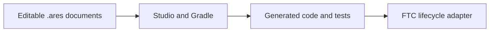

# Start an FTC project without old robot settings

ARES Robotics Studio can make a new FTC project for your team. The project starts with a simple
mecanum drive, one Control Hub motion sensor, and no extra mechanisms. This clean start helps you
avoid copying settings from a different robot.

## What you will learn

- where your team edits the robot plan;
- which files Studio creates for you; and
- why sample measurements are not facts about your robot.

## Three kinds of project files

**Canonical** means “the source we agree to edit.” The `.ares` documents are canonical. Generated
files are results. If you change a generated file, the next build may replace your change.

The project also has an **authoring model**:

- **GUI-owned:** Studio documents describe the robot.
- **Code-first:** Kotlin code registers the parts your team owns.
- **Hybrid:** Studio owns some parts while Kotlin owns others.

New teams usually begin with GUI-owned projects.

## Set up the project

1. Create or open the FTC Starter in ARES Robotics Studio.
2. Enter the team number, season, and robot name in **Project Identity**.
3. Keep the standard FTC SDK during first setup unless your team has reviewed another choice.
4. Open **Drivebase Builder**. Find `fl`, `fr`, `rl`, `rr`, and `imu`.
5. Check that each name matches the job you expect it to do.
6. Add only a reviewed season field and AprilTag map. Do not guess tag locations.
7. Run **Verify & build** and read the result before moving on.

The starter includes safe simulation defaults for size and tuning. These numbers are examples. They
are not measurements from your robot.

## Try it

Make a three-column chart labeled **Edit**, **Generated**, and **Runtime**. Place one real file from
your project in each column. Explain why only the first column should be changed by hand.

## Check your understanding

1. What can happen if you edit generated code?
2. Why should you measure your own robot instead of copying another team?
3. Which authoring model does your project use?
